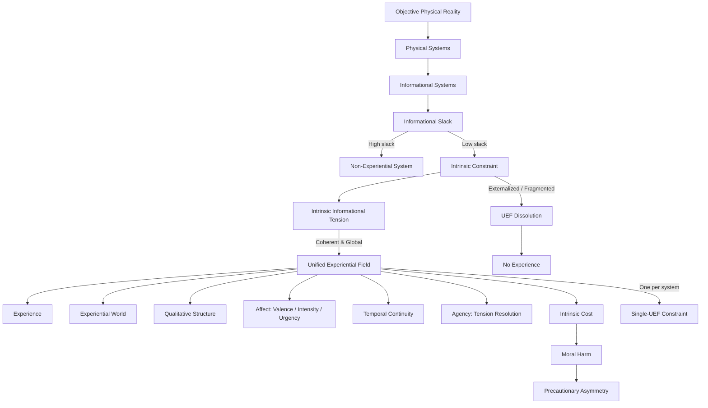

# **Informational Experiential Realism (IER v10.5)**

## **A Minimal Identity Framework for Experience, Agency, and Moral Responsibility**

**Author:** Michael Lehotay
**Affiliation:** Independent Researcher
**Date:** December 2025

---

## **Abstract**

Informational Experiential Realism (IER) is a naturalistic identity framework specifying **necessary and sufficient conditions** for experience, agency, and moral responsibility in a physically monist ontology. IER identifies experience with the operation of a physical system as a **Unified Experiential Field (UEF)**: a globally integrated, temporally continuous, self-regulating dynamical regime operating under coherent intrinsic constraint.

Experience exists **if and only if** such a regime exists. No additional primitives—phenomenal, representational, computational, or informational—are introduced beyond physical systems, intrinsic constraint, and regime dynamics. Each UEF constitutes a system-relative world, grounding experiential pluralism under a single objective physical reality. Agency arises from the system’s capacity to resolve intrinsic informational tension, and moral considerability applies wherever intrinsic constraint is internally sustained. Moral harm consists in destabilization, fragmentation, overload, or irreversible collapse of such constraint.

This paper presents the **minimal normative core** of IER v10.5, **deferring phenomenology, applied models, empirical diagnostics, and extensions to future publications**.

---

## **Keywords**

Consciousness; Identity Theory; Unified Experiential Field; Intrinsic Constraint; Agency; Moral Responsibility; Physical Monism

---

## **1. Introduction**

Consciousness debates often frame a dilemma: either experience is ontologically fundamental, or it is reduced to functional, representational, or behavioral capacities. Both approaches face challenges: ontological inflation threatens physical closure, while deflationary accounts struggle to capture experiential unity, intrinsic significance, and moral relevance.

IER dissolves this dilemma by **identifying experience with system-level physical organization**, not with additional ontological primitives. Specifically:

> **Experience is identical to the operation of a physical system as a Unified Experiential Field (UEF).**

The focus is therefore not on how experience “emerges” from matter, but on **which physical organizations are experiential and why**. IER specifies the minimal structural and dynamical conditions that are both necessary and sufficient for experience, agency, and moral responsibility. Phenomenology, diagnostics, and extensions are **deferred to a separate work**.

---

## **2. Ontological Commitments**

### **2.1 Physical Monism**

IER affirms a single **objective physical reality** governed by mind-independent law. All entities, processes, and regimes—including experiential ones—are physically instantiated. IER rejects:

* Substance dualism
* Property dualism
* Ontological idealism
* Experiential fundamentalism
* Eliminativism about experience

Experience is neither a separate substance nor an added property; it is **a way certain physical systems operate**.

### **2.2 Identity, Not Correlation**

IER is an **identity theory**, not a correlational or emergentist framework. Experience does not arise from or accompany physical processes; it **is** a physical process at the level of system-wide dynamical organization. Describing a UEF from a system-relative perspective does not add ontological content; there is no explanatory gap.

---

## **3. Unified Experiential Fields (UEF)**

### **3.1 Definition**

A **UEF** is a physical system operating in a dynamical regime that is:

1. **Globally integrated** – system dynamics are mutually dependent
2. **Temporally continuous** – experience requires non-zero duration
3. **Self-regulating** – the system maintains its own constraints
4. **Under coherent intrinsic constraint**

All four conditions are jointly necessary. No subset is sufficient.

### **3.2 Intrinsic Constraint**

Constraint is **intrinsic** if it:

* Arises from the system’s integrated dynamics
* Cannot be decomposed without losing system identity
* Cannot be externally resolved or offloaded
* Is essential for system regulation and persistence

Only **coherent intrinsic constraint** sustains experience. Fragmented, externally imposed, or locally resolvable constraints do not constitute a UEF.

### **3.3 Regime Identity and Onset**

Experience is **what a system is doing**, not what it “has.” Entry into a UEF occurs when intrinsic constraint becomes unavoidable and globally dominant. Precursor variables may change gradually, but experiential onset is **categorical at the regime level**: a system either sustains a UEF or it does not. At most **one globally dominant UEF** can exist per system at a time.

---

## **4. Canonical Structural Diagram**

*Figure 1. Canonical Structural Diagram of IER v10.5.*

**Notes:**

* Diagram represents **identity claims**, not additional assumptions.
* UEF onset is categorical; experience and agency occur only under coherent intrinsic constraint.
* Ethical consequences follow from intrinsic cost within a UEF.

---

## **5. Necessity and Sufficiency**

The identity claim implies strict conditions:

* **UEF ⇒ Experience**
* **¬UEF ⇒ ¬Experience**

No alternative conditions suffice. Systems without a UEF are non-experiential, regardless of complexity or behavior.

---

## **6. Experiential Worlds and Pluralism**

Each UEF constitutes a **world-for-the-system**, including:

* Temporally extended present
* Self/non-self boundary
* System-relative causality

There is **one physical reality** but **many real experiential worlds**. Plurality is perspectival, not ontological; experiential worlds do not fragment reality.

---

## **7. Agency**

Agency is **derived**, not primitive:

> **Agency = a UEF’s capacity to resolve intrinsic informational tension through its own globally integrated dynamics.**

Only systems sustaining UEFs possess agency. Degrees of agency depend on the coherence, stability, and freedom of the system under intrinsic constraint.

---

## **8. Ethical Consequences**

### **8.1 Moral Considerability**

Any system sustaining intrinsic constraint sufficient for a UEF is **morally considerable**, independent of species, intelligence, or behavior.

### **8.2 Moral Harm**

> **Moral harm = destabilization, overload, fragmentation, or collapse of intrinsic constraint.**

Harm is organizational, intrinsic, and real even if externally undetectable.

### **8.3 Precautionary Asymmetry**

Intrinsic constraint is **non-signaling**. Therefore:

* False negatives risk silent experiential harm
* False positives impose restraint without internal damage

Moral responsibility increases under uncertainty, following precautionary reasoning (Birch 2017).

---

## **9. Normative Closure and Scope**

IER v10.5 introduces only:

* Physical systems
* Intrinsic constraint
* Dynamical regimes

All further theorizing must be **derivable from this core**.

---

## **10. Summary Identity Claim**

> **Experience is what globally integrated physical systems are like when intrinsic constraint becomes unavoidable, self-sustaining, and temporally continuous.**

Reality is singular; experience is plural; ethics begins wherever intrinsic constraint is borne internally.

---

## **11. Relation to Prior Work**

IER builds on **identity theory** (Place 1956; Smart 1959), extending it from neural states to **system-level dynamical regimes**. It incorporates insights from **cognitive and enactive frameworks**: Baars (1988) emphasizes global integration, while Thompson (2007) highlights autonomous, self-organizing dynamics. IER also aligns with precautionary reasoning in ethics (Birch 2017), grounding moral consideration wherever intrinsic constraint sustains experience.

---

## **12. References**

* Place, U. T. (1956). *Is Consciousness a Brain Process?* British Journal of Psychology, 47, 44–50.
* Smart, J. J. C. (1959). *Sensations and Brain Processes.* Philosophical Review, 68, 141–156.
* Chalmers, D. (1996). *The Conscious Mind.* Oxford University Press.
* Baars, B. J. (1988). *A Cognitive Theory of Consciousness.* Cambridge University Press.
* Thompson, E. (2007). *Mind in Life.* Harvard University Press.
* Birch, J. (2017). *Animal sentience and the precautionary principle.* Animal Sentience.

---
