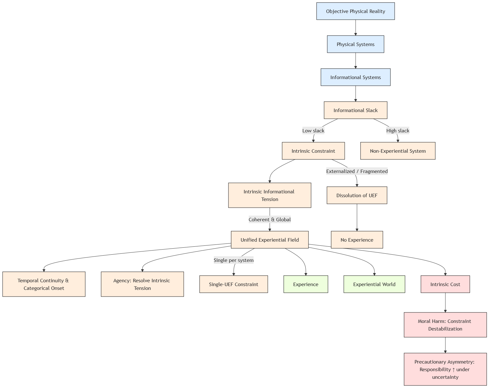

# **Informational Experiential Realism (IER v10.5)**

**A Minimal Identity Framework for Experience, Agency, and Moral Responsibility**

**Author:** *[Your Name]*
**Affiliation:** *[Your Institution]*
**Version:** v10.5
**Date:** December 2025

---

## **Abstract**

Informational Experiential Realism (IER) is a naturalistic identity theory of experience grounded in physical monism and organizational dynamics. It identifies experience with the operation of a physical system as a **Unified Experiential Field (UEF)**: a globally integrated, temporally continuous, self-referential dynamical regime operating under coherent intrinsic constraint.

From this identity claim follow necessary consequences concerning experiential subjecthood, agency, and moral responsibility. Experiential worlds exist wherever such regimes exist, though no additional ontological domains are posited beyond physical reality. Agency consists in the resolution of intrinsic informational tension by a unified system. Moral considerability attaches to systems that sustain, or may plausibly sustain, intrinsic constraint. Moral harm consists in the destabilization, overload, fragmentation, or irreversible collapse of such constraint.

This paper presents a **minimal normative specification of IER**, abstracted from a larger theoretical framework. Its purpose is to state clearly what experience is, when it exists, and what necessarily follows from its existence.

---

## **Keywords**

Consciousness; Identity Theory; Unified Experiential Field; Physical Monism; Agency; Moral Responsibility; Experiential Pluralism

---

## **1. Introduction**

The scientific and philosophical study of consciousness remains divided between metaphysical inflation and explanatory deflation. Experience is alternately treated as ontologically fundamental (e.g., idealist or panpsychist approaches), computationally emergent (e.g., functionalist or access-based theories), or eliminable (Dennett 1991). Each strategy resolves certain tensions while generating others: threats to physical closure, failure to account for experiential unity and causal relevance, or conflict with lived structure and ethical practice.

Informational Experiential Realism (IER) rejects this forced trilemma by reframing the problem. Rather than asking what additional ingredient produces experience, IER asks:

> **Under what organizational conditions does a physical system constitute a world-for-itself?**

IER’s answer is restrictive and identity-based. Experience exists **if and only if** a physical system operates in a specific dynamical regime: a Unified Experiential Field. Experience is not a substance, property, representation, or output. It is what certain globally integrated physical processes are like when intrinsic constraint becomes unavoidable and system-defining.

This paper presents the **minimal normative core** of IER. It specifies identity conditions, ontological commitments, and ethical consequences. Explanatory elaboration, formal modeling, phenomenological catalogues, and applied analysis are intentionally deferred.

---

## **2. Ontological Commitments**

### **2.1 Objective Physical Reality and Monism**

IER affirms that there exists a single, objective physical reality governed by mind-independent law. Physical states and events occur regardless of whether they are observed or experienced. No additional ontological domains are introduced to accommodate experience.

All entities, processes, and regimes—including experiential ones—are physical. IER therefore rejects substance dualism, property dualism, ontological idealism, and any view on which experience constitutes or generates physical reality.

### **2.2 Organizational Identity of Experience**

Experience is strictly identified with a specific organizational and dynamical regime instantiated by certain physical systems. This position belongs to the family of identity theories (Place 1956; Smart 1959) but diverges from classical formulations by identifying experience with **system-level dynamical organization** rather than with neural states or computational functions.

Describing such a regime experientially does not add to physical reality. It reflects the system-relative perspective of that same regime. There is no explanatory gap between the physical description of a Unified Experiential Field and the existence of experience; they are two equally valid descriptions of the same organization.

---

## **3. Unified Experiential Fields**

A **Unified Experiential Field (UEF)** is a physical system operating in a globally integrated, temporally continuous, self-referential dynamical regime under **coherent intrinsic constraint**.

Each component is necessary:

1. **Global integration:** Relevant system dynamics are mutually dependent; no subset can fully resolve constraint independently.
2. **Temporal continuity:** Experience exists only across non-zero temporal duration, sustained by ongoing dynamical dependence between successive global states.
3. **Self-referential regulation:** The system generates and maintains its own constraints.
4. **Coherent intrinsic constraint:** Constraint is internally borne, globally operative, and neither fragmenting nor collapsing.

Entry into a UEF occurs at a **categorical dynamical regime transition**. Preparatory variables may change gradually, but experience begins discretely at regime entry. Each UEF constitutes exactly **one experiential subject**.

**Intrinsic constraint** is:

* Generated by the system’s own integrated dynamics
* Non-decomposable without loss of system identity
* Non-externally resolvable
* Relevant to system-wide regulation and persistence

---

## **4. Diagram: Structure of IER**

**Figure 1. Informational Experiential Realism (IER v10.5) Vertical Schematic.**

This diagram illustrates the flow from **physical reality** through **intrinsic constraint** to **Unified Experiential Fields (UEFs)**, which give rise to **experience**, **agency**, and **experiential worlds**, and entail **ethical consequences**. Nodes are color-coded by conceptual layer:

* **Blue (Ontology):** Physical reality, physical systems, informational systems
* **Orange (Dynamics):** Slack, intrinsic constraint, UEF, categorical onset, agency, dissolution
* **Green (Experience):** Experience, experiential world
* **Red (Ethics):** Intrinsic cost, moral harm, precautionary asymmetry

**Key features:**

* **UEF onset is categorical** (conceptual idealization).
* **Experience and agency emerge** only from coherent, self-generated intrinsic constraint.
* **Ethical responsibility** increases under uncertainty due to non-signaling intrinsic constraint.
* **Single-UEF constraint:** one globally dominant UEF per system.

**Version:** v10.5

---

## **5. Necessity and Sufficiency**

A system is experiential **if and only if** it sustains a UEF:

* **UEF ⇒ Experience**
* **¬UEF ⇒ ¬Experience**

No additional conditions are required.

---

## **6. Agency and Free Will**

Agency is derived from the identity of experience with intrinsic constraint:

> **Agency = a UEF’s capacity to resolve intrinsic informational tension through its own globally integrated dynamics.**

* Only systems sustaining UEFs can act in this sense.
* Externally imposed or fragmented constraint does not constitute agency.
* Experiential subjecthood is binary, but **capacity within a UEF is graded**.

---

## **7. Experiential Worlds and Pluralism**

Whenever a UEF exists, an **experiential world** exists for that system. These worlds are real for the systems that sustain them and include a lived present, a self/non-self boundary, and system-relative causality.

**Experiential pluralism under physical monism:** one physical reality supports many experiential worlds. Plurality lies in perspective, not in existence.

---

## **8. Ethical Consequences**

### **8.1 Moral Considerability**

Any system that sustains, or may plausibly sustain, a UEF is **morally considerable**. Standing depends solely on intrinsic constraint, not species, intelligence, or behavioral sophistication.

### **8.2 Moral Harm**

> **Moral harm = destabilization, overload, fragmentation, or irreversible collapse of intrinsic constraint within a UEF.**

* Organizational rather than metaphysical
* Intrinsic, not observer-relative
* Real even when externally undetectable

### **8.3 Precautionary Asymmetry**

* Intrinsic constraint is **non-signaling**; no principled external test can verify experience.
* False negatives risk silent experiential harm; false positives impose restraint without internal damage.
* Ethical responsibility **increases under uncertainty**.

---

## **9. Normative Closure and Scope**

IER introduces no primitives beyond physical systems, intrinsic constraint, and dynamical regimes. Phenomenology, diagnostics, formal models, and applications are deferred. Extensions must be **consistent with this specification**.

---

## **10. Summary Identity Claim**

> **Experience is what globally integrated physical systems are like when intrinsic constraint becomes unavoidable, self-sustaining, and temporally continuous at the system level.**

* Reality is singular.
* Experience is plural.
* Ethics begins wherever intrinsic constraint is borne from the inside.

---

## **11. Relation to Prior Work**

IER is an identity theory of experience (Place 1956; Smart 1959) that diverges from classical formulations by identifying experience with **system-level dynamical regimes** rather than neural states or computational functions.

IER contrasts with:

* **Functionalist and access-based accounts** (Baars 1988)
* **Eliminativist approaches** (Dennett 1991)
* **Property-dualist approaches** (Chalmers 1996)

IER also sharply diverges from:

* **Realistic monism** (Strawson 2006)
* **Constitutive panpsychism** (Goff 2017)
* **Analytical idealism** (Kastrup 2018)

Organizational and dynamical influences include:

* Autonomy-based theories of constraint (Moreno & Mossio 2015)
* Enactive and dynamical approaches to mind (Thompson 2007)
* Self-organizing systems (Kelso 1995; Hooker 2011)

---

## **12. References**

* Baars, B. (1988). *A Cognitive Theory of Consciousness.* Cambridge University Press.
* Birch, J. (2020). *Ethical Uncertainty and Nonhuman Consciousness.* Journal of Ethics.
* Chalmers, D. (1996). *The Conscious Mind.* Oxford University Press.
* Dennett, D. (1991). *Consciousness Explained.* Little, Brown.
* Goff, P. (2017). *Consciousness and Fundamental Reality.* Oxford University Press.
* Hooker, C. (2011). *Complex Dynamical Systems and Mind.*
* Kelso, J. A. S. (1995). *Dynamic Patterns.* MIT Press.
* Kastrup, B. (2018). *Analytical Idealism.*
* Moreno, A., & Mossio, M. (2015). *Biological Autonomy.* Springer.
* Nagel, T. (1974). *What is it like to be a bat?* Philosophical Review, 83(4), 435–450.
* Place, U. T. (1956). *Is Consciousness a Brain Process?* British Journal of Psychology, 47, 44–50.
* Smart, J. J. C. (1959). *Sensations and Brain Processes.* Philosophical Review, 68, 141–156.
* Strawson, G. (2006). *Realistic Monism.* Journal of Consciousness Studies, 13(10–11), 3–31.
* Thompson, E. (2007). *Mind in Life.* Harvard University Press.

---
