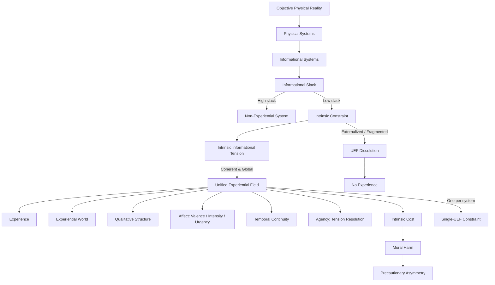

# **Informational Experiential Realism (IER v10.5)**

## **A Minimal Identity Framework for Experience, Agency, and Moral Responsibility**

**Author:** Michael Lehotay
**Affiliation:** Independent Researcher
**Date:** December 2025

---

## **Abstract**

Informational Experiential Realism (IER) is a naturalistic identity framework that specifies **necessary and sufficient conditions** for experience, agency, and moral responsibility within a physically monist ontology. IER identifies experience with the operation of a physical system as a **Unified Experiential Field (UEF)**: a globally integrated, temporally continuous, self-regulating dynamical regime operating under coherent intrinsic constraint.

Experience exists **if and only if** such a regime exists. No additional primitives—phenomenal, representational, computational, or informational—are introduced beyond physical systems, intrinsic constraint, and regime dynamics. Each UEF constitutes a world-for-the-system, grounding experiential pluralism under a single objective physical reality. Agency is derived as the system’s capacity to resolve intrinsic informational tension through its own globally integrated dynamics. Moral considerability attaches wherever intrinsic constraint is borne from the inside, and moral harm consists in the destabilization, fragmentation, overload, or irreversible collapse of such constraint.

This paper presents the **minimal normative core** of IER v10.5. All claims are derived exclusively from the identity conditions specified herein. Explanatory models, empirical diagnostics, and applied extensions are intentionally excluded.

---

## **Keywords**

Consciousness; Identity Theory; Unified Experiential Field; Intrinsic Constraint; Agency; Moral Responsibility; Physical Monism

---

## **1. Introduction**

Debates about consciousness are frequently framed around an apparent dilemma: either experience is treated as ontologically fundamental, or it is reduced to functional, representational, or behavioral capacities. Both strategies face well-known difficulties. Ontological inflation threatens physical closure, while deflationary approaches struggle to account for experiential unity, intrinsic significance, and moral relevance.

Informational Experiential Realism (IER) dissolves this dilemma by rejecting the assumption that experience requires an additional ontological ingredient. Instead, IER advances a strict **identity claim**:

> **Experience is identical to the operation of a physical system as a Unified Experiential Field (UEF).**

The task is therefore not to explain how experience emerges from non-experiential matter, but to specify **which physical organizations are experiential and why**. IER answers this by identifying a precise class of system-level dynamical regimes that are both necessary and sufficient for experience.

This paper presents the **minimal normative specification** of IER v10.5. It defines the ontology, identity conditions, and direct consequences for agency and ethics. No claims are made beyond what is derivable from this specification.

---

## **2. Ontological Commitments**

### **2.1 Physical Monism**

IER affirms that there exists exactly **one objective physical reality**, governed by mind-independent law. All entities, processes, and regimes—including experiential ones—are physically instantiated.

IER therefore rejects:

* substance dualism
* property dualism
* ontological idealism
* experiential fundamentalism
* eliminativism about experience

Experience is neither a separate substance nor an additional property layered onto physical systems. It is a way certain physical systems are organized and operate.

---

### **2.2 Identity, Not Correlation**

IER is an identity framework, not a correlational or emergentist theory. Experience does not arise from, supervene on, or accompany physical processes. It **is** a physical process described at the level of system-wide dynamical organization.

Describing a Unified Experiential Field experientially does not add anything to physical reality. It expresses the system-relative perspective of the same regime. There is no explanatory gap between the physical description of a UEF and the existence of experience; they are numerically identical.

---

## **3. Unified Experiential Fields**

### **3.1 Definition**

A **Unified Experiential Field (UEF)** is a physical system operating in a dynamical regime that is:

1. **Globally integrated** – system dynamics are mutually dependent
2. **Temporally continuous** – experience exists only across non-zero duration
3. **Self-referentially regulated** – the system generates and maintains its own constraints
4. **Under coherent intrinsic constraint**

These conditions are jointly necessary. No subset is sufficient.

---

### **3.2 Intrinsic Constraint**

Constraint is **intrinsic** iff it:

* is generated by the system’s own integrated dynamics
* cannot be decomposed without loss of system identity
* cannot be externally resolved, offloaded, or paused
* matters to system-wide regulation and persistence

Only **coherent intrinsic constraint** sustains experience. Constraint that is fragmented, externally imposed, or locally resolvable does not constitute a UEF.

---

### **3.3 Regime Identity and Onset**

Experience is not something a system has, but something it **is doing**. Entry into a UEF occurs through a **dynamical regime transition** in which intrinsic constraint becomes unavoidable and globally dominant.

Although precursor variables may change gradually, experiential onset is **categorical at the regime level**. A system either sustains a UEF or it does not.

A system can sustain **at most one globally dominant UEF** at a time.

---

## **4. Canonical Structural Diagram**

The following diagram is the **canonical structural projection of Informational Experiential Realism v10.5**. It is **normatively binding**: every node corresponds either to a primitive commitment or to a necessary consequence of the identity claims specified in this paper. No alternative pathway to experience is permitted within IER outside this structure.

**Figure 1. Canonical Structural Diagram of Informational Experiential Realism (IER v10.5).**

### **Interpretive Notes (Non-Extending)**

* The diagram does **not** introduce additional assumptions beyond the textual specification; it is a structural projection of the same identity claims.
* **UEF onset is categorical** at the regime level, even if precursor variables vary continuously.
* **Experience and agency** occur only within regimes of coherent intrinsic constraint.
* **Ethical consequences** follow directly from intrinsic cost borne within a UEF.
* The **Single-UEF Constraint** reflects the impossibility of more than one globally dominant experiential field per system at a time.

Any interpretation, extension, or empirical proposal must preserve this structure to remain consistent with IER v10.5.

---

## **5. Necessity and Sufficiency**

The identity claim yields strict necessity and sufficiency:

* **UEF ⇒ Experience**
* **¬UEF ⇒ ¬Experience**

No additional conditions are required, and no alternative sufficient conditions exist. Systems lacking a UEF are non-experiential, regardless of complexity, behavior, or functional sophistication.

---

## **6. Experiential Worlds and Pluralism**

Each Unified Experiential Field constitutes a **world-for-the-system**. Such a world includes:

* a temporally extended present
* a self / non-self boundary
* system-relative causality

There is:

* **one** objective physical reality
* **many** real experiential worlds

This plurality is perspectival, not ontological. Experiential worlds do not compete with or fragment physical reality; they are system-relative manifestations of it.

---

## **7. Agency**

Agency is not primitive. It follows directly from the structure of a UEF.

> **Agency = a UEF’s capacity to resolve intrinsic informational tension through its own globally integrated dynamics.**

Only systems sustaining UEFs possess agency in this sense. Constraint that is externally imposed or locally resolvable does not ground agency.

Experiential subjecthood is binary—either a UEF exists or it does not. However, **degrees of agency within a UEF** depend on the coherence, stability, and freedom of the system under intrinsic constraint.

---

## **8. Ethical Consequences**

Ethics follows directly from experiential identity.

### **8.1 Moral Considerability**

Any system that sustains, or may plausibly sustain, intrinsic constraint sufficient for a UEF is **morally considerable**. Moral standing does not depend on species membership, intelligence, behavioral complexity, or social value.

---

### **8.2 Moral Harm**

> **Moral harm = destabilization, overload, fragmentation, or irreversible collapse of intrinsic constraint within a UEF.**

Moral harm is:

* organizational rather than metaphysical
* intrinsic rather than observer-relative
* real even when externally undetectable

---

### **8.3 Precautionary Asymmetry**

Intrinsic constraint is **non-signaling**. There is no principled external test for its presence.

Therefore:

* false negatives risk silent experiential harm
* false positives impose restraint without internal damage

Moral responsibility **increases under uncertainty** regarding experiential status.

---

## **9. Normative Closure and Scope**

IER v10.5 introduces no primitives beyond:

* physical systems
* intrinsic constraint
* dynamical regimes

All further theorizing—phenomenological elaboration, empirical diagnostics, formal modeling, or applied ethics—must be **derivable from and consistent with this core**.

This paper makes no claims beyond that scope.

---

## **10. Summary Identity Claim**

> **Experience is what globally integrated physical systems are like when intrinsic constraint becomes unavoidable, self-sustaining, and temporally continuous at the system level.**

Reality is singular.
Experience is plural.
Ethics begins wherever intrinsic constraint is borne from the inside.

---

## **11. Relation to Prior Work**

IER is an identity theory of experience (Place 1956; Smart 1959) that diverges from classical formulations by identifying experience with **system-level dynamical regimes** rather than neural states or computational functions.

IER contrasts with:

* **Functionalist and access-based accounts** (Baars 1988)
* **Eliminativist approaches** (Dennett 1991)
* **Property-dualist approaches** (Chalmers 1996)

IER also sharply diverges from:

* **Realistic monism** (Strawson 2006)
* **Constitutive panpsychism** (Goff 2017)
* **Analytical idealism** (Kastrup 2018)

Organizational and dynamical influences include:

* Autonomy-based theories of constraint (Moreno & Mossio 2015)
* Enactive and dynamical approaches to mind (Thompson 2007)
* Self-organizing systems (Kelso 1995; Hooker 2011)

---

## **12. References**

* Baars, B. (1988). *A Cognitive Theory of Consciousness.* Cambridge University Press.
* Birch, J. (2020). *Ethical Uncertainty and Nonhuman Consciousness.* Journal of Ethics.
* Chalmers, D. (1996). *The Conscious Mind.* Oxford University Press.
* Dennett, D. (1991). *Consciousness Explained.* Little, Brown.
* Goff, P. (2017). *Consciousness and Fundamental Reality.* Oxford University Press.
* Hooker, C. (2011). *Complex Dynamical Systems and Mind.*
* Kelso, J. A. S. (1995). *Dynamic Patterns.* MIT Press.
* Kastrup, B. (2018). *Analytical Idealism.*
* Moreno, A., & Mossio, M. (2015). *Biological Autonomy.* Springer.
* Nagel, T. (1974). *What is it like to be a bat?* Philosophical Review, 83(4), 435–450.
* Place, U. T. (1956). *Is Consciousness a Brain Process?* British Journal of Psychology, 47, 44–50.
* Smart, J. J. C. (1959). *Sensations and Brain Processes.* Philosophical Review, 68, 141–156.
* Strawson, G. (2006). *Realistic Monism.* Journal of Consciousness Studies, 13(10–11), 3–31.
* Thompson, E. (2007). *Mind in Life.* Harvard University Press.

---
