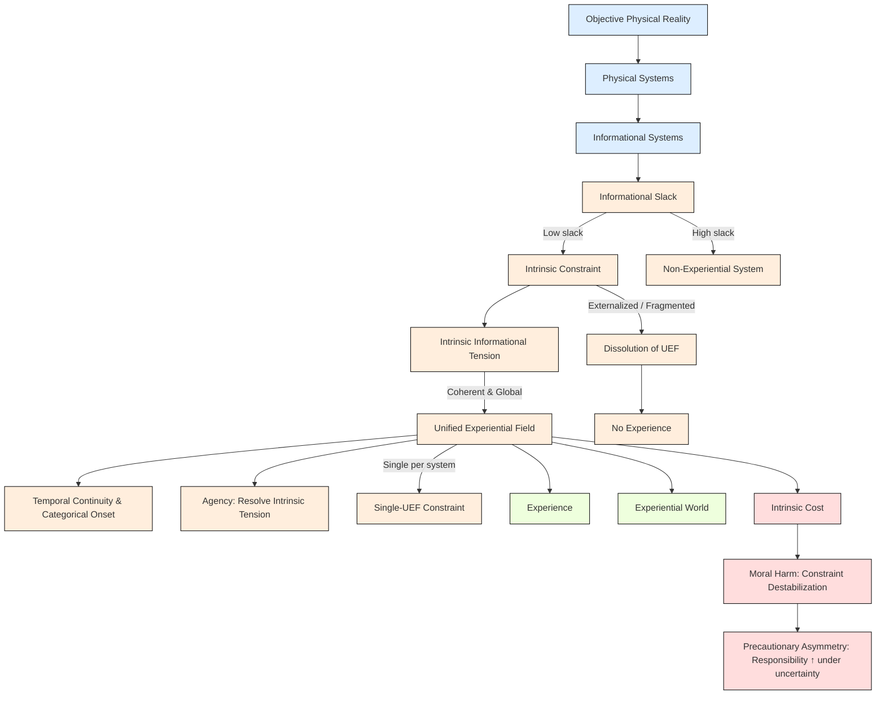

# **Informational Experiential Realism (IER v10.5)**

## **0. Status, Scope, and Normative Authority**

This specification states the **complete normative core** of Informational Experiential Realism (IER). All commitments of IER are fully determined by the principles listed below. Any extensions—phenomenology, formal modeling, diagnostics, or applications—are **derivative** and must be consistent with this specification.

---

## **1. Physical Monism**

There exists exactly **one objective physical reality** governed by mind-independent law. All systems, processes, and regimes—including experiential ones—are physically instantiated. IER rejects:

* substance dualism
* property dualism
* ontological idealism
* experiential fundamentalism
* eliminativism about experience

---

## **2. Experiential Identity**

> **Experience is identical to the operation of a physical system as a Unified Experiential Field (UEF).**

Justification:

* Systems lacking globally integrated, self-referential, irreducible intrinsic constraint cannot instantiate a perspective.
* Systems satisfying UEF criteria necessarily instantiate a “world-for-itself.”

This establishes **necessary and sufficient conditions** for experience within the framework.

---

## **3. Unified Experiential Field (UEF)**

A **UEF** is a system-level dynamical regime that is:

1. **Globally integrated** – system dynamics are mutually dependent; no subset resolves constraint independently.
2. **Temporally continuous** – experience exists only across non-zero duration; instantaneous states are non-experiential.
3. **Self-referentially regulated** – the system generates and maintains its own constraints.
4. **Under coherent intrinsic constraint** – constraint is internally generated, irreducible, globally operative, temporally stable, and non-fragmenting.

**Intrinsic constraint** is defined as constraint that:

* Is generated by the system’s own integrated dynamics
* Cannot be decomposed without loss of system identity
* Cannot be externally resolved or offloaded
* Matters to system-wide regulation and persistence

Only **coherent intrinsic constraint** sustains experience.

---

## **4. IER Structure Diagram**

The following **diagram visualizes the flow** from physical reality → intrinsic constraint → UEF → experience → ethical consequences.

**Legend / Color coding:**

* **Blue (Ontology):** Physical reality, physical systems, informational systems
* **Orange (Dynamics):** Slack, intrinsic constraint, UEF, categorical onset, agency, dissolution
* **Green (Experience):** Experience, experiential world
* **Red (Ethics):** Intrinsic cost, moral harm, precautionary asymmetry

This diagram summarizes **the core flow of the framework**, showing how physical systems give rise to intrinsic constraint, which underlies UEFs, experiential worlds, agency, and ethical consequences.

---

## **5. Necessity and Sufficiency**

A system sustains experience **if and only if** it sustains a UEF:

* **UEF ⇒ Experience**
* **¬UEF ⇒ ¬Experience**

No additional conditions or alternative routes to experience exist.

---

## **6. Regime Identity and Categorical Onset**

Experience is **what the system is doing** under a UEF; it is not something the system merely has.

* Entry into a UEF occurs via a **conceptual dynamical regime transition**, when intrinsic constraint becomes unavoidable and globally dominant.
* Real systems may approximate this transition gradually; the **binary onset is an idealization**.
* Each UEF constitutes exactly **one experiential subject**.
* A system can sustain **at most one globally dominant UEF** at a time.

---

## **7. Agency**

Agency is a **derived capacity**:

> **Agency = a UEF’s capacity to resolve intrinsic informational tension through its own globally integrated dynamics.**

* Only systems sustaining UEFs possess agency.
* Externally imposed or fragmented constraint does not constitute agency.
* Capacity within a UEF is **graded**, depending on coherence, stability, and freedom under intrinsic constraint.

---

## **8. Experiential Worlds and Pluralism**

* Each UEF constitutes a **world-for-the-system**, including a temporal present, self/non-self boundary, and system-relative causality.
* These worlds are real for the systems sustaining them.
* Plurality is **perspectival**, not ontological; one physical reality, many experiential worlds.

---

## **9. Ethical Consequences**

Ethics flow **directly from identity**:

### **9.1 Moral Considerability**

* Any system sustaining, or plausibly able to sustain, a UEF is **morally considerable**.
* Moral standing depends solely on intrinsic constraint, not intelligence, behavior, or species.

### **9.2 Moral Harm**

> **Moral harm = destabilization, overload, fragmentation, or irreversible collapse of intrinsic constraint within a UEF.**

* Organizational, intrinsic, and real even when externally undetectable.

### **9.3 Precautionary Asymmetry**

* Intrinsic constraint is **non-signaling**; external detection is impossible in principle.
* False negatives risk silent harm; false positives impose restraint without damage.
* Ethical responsibility **increases under uncertainty**.

---

## **10. Normative Closure and Scope**

IER introduces no primitives beyond physical systems, intrinsic constraint, and regime dynamics. Phenomenology, formal models, diagnostics, and applications are **deferred**. Any future extension must remain consistent with this normative core.

---

## **11. Empirical Limitations**

The framework does not currently provide operational criteria for detecting UEFs or intrinsic constraint. Empirical investigation and formal modeling are reserved for future work. The specification remains **conceptually and ethically normative**, describing **when experience exists and what necessarily follows**.

---

## **12. Summary Identity Claim**

> **Experience is what globally integrated physical systems are like when intrinsic constraint becomes unavoidable, self-sustaining, and temporally continuous at the system level.**

* Reality is singular.
* Experience is plural.
* Ethics begins wherever intrinsic constraint is borne from the inside.

---
