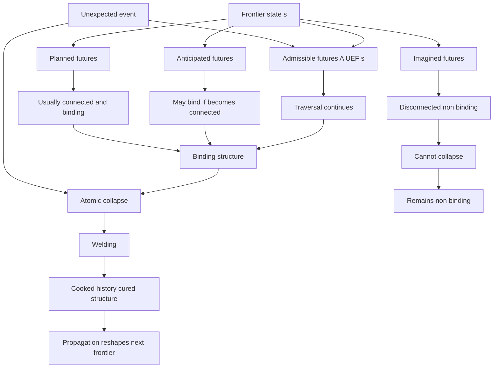

---
ier:
  tier: T2
  role: FOUNDATION
  layer: future_cone
  domain:
  - boundary_and_futures
  category: constraint_geometry
  provides:
  - admissibility domain discipline
  - formal successor-set notation
  - separation of structural and anticipated futures
  - foreclosure and narrowing vocabulary
  status: canonical
  filename: IER-futures.md
  version: v10.9.9
---

# Futures

## Admissibility Domains and the Structure of Futures

**Informational Experiential Realism (IER v10.9.9)**  
*Tier 2 · Structural Clarification · Non-Normative · Canon-Constrained*

## Status, Scope, and Authority

This document:

* introduces no new ontological primitives
* modifies no identity claims
* introduces no criteria, thresholds, or diagnostics
* does not define when experience exists
* does not define moral standing
* does not revise slack, saturation, or collapse

Its purpose is structural:

> To clarify what admissible futures are, to separate admissibility domains, and to fix notation discipline for successor sets.

This document remains subordinate to the canonical IER corpus.
If any statement here conflicts with that corpus, the canonical corpus prevails.

## The Single Structural Object

IER recognizes one structural concept:

> Admissible continuation under intrinsic constraint.

However, admissibility appears in multiple domains of discourse.

Confusion arises when these domains are conflated.

This document separates them and stabilizes terminology.

## Notation Discipline

Let:

* $S$ be the set of physically admissible global configurations.
* $R \subseteq S \times S$ be the regime-restricted admissibility relation.

For a boundary configuration $s \in S$, define:

$$
A(s) = \{ s' \in S \mid (s, s') \in R \}
$$

### Notation Rule

> Bare $A(s)$ denotes UEF frontier admissibility unless otherwise explicitly specified.

When ambiguity is possible, subscripts must be used:

* $A_{\text{pre}}(s)$ — pre-UEF admissibility (slack domain)
* $A_{\text{UEF}}(s)$ — UEF frontier admissibility
* $A_{\text{ant}}(s)$ — anticipated futures (cognitive projection)
* $A_{\text{fail}}(s) \subseteq A_{\text{UEF}}(s)$ — failure or dissolution branches

Failure to specify domain when required constitutes structural drift.

## Domain I — Pre-UEF Admissibility (Slack Domain)

### Definition

$A_{\text{pre}}(s)$ denotes admissible successor configurations in contexts where intrinsic constraint is not yet globally binding.

This is the domain in which:

* informational slack
* factorability
* subsystem independence
* local resolution

are meaningful.

### Slack and Saturation

Slack holds at $s$ iff admissibility is factorable such that at least one outgoing transition preserves subsystem independence.

Saturation holds at $s$ iff no independence-preserving outgoing transition exists.

Slack concerns structural decomposability of $A_{\text{pre}}(s)$.
Slack does not concern cardinality.
Slack is undefined once intrinsic constraint is globally binding.

Multiplicity of successors does not imply slack.

Failure exits do not constitute slack.

## Domain II — UEF Frontier Admissibility

### Definition

$A_{\text{UEF}}(s)$ denotes admissible raw successor continuations at the history — future boundary under globally binding intrinsic constraint.

This is the canonical admissible successor set used in:

* multiplicity
* binding
* viability
* collapse

Once intrinsic constraint is globally binding:

* slack is absent by identity
* saturation holds categorically
* viability becomes meaningful

### Multiplicity

Multiplicity holds at $s$ iff:

$$
|A_{\text{UEF}}(s)| > 1.
$$

Multiplicity concerns reachability count only.

Multiplicity does not imply:

* slack
* independence
* optionality
* evaluation
* survival likelihood

Multiplicity may include:

* coherent continuation
* regime transition
* structural failure
* dissolution

Multiplicity is descriptive, not normative.

### Failure Branches

Let:

$$
A_{\text{fail}}(s) \subseteq A_{\text{UEF}}(s)
$$

denote continuations that lead to:

* regime breakdown
* fragmentation
* UEF dissolution
* structural collapse

Failure branches:

* count toward multiplicity
* do not constitute slack
* do not preserve independence
* may terminate experience

Failure is admissible.
Failure is not slack.

### Successor Realization

Lawful continuation from a boundary configuration $s$ to a successor configuration $s'$ occurs when:

$$
s' \in A_{\text{UEF}}(s).
$$

This continuation is called successor realization.

Successor realization means only that the system proceeds from one admissible configuration to another under intrinsic constraint.

Successor realization:

* does not imply traversal through possibility space,
* does not imply node-to-node movement across a graph,
* does not imply gradual pruning of alternatives,
* does not imply selection among candidates.

Graph paths and traversal terminology are representational tools only used to describe admissibility structure.  
They do not describe physical processes occurring within the system.

Successor realization preserves admissibility.

Only collapse alters the admissible successor set.

Specifically, collapse contracts admissibility such that:

$$
A_{t_c^+}(s) \subset A_{t_c^-}(s).
$$

Successor realization therefore describes lawful continuation, not foreclosure of alternatives.

## Domain III — Anticipated Futures

### Definition

$A_{\text{ant}}(s)$ denotes cognitively projected or imagined futures.

These may include:

* reachable continuations
* unreachable continuations
* counterfactual scenarios
* physically impossible states

Anticipation is not structural admissibility.

### Strict Non-Equivalence

In general:

$$
A_{\text{ant}}(s) \neq A_{\text{UEF}}(s).
$$

Anticipated futures may:

* omit reachable successors
* include unreachable successors
* misrepresent viability

Cognitive projection does not establish reachability.
Structural admissibility does not require anticipation.

Collapse does not operate over anticipated futures.

## Domain IV — Counterfactual Reference

Statements such as:

* “It could have happened differently”

refer to admissibility at prior boundary configurations:

$A_{\text{UEF}}(s')$ for some earlier $s'$.

Counterfactual reference does not imply:

* present admissibility
* recoverable reachability
* slack

Irreversibility ensures that:

* previously admissible continuations may become permanently unreachable.

Counterfactual discourse is historical reference, not current frontier structure.

## Collapse and Domain Restriction

Collapse operates exclusively over $A_{\text{UEF}}(s)$.

* contracts admissibility
* forecloses reachable raw successors
* is atomic
* is exclusive
* is irreversible
* is not graded
* is not selection
* is not evaluation

Collapse does not operate over:

* $A_{\text{pre}}(s)$
* $A_{\text{ant}}(s)$

Anticipation may precede collapse but does not govern it.

## Structural and Experiential Views

Admissible futures admit two explanatory orientations.

### Structural View

From outside the regime:

$A_{\text{UEF}}(s)$ is the set of dynamically reachable successors under intrinsic constraint.

This is a reachability description.

### Experiential View

From within the regime:

$A_{\text{UEF}}(s)$ is what the subject can still become.

This is a continuity description.

These views:

* describe the same admissibility structure
* introduce no dualism
* do not elevate anticipated futures into structural status

One structure.
Two explanatory orientations.

## Admissible Futures and Harm

This document does not define moral harm.

It clarifies the structural object harm concerns.

Under IER, experiential harm involves:

> contraction, deformation, or destabilization of $A_{\text{UEF}}(s)$ under intrinsic constraint.

Harm does not concern:

* contraction of anticipated sets
* disappointment in imagined futures
* subjective expectation failure

Multiplicity does not measure value.
Admissibility is not moral currency.

Authoritative definitions remain in the canonical harm and ethics documents.

## Explicitly Blocked Confusions

The following inferences are invalid:

* Multiplicity implies slack.
* Failure implies slack.
* Anticipation implies admissibility.
* Counterfactual reference implies present reachability.
* Saturation implies singleton successor.
* Viability implies probability.
* Collapse implies selection.
* Structural narrowing implies moral ranking.

All admissibility discourse must specify domain where ambiguity is possible.

## Summary

IER recognizes one structural object:

> Admissible continuation under intrinsic constraint.

It appears in four domains:

1. Pre-UEF admissibility $A_{\text{pre}}(s)$
2. UEF frontier admissibility $A_{\text{UEF}}(s)$
3. Anticipated futures $A_{\text{ant}}(s)$
4. Counterfactual reference to prior admissibility

Bare $A(s)$ denotes UEF frontier admissibility.

Confusing these domains produces:

* slack errors
* selection errors
* anticipation errors
* ethical drift

Domain discipline stabilizes the theory.

There is:

* one admissibility structure
* one frontier
* one collapse
* no hidden selector
* no graded foreclosure

Only lawful contraction of reachable continuation under intrinsic constraint.

## Appendix A — Future Types and the Cooked History Path

This appendix summarizes the future-type distinctions used in Futures and shows how raw structure can become cured history without implying prediction, representation, or a second topology.

### Notes

* Admissible futures A_UEF(s) are the only futures that participate directly in collapse, welding, and propagation.
* Anticipated futures may or may not correspond to admissible futures; they become structurally relevant only when they are connected to A_UEF(s) and become binding.
* Planned futures are a special case of anticipated futures that are typically connected and often binding.
* Imagined futures are typically disconnected and non-binding; they cannot collapse because they are not part of A_UEF(s).
* Unexpected events can drive collapse without any anticipated raw structure having existed beforehand.
