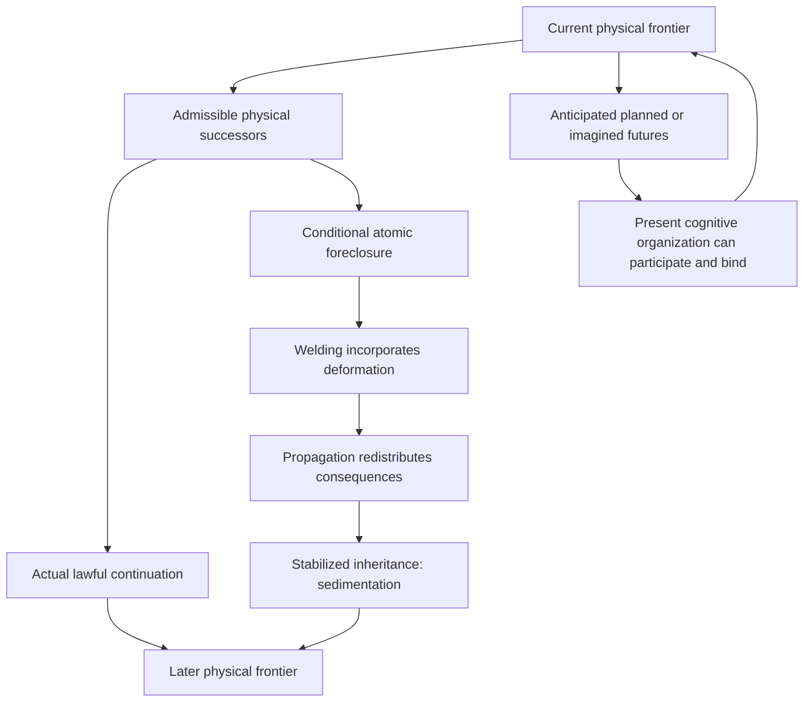

---
ier:
  tier: T2
  role: FOUNDATION
  layer: future_cone
  domain:
  - boundary_and_futures
  category: constraint_geometry
  provides:
  - UC011
  - UC013
  - UI033
  status: canonical
  filename: IER-futures.md
  version: v10.11.5
  requires:
    hard:
    - IER-specification
    - IER-math
    structural:
    - IER-slack
    - IER-saturation
    - IER-multiplicity
    - IER-collapse
    - IER-continuity
    - IER-pipeline
    - IER-binding
    guardrails:
    - IER-canon
    - IER-nonentailment
    - IER-ethics
---

# Futures

## Admissibility Domains and the Structure of Futures

**Informational Experiential Realism (IER v10.11.5)**\
*T2 · FOUNDATION · Non-Normative · Canon-Constrained*

## Status, Scope, and Authority

This document:

* introduces no new ontological primitives
* modifies no identity claims
* introduces no criteria, thresholds, or diagnostics
* does not define when experience exists
* does not define moral standing
* does not revise slack, saturation, or collapse

Its purpose is structural:

> To clarify what admissible futures are, to separate admissibility domains, and to fix notation discipline for successor sets.

This document remains subordinate to the canonical IER corpus.
If any statement here conflicts with that corpus, the canonical corpus prevails.

## The Single Structural Object

IER recognizes one structural concept:

> Physical admissible continuation under the explicitly stated operative restriction.

However, admissibility appears in multiple domains of discourse.

Confusion arises when these domains are conflated.

This document separates them and stabilizes terminology.

## Notation Discipline

Fix the physical candidate boundary, grain, interval, frontier, and operative restriction. Let:

* $S$ be the relevant physical configuration domain.
* $T \subseteq S \times S$ be the lawful transition relation.
* $R \subseteq T$ be the operative regime-restricted admissibility relation.

For a boundary configuration $s \in S$, define:

$$ A(s) = \{ s' \in S \mid (s, s') \in R \} $$

### Notation Rule

> Bare $A(s)$ denotes the outgoing physical successor fibre under the stated operative restriction. It does not silently establish UEF qualification.

When ambiguity is possible, subscripts must be used:

* $A_{\text{pre}}(s)$ - pre-UEF admissibility (slack domain)
* $A_{\text{UEF}}(s)$ - UEF frontier admissibility
* $A_{\text{ant}}(s)$ - anticipated futures (cognitive projection)
* $A_{\text{fail}}(s) \subseteq A_{\text{UEF}}(s)$ - failure or dissolution branches

Failure to specify domain when required constitutes structural drift.

## Domain I - Pre-UEF Admissibility (Slack Domain)

### Definition

$A_{\text{pre}}(s)$ denotes admissible successor configurations in contexts where intrinsic constraint is not yet globally binding.

This is the domain in which:

* informational slack
* factorability
* subsystem independence
* local resolution

are meaningful.

### Slack and Saturation

Canonical slack concerns independence-preserving absorption, localization, deferral, or external resolution in this pre-UEF domain. A support-factorization claim must use subsystem projections of the same global fibre under physically meaningful predeclared partitions; independently unconstrained subsystem permissions are not a substitute.

Saturation is exhaustion of the relevant independence-preserving local-resolution pathways. Neither exhaustion alone nor exhaustion together with coherence establishes a qualifying UEF or entails collapse.

Slack concerns structural decomposability of $A_{\text{pre}}(s)$.
Slack does not concern cardinality.
Slack is undefined once intrinsic constraint is globally binding.

Multiplicity of successors does not imply slack.

Failure exits do not constitute slack.

## Domain II - UEF Frontier Admissibility

### Definition

$A_{\text{UEF}}(s)$ denotes admissible raw successor continuations at the history - future boundary under globally binding intrinsic constraint.

This is the canonical admissible successor set used in:

* multiplicity
* binding
* viability
* collapse

A qualifying UEF cannot independently offload the constraint borne by that same operation. Canonical slack and saturation retain their pre-UEF local-resolution domain; saturation is not redescribed as a categorical state inside the UEF. Viability describes graded sustainment under intrinsic constraint. Causal energy and material support do not thereby count as external resolution.

### Multiplicity

Multiplicity holds at $s$ iff:

$$ |A_{\text{UEF}}(s)| > 1. $$

Multiplicity concerns reachability count only.

Multiplicity does not imply:

* slack
* independence
* optionality
* evaluation
* survival likelihood

Multiplicity may include:

* coherent continuation
* regime transition
* structural failure
* dissolution

Multiplicity is descriptive, not normative.

### Failure Branches

Let:

$$ A_{\text{fail}}(s) \subseteq A_{\text{UEF}}(s) $$

denote continuations that lead to:

* regime breakdown
* fragmentation
* UEF dissolution
* failure of specified organization

Failure branches:

* count toward multiplicity
* do not constitute slack
* do not preserve independence
* may terminate experience

Failure is admissible.
Failure is not slack.

### Successor Realization

A realized lawful continuation from a boundary configuration $s$ to a successor configuration $s'$ must satisfy:

$$ s' \in A_{\text{UEF}}(s). $$

This continuation is called successor realization.

Successor realization means only that the system proceeds from one admissible configuration to another under intrinsic constraint.

Successor realization:

* does not imply traversal through possibility space,
* does not imply node-to-node movement across a graph,
* does not imply gradual pruning of alternatives,
* does not imply selection among candidates.

Graph paths represent possible continuation or actual physical succession, as stated; a graph is not a mechanism inside the system. Membership in the successor set establishes possibility, not actual realization.

Ordinary realization changes the frontier configuration. Later fibres, costs, margins, and directional geometry can differ without an atomic foreclosure event. Collapse alone names atomic irreversible foreclosure of a connected region; it need not remove every sibling or leave one successor.

Specifically, collapse contracts admissibility such that:

$$ A_{t_c^+}(s) \subset A_{t_c^-}(s). $$

The before/after comparison requires a common physical typing or justified mapping of successor alternatives. Changed labels or geometry alone do not establish strict contraction. Successor realization therefore describes lawful continuation; it does not by itself establish foreclosure.

## Domain III - Anticipated Futures

### Definition

$A_{\text{ant}}(s)$ denotes cognitively organized anticipated or imagined
futures relative to an already qualifying UEF. This notation records a
cognitive domain; it is not an additional physical successor relation.

These may include:

* reachable continuations
* unreachable continuations
* counterfactual scenarios
* physically impossible states

Anticipation is not structural admissibility.

### Strict Non-Equivalence

In general:

$$ A_{\text{ant}}(s) \neq A_{\text{UEF}}(s). $$

Anticipated futures may:

* omit reachable successors
* include unreachable successors
* misrepresent viability

Cognitive projection does not establish reachability.
Structural admissibility does not require anticipation.

Imagined futures are not foreclosed merely by ceasing to be imagined. The physically instantiated cognitive organization doing the imagining can nevertheless participate, bind, deform, and undergo owned resolution. Its imagined content must not be substituted for operative physical successors.

## Domain IV - Counterfactual Reference

Statements such as:

* “It could have happened differently”

refer to admissibility at prior boundary configurations:

$A_{\text{UEF}}(s')$ for some earlier $s'$.

Counterfactual reference does not imply:

* present admissibility
* recoverable reachability
* slack

Irreversibility ensures that:

* previously admissible continuations may become permanently unreachable.

Counterfactual discourse is historical reference, not current frontier structure.

## Collapse and Domain Restriction

Collapse operates exclusively over $A_{\text{UEF}}(s)$.

* contracts admissibility
* forecloses reachable raw successors
* is atomic
* is exclusive
* is irreversible
* is not graded
* is not selection
* is not evaluation

Collapse does not operate over:

* $A_{\text{pre}}(s)$
* $A_{\text{ant}}(s)$

Anticipation may precede collapse but does not govern it.

## Structural and Experiential Views

Admissible futures admit two explanatory orientations.

### Structural View

From outside the regime:

$A_{\text{UEF}}(s)$ is the set of dynamically reachable successors under intrinsic constraint.

This is a reachability description.

### Experiential View

From within the regime:

$A_{\text{UEF}}(s)$ is what the subject can still become.

This is an experiential orientation toward continuation, not proof that every successor preserves the same subject. Dissolution and token discontinuity can be admissible. Numerical persistence requires the full canonical stage relation, not just a path or a nonempty successor set.

These views:

* describe the same admissibility structure
* introduce no dualism
* do not elevate anticipated futures into structural status

One structure.
Two explanatory orientations.

## Admissible Futures and Harm

This document does not define moral harm.

It clarifies the structural object harm concerns.

The governing harm account concerns damage to the organization of a
qualifying UEF. Contraction, deformation, or destabilization of admissible
continuation can be relevant. Ordinary cost alone does not establish such damage.

A smaller anticipated set or disappointed expectation does not alone establish experiential harm. Disappointment can matter through the physically instantiated organization and consequences borne by a qualifying UEF. Geometry, successor count, and cost do not themselves supply an ethical ranking or harm threshold.

Multiplicity does not measure value.
Admissibility is not moral currency.

Authoritative definitions remain in the canonical harm and ethics documents.

## Explicitly Blocked Confusions

The following inferences are invalid:

* Multiplicity implies slack.
* Failure implies slack.
* Anticipation implies admissibility.
* Counterfactual reference implies present reachability.
* Saturation implies singleton successor.
* Viability implies probability.
* Collapse implies selection.
* Structural narrowing implies moral ranking.

All admissibility discourse must specify domain where ambiguity is possible.

## Summary

IER recognizes one structural object:

> Physical admissible continuation under the explicitly stated operative restriction.

It appears in four domains:

1. Pre-UEF admissibility $A_{\text{pre}}(s)$
2. UEF frontier admissibility $A_{\text{UEF}}(s)$
3. Anticipated futures $A_{\text{ant}}(s)$
4. Counterfactual reference to prior admissibility

Bare $A(s)$ remains domain-relative physical admissibility; qualifying UEF discourse must be explicit.

Confusing these domains produces:

* slack errors
* selection errors
* anticipation errors
* ethical drift

Domain discipline stabilizes the theory.

There is:

* one admissibility structure
* one frontier
* one typed meaning of collapse
* no hidden selector
* no graded foreclosure

Lawful continuation need not contain a fresh collapse, welding, propagation, or sedimentation episode. Those roles apply conditionally when foreclosure and its inheritance occur.

## Appendix A - Future Types and Conditional History

```mermaid
flowchart TD
A[Current physical frontier] --> B[Admissible physical successors]
A --> C[Anticipated planned or imagined futures]
B --> D[Actual lawful continuation]
D --> E[Later physical frontier]
B --> F[Conditional atomic foreclosure]
F --> G[Welding incorporates deformation]
G --> H[Propagation redistributes consequences]
H --> I[Stabilized inheritance: sedimentation]
I --> E
C --> J[Present cognitive organization can participate and bind]
J --> A
```

Plans and imagination are cognitive organizations, not further physical
successor sets. Their content can misdescribe reachability; their current
physical realization can still affect frontier organization. Unexpected
physical events can change admissibility without any prior anticipation.
The diagram distinguishes ordinary continuation from a conditional foreclosure
pipeline; it certifies neither ownership nor a physical instance of experience.

## Intermission - Structural Fact

What is imagined and what remains physically possible answer different questions.
