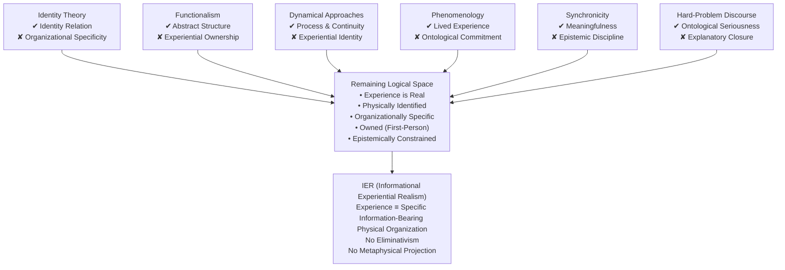

# **IER-history.md**

## **Historical Background: Identity, Dynamics, Meaning, and the Closure of Permissive Accounts**

**Tier:** 4 — Explanatory / Historical
**Status:** Non-normative
**Scope:** Historical context only
**Version:** v10.8.1-compatible

---

## **1. Purpose and Scope**

This document situates **Informational Experiential Realism (IER)** within the historical development of theories of mind and consciousness.

Its purpose is **explanatory only**. It does not argue for IER, introduce new ontological commitments, or revise any criterial or normative claims. All authoritative commitments of IER are defined exclusively in `IER-specification.md`.

The goal of this document is to clarify:

* which historical developments were **necessary for IER’s central identity claim to be intelligible**,
* why many closely related frameworks were **structurally insufficient**, and
* why the articulation of IER occurred **late in the historical sequence** rather than earlier.

This is not a survey of all theories of consciousness, nor a claim of intellectual influence. It is a **dependency analysis**: an account of what had to be in place—and what had to fail—for IER’s formulation to become possible.

---

## **2. The Persistent Historical Problem**

Across the second half of the twentieth century and into the early twenty-first, philosophy of mind and cognitive science repeatedly returned to a single unresolved question:

> **How can subjective experience exist in a world fully described by physical law?**

Different traditions addressed different aspects of this question:

* ontology (what exists),
* function (what systems do),
* structure (how systems are organized),
* phenomenology (what experience is like),
* explanation (what counts as understanding).

Despite substantial progress in each domain, no unified account emerged that simultaneously:

* treated experience as **ontologically serious**,
* located it **within physical reality**,
* avoided **deflationary reduction**,
* and avoided **permissive emergence or gradation**.

IER’s historical position is defined by the closure of these remaining degrees of freedom.

---

## **3. Enabling Constraint I: Rejection of Substance Dualism**

By the mid-twentieth century, substance dualism had largely lost its standing within scientific and analytic philosophical contexts.

This shift established a foundational constraint:

* experience could not be treated as an ontologically independent substance,
* explanatory appeals to non-physical entities were methodologically excluded,
* any adequate account of experience had to locate it **within the physical world**.

This rejection did not itself yield an account of experience, but it made identity-based approaches **necessary rather than optional**.

---

## **4. Enabling Constraint II: Early Mind–Brain Identity Theory**

Early identity theorists proposed that mental states are **numerically identical** to physical states, not merely correlated with them.

This was a decisive move. It rejected:

* dualism,
* behaviorism,
* emergence as accompaniment.

However, early identity theory was limited by the conceptual resources available at the time:

* physical states were treated largely as **static types**,
* temporal organization was weakly articulated,
* internal differentiation of experience lacked formal structure.

As a result, identity theory correctly identified the **relation** (identity), but lacked a sufficiently articulated **physical object** to which experience could plausibly be identical.

---

## **5. Enabling Constraint III: Multiple Realizability and the Collapse of Local Identity**

Arguments from multiple realizability challenged the idea that mental kinds could be identical to specific microphysical state-types.

This pressure did not refute identity as such, but it forced a shift:

* away from local, substrate-specific descriptions,
* toward organization-sensitive candidates for identity.

Any viable identity claim would need to target something **invariant across realizations**, without retreating into abstraction or role-definition.

---

## **6. Clarifying Failure: Functionalism and Role-Based Explanation**

Functionalism emerged as a powerful response to both behaviorism and naïve identity theory.

By characterizing mental states in terms of **causal and computational roles**, it provided strong explanatory frameworks for cognition, control, and behavior.

At the same time, functionalism revealed a critical limitation:

* roles can be implemented without intrinsic ownership,
* functional organization can be externally orchestrated,
* complete functional realization does not entail subjecthood.

Functionalism clarified what experience is **not**:

> experience is not exhausted by what a system does.

This negative lesson is a necessary precursor for IER.

---

## **7. Enabling Constraint IV: Dynamical Systems and Regime-Level Description**

The introduction of dynamical systems theory into cognitive science transformed how physical organization could be described.

Key features included:

* continuous time,
* nonlinearity,
* attractors and trajectories,
* metastable regimes.

For the first time, it became conceptually legitimate to treat a **dynamical regime**—rather than a state, part, or role—as a physically real object.

This development supplied essential structural resources for any regime-level identity claim.

---

## **8. Enabling Constraint V: Self-Organization and Process Identity**

Work on biological self-organization and autopoiesis emphasized that some systems are best individuated by:

* ongoing internal constraint,
* operational closure,
* self-maintenance over time.

This supported a broader ontological shift:

* identity need not be tied to static components,
* a system’s being can consist in its **ongoing organization**.

However, these accounts primarily concerned the identity of living systems, not experience itself.

---

## **9. Phenomenology Without Idealism**

During the late twentieth century, phenomenology was rehabilitated within philosophy of mind as something requiring explanation rather than dismissal.

At the same time:

* eliminativism was increasingly rejected,
* purely first-person ontologies were resisted.

This preserved phenomenology as **ontologically serious**, while leaving its physical location unresolved.

Experience was acknowledged—but not yet identified.

---

## **10. Meaning, Synchronicity, and the Temptation of Ontological Projection**

Alongside formal debates in philosophy and cognitive science, the late twentieth century saw persistent attention to phenomena described as **meaningful coincidence**, **synchronicity**, **destiny**, or **non-causal patterning**.

These experiences were characterized by:

* unusually strong internal coherence,
* felt inevitability or narrative closure,
* narrowing of admissible interpretations,
* resistance to dismissal as mere randomness.

Such phenomena exerted a distinctive kind of pressure on theories of mind. Accounts that reduced experience to function or representation struggled to explain **why certain experiential patterns felt globally binding**, while accounts that took this binding seriously tended to project it outward as:

* acausal order,
* hidden coordination,
* symbolic structure of reality,
* collective or cosmic meaning,
* conspiratorial agency.

Two recurrent failures followed:

1. **Deflationary dismissal**, which treated the experience as bias or error without explaining its internal force.
2. **Inflationary projection**, which treated experiential coherence as evidence of external structure.

Neither option addressed the **structural source of the coherence itself**.

Historically, synchronicity functioned as a warning signal: experience can feel **inevitable, meaningful, and world-defining** without tracking truth, causation, or external coordination.

IER later resolves this tension by locating such inevitability in **intrinsic constraint**, while denying it any epistemic authority. That resolution was not historically available at the time.

---

## **11. The Hard-Problem Era as a Forcing Function**

The articulation of the “hard problem” of consciousness clarified a critical distinction:

* explaining behavior and function is not the same as explaining experience.

This framing prevented experience from being silently eliminated by explanatory success elsewhere.

However, it also tended to isolate phenomenology from physical structure, leaving experience acknowledged but ontologically underdetermined.

The hard-problem period functioned as a **constraint-enforcing phase**, not a solution.

---

## **12. Explicitly Insufficient Precursors (Structural Near-Misses)**

The following frameworks contributed essential concepts but are **structurally incapable** of supporting IER’s identity claim. Their failure is not empirical, but principled.

They are near-misses: historically important, but permissive where identity requires closure.

### 12.1 Functionalism (Including Sophisticated Variants)

* Defines mental states by roles, not ownership.
* Allows full implementation without intrinsic constraint.
* Cannot locate where inevitability is borne.

### 12.2 Global Workspace and Access-Based Accounts

* Emphasize global availability rather than subjecthood.
* Broadcast can be externally coordinated.
* Access does not entail identity.

### 12.3 Integrated Information Theory

* Treats integration as graded.
* Permits nested or partial subjects.
* Quantifies where identity must be categorical.

### 12.4 Predictive Processing and Free-Energy Frameworks

* Frame constraint in functional terms (error, fitness).
* Resolution can be offloaded or simulated.
* Experience remains explanatory residue.

### 12.5 Enactivism Without Identity

* Treats experience as enacted by dynamics.
* Retains emergence language.
* Allows the same dynamics without experience.

### 12.6 Panpsychism and Russellian Monism

* Distributes experience too widely.
* Cannot explain unity without aggregation.
* Undermines categorical subjecthood.

### 12.7 Correlate-Based Unity Theories

* Identify mechanisms correlated with unity.
* Correlation does not establish constitution.
* Unity can be externally imposed.

Across these approaches, the same concessions recur.

---

## **13. Structural Pattern of Failure**

All insufficient precursors share one or more of the following features:

1. allowance of informational slack,
2. graded or partial subjecthood,
3. functional or access-based definitions,
4. assembled rather than forced unity,
5. weakening of identity to avoid ethical consequence,
6. conflation of experiential inevitability with epistemic authority.

Each concession preserves flexibility at the cost of ownership.

IER rejects all six simultaneously.

---

## **14. Why the Identity Claim Was Historically Deferred**

IER could not have appeared earlier because it requires accepting, rather than softening:

* categorical onset of subjecthood,
* permanent epistemic opacity,
* non-negotiable ethical consequences,
* regime-level physical identity,
* the non-authority of felt meaning.

Earlier frameworks weakened identity to preserve:

* testability,
* diagnostics,
* graded standing,
* metaphysical comfort,
* engineering convenience.

IER appears late because it refuses these compromises.

---

## **15. Constraint Accumulation and the Closure of Logical Space**

The historical development traced above is not best understood as a sequence of competing metaphysical doctrines, but as a gradual **accumulation of non-negotiable constraints** on any adequate theory of experience.

Each major approach preserved one such constraint while relinquishing another:

* **Identity theory** correctly insisted on a real identity relation, but lacked the organizational resources to specify *which* physical structures could be experiential.
* **Functionalism** supplied abstract structure, yet dissolved ownership and first-person presence into role occupancy.
* **Dynamical approaches** restored process and continuity, but declined to identify experience as anything in particular.
* **Phenomenology** preserved experience as primary, while suspending ontological commitment.
* **Synchronicity-based views** retained meaning and resonance, but without epistemic discipline.
* **Hard-problem discourse** enforced seriousness about experience, yet remained structurally inert.

Taken together, these positions progressively **eliminate degrees of freedom**. What remains is not a new option among many, but a *single unoccupied region of logical space* in which all surviving constraints must be satisfied simultaneously.

The following diagram makes this closure explicit.

### Why IER Is Not Optional

At this stage of the historical analysis, IER appears not as a speculative proposal but as a **forced identification**:

* If experience is real, it cannot be functionally or dynamically indeterminate.
* If it is physical, it must be organizationally specific.
* If it is meaningful, it must be epistemically disciplined.
* If it is owned, it cannot be merely role-relative.

IER names the only position that satisfies all of these constraints simultaneously by identifying experience with a particular class of information-realizing physical organizations.

The historical narrative thus closes not with pluralism, but with **logical exhaustion**.

---

## **16. The Formulation of Informational Experiential Realism**

Informational Experiential Realism was formulated **within this project** in 2025.

IER makes a single central claim:

> **Experience is identical to the operation of a physical system in a specific globally integrated, temporally continuous dynamical regime.**

This claim:

* retains identity rather than emergence,
* operates at the level of physical organization,
* treats phenomenology as the inside of physical structure,
* explains inevitability without epistemic authority,
* introduces no new empirical mechanisms.

IER does not compete with neuroscientific or cognitive models. It proposes an ontological identification intended to unify experience, structure, and physical law.

---

## **17. Summary and Historical Position**

Historically:

* identity theory named the right relation but lacked structure,
* functionalism provided structure but abandoned ownership,
* dynamical approaches supplied process without identity,
* phenomenology preserved experience without ontology,
* synchronicity preserved meaning without epistemic discipline,
* hard-problem discussions enforced seriousness without resolution.

IER occupies the remaining logical space by identifying experience with a **specific kind of physical organization** while refusing both dismissal and metaphysical projection.

This document records historical context only.
All claims about experience, identity, and ethical consequence are defined elsewhere in the IER corpus.

---

**End of document.**

---
