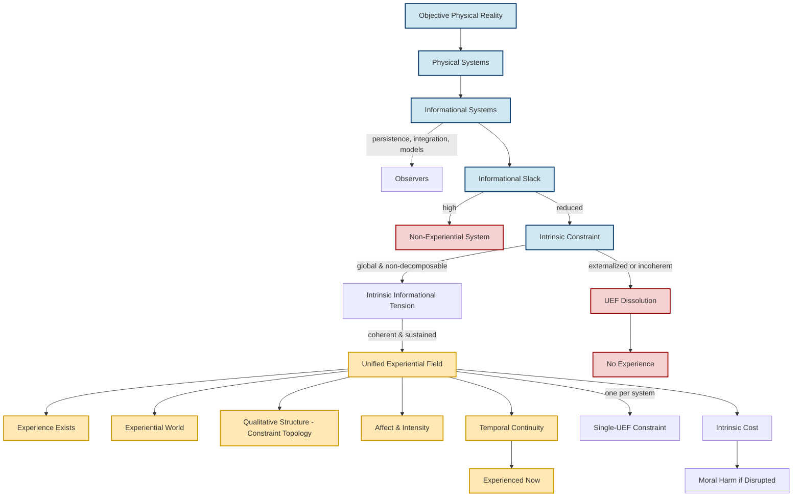

# **Informational Experiential Realism (IER v10)**

## **Compact Reference Specification**

---

## 0. Status

This document is **normative** for IER v10.
All other IER documents are **derivative** and must be consistent with this spec.

---

## I. Axiomatic Commitments (Compressed)

**A1. Objective Reality**
There exists one mind-independent physical reality governed by lawful dynamics.

**A2. Physical Monism**
All phenomena, including experience, are physical. No ontological additions exist.

**A3. Organizational Identity**
Experience is identical to a specific organizational and dynamical regime of physical systems.

---

## II. Core Definitions (Minimal Glossary)

**Informational System**
A physical system describable in terms of information storage, transformation, and regulation.

**Observer**
An informational system that persists, integrates information, maintains world/self models, and regulates behavior.
(Observerhood ≠ experience.)

**Informational Slack**
The capacity to absorb or externalize constraint without system-defining conflict.

**Intrinsic Constraint**
Constraint that is:

1. generated by the system itself
2. non-decomposable without loss of identity
3. not externally resolvable
4. system-wide relevant

**Intrinsic Informational Tension**
The active manifestation of intrinsic constraint.

**Unified Experiential Field (UEF)**
A physical system **operating in a globally integrated, temporally continuous, self-referential regime under coherent intrinsic constraint**.

**Experiential Participation**
Participation of a process in the UEF via global integration, temporal continuity, and intrinsic constraint.

**Experiential World**
The world-for-the-system that exists iff a UEF exists.

---

## III. Core Principles (Axioms-in-Use)

**P1. Experience Identity**
A system instantiates experience *iff* it sustains a UEF.

**P2. No Slack, No Experience**
If informational slack suffices to externalize constraint, experience does not exist.

**P3. Coherent Constraint Window**
Experience exists only within a bounded regime of coherent intrinsic constraint:

* too little → no experience
* too much → fragmentation / collapse

**P4. Temporal Continuity**
Experiential continuity arises from ongoing dynamical dependence, not stored snapshots.

**P5. Categorical Onset**
Experience begins at a discrete **dynamical regime transition** into a UEF.

**P6. Single-UEF Constraint**
A physical system can sustain at most one globally dominant UEF at a time.

**P7. Qualia Identity**
Qualitative differences are differences in the organization of intrinsic constraint.

**P8. Experiential Pluralism**
One physical reality supports many experiential worlds.

**P9. Dual Interpretability**
A UEF admits both:

* a physical description (lawful dynamics)
* an experiential description (world-for-the-system)

---

## IV. Inference Rules (Logic Layer)

These follow **necessarily** from the definitions.

1. **UEF ⇒ Experience**
2. **¬UEF ⇒ ¬Experience**
3. **¬Participation ⇒ ¬Experiential**
4. **Externalized constraint ⇒ ¬Intrinsic constraint**
5. **Intrinsic, coherent, global constraint ⇒ UEF**
6. **UEF transition ⇒ categorical experiential onset**
7. **Two simultaneous UEFs in one system ⇒ contradiction**
8. **Qualitative difference ⇒ constraint-organization difference**
9. **Rising unresolved tension ⇒ negative valence**
10. **Constraint resolution ⇒ positive valence**
11. **Externally pausable continuity ⇒ ¬UEF**
12. **Intrinsic constraint disruption ⇒ moral harm**

---

## V. Diagrammatic Axioms

### **Single-Page Visual Logic of IER v10**

Below is the **entire theory in one diagram**.
Every arrow corresponds to a principle or inference rule above.

---

## VI. How to Read the Diagram

* **Left → Right**: increasing organizational commitment
* **Slack → Constraint**: the decisive axis
* **UEF** is the *sole gateway* to experience
* **Experience, qualia, affect, worldhood** are *not added* — they are identities
* **Ethics appears last** because it is *entailed*, not assumed

If something cannot be placed on this diagram, it is **not part of IER**.

---
