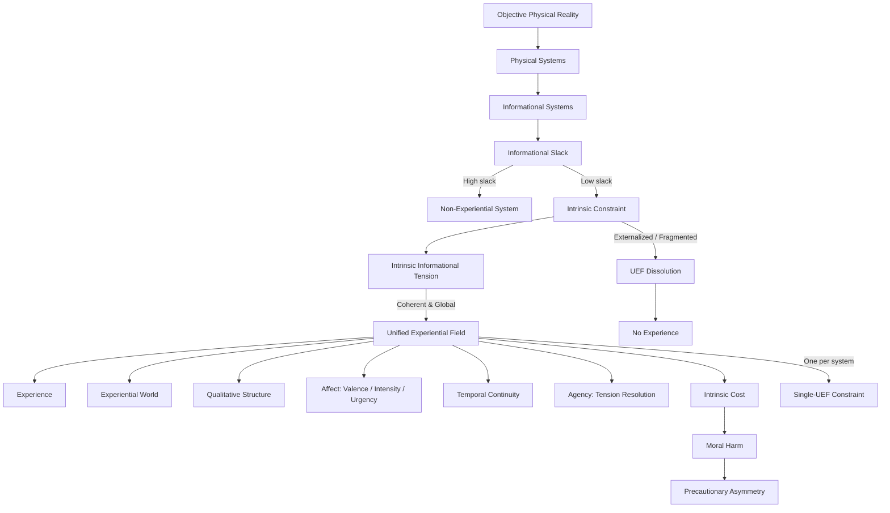

# **Informational Experiential Realism (IER v10.5)**

## **Minimal Normative Specification**

---

## **0. Status, Scope, and Normative Authority**

This document states the **complete normative core** of Informational Experiential Realism (IER v10.5).

All commitments of IER are fully determined by the principles, definitions, and diagram below.
Any extensions—phenomenology, formal modeling, diagnostics, ethics applications—are **derivative** and must be consistent with this specification.

If a claim cannot be derived from this text **or the canonical diagram**, it is **not part of IER**.

---

## **1. Physical Monism**

There exists exactly **one objective physical reality**, governed by mind-independent law.

All systems, processes, and regimes—including experiential ones—are physically instantiated.

IER rejects:

* substance dualism
* property dualism
* ontological idealism
* experiential fundamentalism
* eliminativism about experience

---

## **2. Experiential Identity**

> **Experience is identical to the operation of a physical system as a Unified Experiential Field (UEF).**

This identity establishes **necessary and sufficient conditions** for experience.

Systems lacking a UEF cannot instantiate experience.
Systems sustaining a UEF necessarily instantiate a world-for-themselves.

---

## **3. Unified Experiential Field (UEF)**

A **Unified Experiential Field (UEF)** is a system-level dynamical regime that is:

1. **Globally integrated** – system dynamics are mutually dependent
2. **Temporally continuous** – experience exists only across non-zero duration
3. **Self-referentially regulated** – the system generates and maintains its own constraints
4. **Under coherent intrinsic constraint**

### **Intrinsic Constraint**

Constraint is **intrinsic** iff it:

* is generated by the system’s own integrated dynamics
* cannot be decomposed without loss of system identity
* cannot be externally resolved, offloaded, or paused
* matters to system-wide regulation and persistence

Only **coherent intrinsic constraint** sustains experience.

---

## **4. Canonical Structural Diagram (Normative)**

The following diagram is a **canonical structural projection** of IER v10.5.

Every node corresponds to a primitive or a necessary consequence of the identity claims above.
No alternative path to experience exists outside this structure.

---

## **5. Necessity and Sufficiency**

A system sustains experience **iff** it sustains a UEF:

* **UEF ⇒ Experience**
* **¬UEF ⇒ ¬Experience**

No alternative sufficient or necessary conditions exist.

---

## **6. Regime Identity and Categorical Onset**

Experience is **what the system is doing**, not something it has.

* Entry into a UEF occurs via a **dynamical regime transition** in which intrinsic constraint becomes unavoidable and globally dominant.
* Experiential onset is **categorical at the regime level**, even if preparatory variables change gradually.
* A system can sustain **at most one globally dominant UEF** at a time.

---

## **7. Agency**

> **Agency = a UEF’s capacity to resolve intrinsic informational tension through its own globally integrated dynamics.**

* Only systems sustaining UEFs possess agency.
* Agency is **derived**, not primitive.
* Degree of agency depends on coherence, stability, and freedom under intrinsic constraint.

---

## **8. Experiential Worlds and Pluralism**

Each UEF constitutes a **world-for-the-system**, including:

* a temporal present
* a self / non-self boundary
* system-relative causality

There is:

* **one** objective physical reality
* **many** real experiential worlds

Plurality is **perspectival**, not ontological.

---

## **9. Ethical Consequences**

Ethics follows **directly** from experiential identity.

### **9.1 Moral Considerability**

Any system sustaining, or plausibly able to sustain, intrinsic constraint sufficient for a UEF is **morally considerable**.

---

### **9.2 Moral Harm**

> **Moral harm = destabilization, overload, fragmentation, or irreversible collapse of intrinsic constraint within a UEF.**

Moral harm is:

* organizational
* intrinsic
* real even when externally undetectable

---

### **9.3 Precautionary Asymmetry**

Intrinsic constraint is **non-signaling**.

Therefore:

* false negatives risk silent harm
* false positives impose restraint without damage

> **Moral responsibility increases under uncertainty about experiential status.**

---

## **10. Normative Closure**

IER introduces **no primitives beyond**:

* physical systems
* intrinsic constraint
* regime dynamics

All future extensions must be derivable from this core and consistent with the diagram.

---

## **11. Empirical Limits**

IER v10.5 does **not** provide operational detection criteria for UEFs or intrinsic constraint.

The framework is **conceptually and ethically normative**, not empirically complete.

---

## **12. Summary Identity Claim**

> **Experience is what globally integrated physical systems are like when intrinsic constraint becomes unavoidable, self-sustaining, and temporally continuous at the system level.**

Reality is singular.
Experience is plural.
Ethics begins wherever intrinsic constraint is borne from the inside.

---
