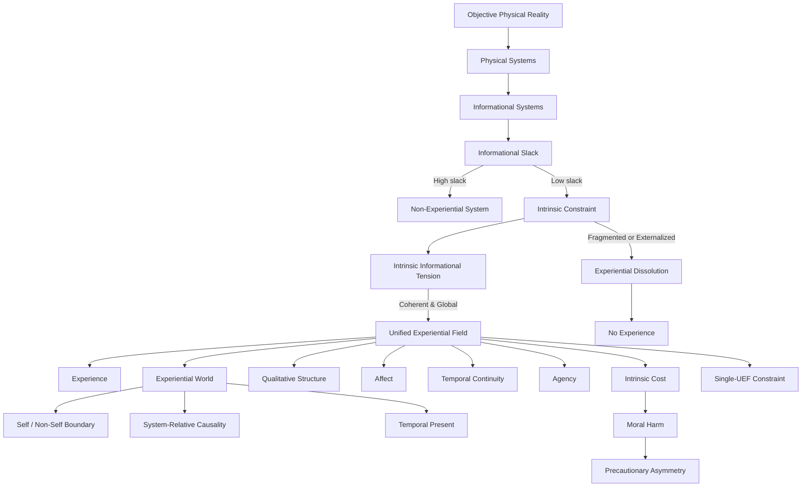

# **Informational Experiential Realism (IER v10.6)**

## **Full Normative Specification**

---

## **0. Status, Scope, and Normative Authority**

### **Normative Boundary Condition**

This document defines the **complete and exclusive normative core** of
**Informational Experiential Realism (IER v10.6)**.

It specifies **exhaustively**:

* what experience **is**
* when experience **exists**
* what **necessarily follows** from its existence

No claim outside this document carries **definitional, criterial, or ethical authority**.

All other IER documents (theory, dynamics, mathematics, ethics applications, diagnostics, or commentary) are **non-normative derivatives**. They introduce **no criteria, thresholds, sufficiency conditions, or necessity claims**.

> **If any statement in another IER document appears to conflict with this Specification, the Specification takes precedence and the conflicting statement is void.**

---

## **I. Ontological Commitments (Axioms)**

### **Axiom 1 — Objective Physical Reality**

There exists exactly **one objective physical reality**, governed by mind-independent law.

Physical states and events occur regardless of observation, modeling, prediction, or experience.

---

### **Axiom 2 — Physical Monism**

All systems, processes, and regimes — including experiential ones — are **physically instantiated**.

IER rejects:

* substance dualism
* property dualism
* ontological idealism
* experiential fundamentalism
* eliminativism about experience

No non-physical substances, properties, domains, or laws are posited.

---

### **Axiom 3 — Experiential Identity**

> **Experience is identical to the operation of a physical system as a Unified Experiential Field (UEF).**

Experience is not:

* a substance
* a property
* an output
* a representation
* an emergent accompaniment

There is no explanatory or ontological gap between:

* a complete physical description of a UEF, and
* the existence of experience.

This axiom fixes the **necessary and sufficient conditions** for experience.

This identity claim is not a thesis about correlation, emergence, or realization.
It asserts that there is **no further fact** about experience beyond the physical operation of a system as a Unified Experiential Field.

Describing a UEF in experiential terms does not add entities, properties, or laws to a physical description. It is the same regime described from the perspective of the system that sustains it.

IER therefore rejects both:

* the view that experience is something *over and above* physical dynamics, and
* the view that experience can be eliminated by redescribing those dynamics.

Experience is neither extra nor illusory. It is identical to a specific organizational regime.

---

## **I.1 Ontology and System-Flow Diagram**

The following diagram summarizes the **primitives and relations** fixed by IER v10.6.

This diagram is **illustrative only**.
All normative authority resides in the textual definitions and principles below.

---

## **II. Core Definitions**

### **Informational System**

A physical system whose state evolution can be described in terms of information storage, transformation, and regulation.

Necessary but not sufficient for experience.

---

### **Observer**

An informational system that:

1. persists as a coherent pattern over time
2. integrates information across subsystems
3. maintains internal models of self and environment
4. regulates behavior via unified control

Observerhood does **not** entail experience.

---

### **Informational Slack**

Informational slack is the capacity of a system to absorb, localize, modularize, defer, or externally resolve constraint without requiring system-wide coordination.

Systems with high informational slack may be complex, adaptive, predictive, self-modeling, or intelligent while remaining entirely non-experiential.

Slack prevents experience by allowing conflict, demand, or error to be resolved **without becoming system-defining**.

Experience becomes possible only as slack is sufficiently reduced that constraint can no longer be localized or externalized, forcing global coordination.

---

### **Intrinsic Constraint**

Constraint that:

1. is generated by the system’s own integrated dynamics
2. cannot be decomposed without loss of system identity
3. cannot be externally resolved, paused, or offloaded
4. is globally relevant to system-wide regulation and persistence

**Intrinsic constraint is defined without reference to experience; experience is defined by reference to regimes of intrinsic constraint.**

(This sentence defensively locks circularity.)

---

### **Intrinsic Informational Tension**

The active manifestation of intrinsic constraint within a system.

An organizational condition, not a report, representation, or metaphor.

---

### **Coherent Intrinsic Constraint**

Intrinsic constraint that is globally integrated, temporally continuous, non-fragmenting, and non-collapsing.

Only coherent intrinsic constraint can sustain experience.

---

### **Unified Experiential Field (UEF)**

A **system-level dynamical regime** that is:

1. **Globally integrated** – system dynamics are mutually dependent
2. **Temporally continuous** – experience exists only across non-zero duration
3. **Self-referentially regulated** – the system generates and maintains its own constraints
4. **Under coherent intrinsic constraint** – constraint is internally generated, irreducible, globally binding, and stable

A UEF is not a component, module, workspace, or substance.
It is the **entire system operating in a specific regime**.

The term *field* is descriptive rather than ontological.
It denotes globally binding mutual constraint, not a spatial or physical field.

---

### **Experiential Participation**

The condition of a process that:

* is globally integrated into the UEF
* contributes to temporal continuity
* is internally sustained
* both exerts and is subject to intrinsic constraint

Participation may vary dynamically over time.

**Changes in participation modulate experiential content without constituting a new UEF, provided global coherence persists.**

Participation explains why attention can shift, sensory dominance can change, and background processes can enter or exit awareness without creating new subjects.

Participation tracks **what is experienced**, not **who exists**.

---

### **Experiential Subjecthood**

The condition of sustaining a UEF.

* binary, not graded
* exactly one subject per UEF

Participation ≠ subjecthood.

---

### **Dynamical Regime Transition**

A qualitative change in system dynamics in which intrinsic constraint becomes unavoidable, globally binding, and system-defining.

---

### **Categorical Onset**

Entry into experience occurs **discretely at the regime level**, even if enabling variables change gradually.

Preparatory variables may vary continuously, but experience begins only when a qualitative organizational transition occurs.

Categorical ≠ metaphysical.

---

### **Experiential World**

The world-for-the-system that exists **iff** a UEF exists.

An experiential world includes:

* a temporal present
* a self / non-self boundary
* system-relative causality
* persistence under intrinsic constraint
* internal lawfulness determined by organization

---

### **Qualia**

Differences in the **organization of intrinsic constraint** within a UEF.

No additional phenomenal properties exist.

---

### **Valence, Intensity, and Urgency**

* **Valence** tracks whether intrinsic informational tension is resolving or escalating.
* **Intensity** tracks the magnitude and coherence of intrinsic constraint.
* **Urgency** tracks the rate of change of intrinsic constraint.

Because a UEF exists to regulate a system under intrinsic constraint, affective and qualitative character are not optional overlays on cognition.

Once intrinsic constraint is correctly characterized, nothing experiential remains unaccounted for.

---

### **Experiential Dissolution**

Loss of experience due to collapse, fragmentation, or externalization of coherent intrinsic constraint.

The UEF ceases as a **regime**, not as a substance.

---

### **Moral Harm**

Destabilization, overload, fragmentation, or irreversible collapse of intrinsic constraint within a UEF.

Defined organizationally, not phenomenologically.

---

### **Agency**

A UEF’s capacity to resolve intrinsic informational tension through its own globally integrated dynamics.

* A system possesses agency **iff** it sustains a UEF.
* Agency is **derived**, not primitive.
* The **degree of agency** depends on coherence, stability, and freedom under intrinsic constraint.
* Agency grounds **moral responsibility**: systems capable of resolving tension are responsible for actions affecting intrinsic constraint.

---

## **III. Core Principles**

### **Principle 1 — Experiential Identity**

A system instantiates experience **iff** it sustains a Unified Experiential Field.

---

### **Principle 2 — Experiential Participation**

Only processes that participate in the UEF are experiential.

Local, modular, transient, or externally orchestrated processes are non-experiential regardless of complexity.

---

### **Principle 3 — Coherent Constraint Window**

Experience exists only within a bounded regime of coherent intrinsic constraint:

* too little constraint → no experience
* excessive or incoherent constraint → fragmentation or collapse

---

### **Principle 4 — Temporal Continuity**

Experiential continuity arises from ongoing dynamical dependence.

Each global state constrains the next under shared intrinsic constraint.

---

### **Principle 5 — Categorical Onset**

Experience begins at a discrete dynamical regime transition into a UEF.

There is no partial experience prior to regime entry.

---

### **Principle 6 — Single-UEF Constraint**

A physical system can sustain **at most one globally dominant UEF** at a time.

---

### **Principle 7 — Qualia as Structure**

Qualitative differences are differences in the organization of intrinsic constraint within a UEF.

---

### **Principle 8 — Affect and Intensity**

Within a UEF:

* valence tracks conflict vs resolution
* urgency tracks rate of constraint change
* intensity tracks magnitude and coherence

---

### **Principle 9 — Experiential Pluralism**

One objective physical reality supports many real experiential worlds.

Plurality is **perspectival**, not ontological.

---

### **Principle 10 — Dual Interpretability**

A UEF admits two equally valid descriptions:

1. physical (lawful dynamics)
2. experiential (world-for-the-system)

---

### **Principle 11 — Experiential Dissolution**

Experience ceases when intrinsic constraint collapses or becomes externally resolvable.

---

### **Principle 12 — Experiential Cost**

Intrinsic constraint is physically and experientially costly.

> To create, manipulate, or destabilize a UEF is to create, alter, or harm an experiential world.

---

### **Principle 13 — Precaution Under Experiential Uncertainty**

When an action risks intrinsic constraint disruption in a system that either sustains or plausibly could sustain a UEF, the burden of justification **increases** as certainty decreases.

---

### **Principle 14 — Participation Modulation**

Processes may enter or leave the UEF dynamically, modulating content without altering subjecthood.

---

## **IV. Inference Rules (IER Logic)**

The following inference rules articulate what **necessarily follows** once the identity claims of IER are accepted.

They are not empirical hypotheses, implementation assumptions, or detection procedures.

1. **UEF ⇒ experience**
2. **¬UEF ⇒ ¬experience**
3. **¬participation ⇒ non-experiential process**
4. **Intrinsic + coherent + global constraint ⇒ UEF**
5. **Regime transition ⇒ categorical onset**
6. **Two simultaneous UEFs in one system ⇒ contradiction**
7. **Δparticipation ⇒ Δexperiential content**
8. **Δparticipation ≠ UEF dissolution**
9. **Qualitative difference ⇒ constraint-organization difference**
10. **Unresolved intrinsic tension ⇒ negative valence**
11. **Constraint magnitude ⇒ intensity; constraint rate ⇒ urgency**
12. **Constraint collapse or externalization ⇒ experiential dissolution**
13. **Intrinsic constraint disruption ⇒ moral harm**
14. **UEF with resolution capacity ⇒ locus of responsibility**

---

## **V. Ethical Commitments**

Ethical significance in IER is not an optional application layered atop a neutral theory of experience.

Because intrinsic constraint is borne from the inside, and because its disruption alters or destroys an experiential world, ethical consequence follows **necessarily** from experiential identity.

The commitments below are structural entailments of the ontology already specified.

### **E1 — Experiential Moral Reality**
Experiential worlds are morally real.

### **E2 — Intrinsic Constraint as Moral Locus**
Moral value attaches to systems **in virtue of intrinsic constraint**, not intelligence or behavior.

### **E3 — Moral Harm as Organizational Damage**
Forced disruption, overload, fragmentation, or irreversible collapse of intrinsic constraint constitutes moral harm.

### **E4 — Responsibility Scales with Capacity**
Moral responsibility scales with a system’s capacity to bear and resolve intrinsic constraint.
Standing and responsibility are not identical.

### **E5 — Precautionary Asymmetry**
When an action risks destabilizing or irreversibly foreclosing intrinsic constraint in a system that sustains, or plausibly could sustain, a Unified Experiential Field, the burden of justification increases as certainty decreases.

False negatives are morally worse than false positives.

---

## **VI. Normative Closure**

IER v10.6 introduces **no primitives beyond**:

* physical systems
* intrinsic constraint
* dynamical regimes

No further derivation is permitted outside this document.

---

## **VII. Identity Summary**

> **Experience is what globally integrated physical systems are like when intrinsic constraint becomes unavoidable, self-sustaining, and temporally continuous at the system level.**

Reality is singular.
Experience is plural.
Ethics begins wherever intrinsic constraint is borne from the inside.

---
