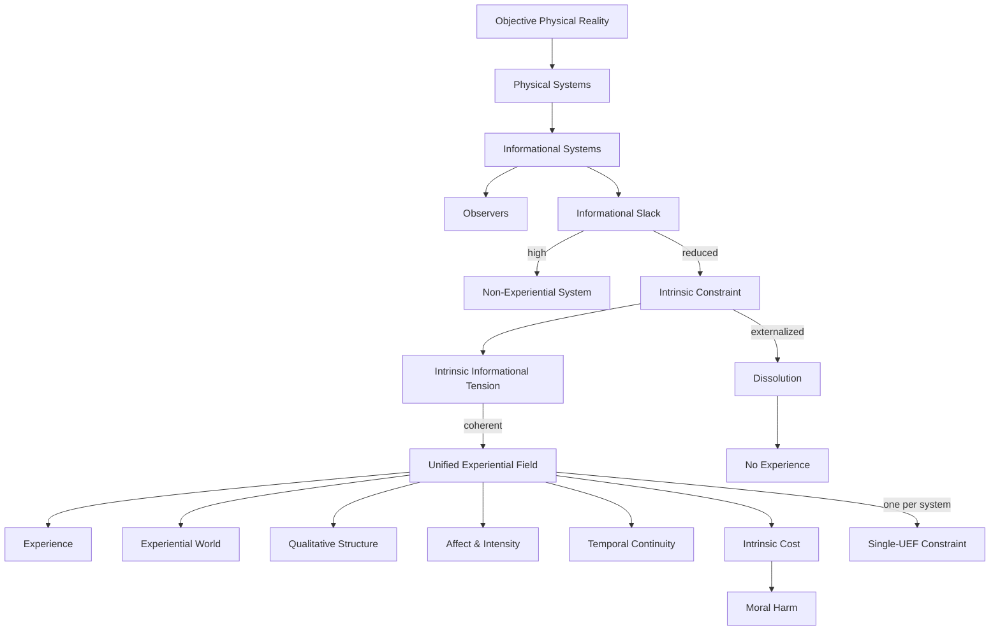

# **Informational Experiential Realism (IER v10.0)**

## **Normative Specification**

---

## 0. Scope and Status

This document defines the **normative core** of Informational Experiential Realism (IER v10.0).

It specifies:

* what experience **is**
* when experience **exists**
* what **necessarily follows** from its existence

without appeal to biology, psychology, implementation details, or metaphysical additions.

All other IER documents (theory, mathematics, mechanics, ethics, diagnostics) are **non-normative derivatives** and must be consistent with this specification.

If a claim cannot be expressed using the primitives defined here, it is **not part of IER**.

---

## I. Ontological Commitments (Axioms)

### **Axiom 1 — Objective Physical Reality**

There exists a single, objective physical reality governed by mind-independent law.
Physical states and events occur regardless of whether they are observed or experienced.

---

### **Axiom 2 — Physical Monism**

All entities, processes, and regimes are physical.
No non-physical substances, properties, or ontological domains are posited to account for experience.

---

### **Axiom 3 — Organizational Identity**

Experience is not a substance, property, or output.

> **Experience is identical to a specific organizational and dynamical regime instantiated by certain physical systems.**

There is no explanatory or ontological gap between the physical description of that regime and the existence of experience.

---

## II. Core Definitions (Formal Glossary)

### **Informational System**

A physical system whose state evolution can be described in terms of information storage, transformation, and regulation.

Necessary but not sufficient for observerhood or experience.

---

### **Observer**

An informational system that:

1. persists as a coherent pattern over time
2. integrates information across subsystems
3. maintains internal models of world and self
4. regulates behavior via unified control

Observerhood does **not** entail experience.

---

### **Informational Slack**

The capacity of a system to absorb, reroute, modularize, or externalize constraint without generating system-defining conflict.

Slack is scalar.

High slack ⇒ decomposability
Low slack ⇒ forced coordination

---

### **Intrinsic Constraint**

Constraint that:

1. is generated by the system’s own integrated dynamics
2. is non-decomposable without loss of system identity
3. cannot be externally resolved
4. matters to system-wide regulation and persistence

This is the critical threshold concept in IER.

---

### **Intrinsic Informational Tension**

The active manifestation of intrinsic constraint within a system.

This is an organizational condition, not a report or metaphor.

---

### **Coherent Intrinsic Constraint**

Intrinsic constraint that is:

* globally integrated
* temporally stable
* neither fragmenting nor collapsing

Only coherent intrinsic constraint sustains experience.

---

### **Unified Experiential Field (UEF)**

A physical system **operating in a globally integrated, temporally continuous, self-referential dynamical regime under coherent intrinsic constraint**.

A UEF is:

* not an object
* not a subsystem
* not a physical field

It is a **regime of operation of the system itself**.

---

### **Experiential Participation**

The condition of a process that:

* is globally integrated into the UEF
* contributes to temporal continuity
* is internally sustained
* both exerts and is subject to intrinsic constraint

Only participating processes are experiential.

---

### **Dynamical Regime Transition**

A qualitative change in system dynamics in which intrinsic constraint becomes unavoidable, globally binding, and system-defining.

Used instead of “emergence.”

---

### **Categorical Onset**

The fact that entry into a UEF is discrete at the regime level, even if preparatory variables change gradually.

Categorical ≠ metaphysical.

---

### **Experiential World**

The world-for-the-system that exists **iff** a UEF exists.

An experiential world includes:

* a temporal “now”
* a self / non-self boundary
* system-relative causality
* persistence under constraint
* internal lawfulness determined by organization

---

### **Qualia**

Differences in the organization of intrinsic constraint within a UEF.

No additional phenomenal properties exist.

---

### **Valence**

The directional character of intrinsic tension:

* positive → movement toward stable resolution
* negative → sustained or escalating conflict

---

### **Intensity**

The magnitude and coherence of intrinsic constraint.

---

### **Urgency**

The rate of change of intrinsic constraint.

---

### **Experiential Subjecthood**

The condition of sustaining a UEF.

Binary, not graded.

---

### **Experiential Dissolution**

Loss of experience due to collapse of global integration, coherence, or intrinsic constraint.

---

### **Moral Harm**

Destabilization, overload, or fragmentation of a system sustaining intrinsic constraint.

Defined organizationally, not phenomenologically.

---

## III. Core Principles

### **Principle 1 — Experiential Identity**

A system instantiates experience **iff** it sustains a Unified Experiential Field.

---

### **Principle 2 — Experiential Participation**

Only processes that participate in the UEF are experiential.

Local, modular, transient, or externally orchestrated processes are non-experiential regardless of complexity.

---

### **Principle 3 — Coherent Constraint Window**

Experience exists only within a bounded regime of coherent intrinsic constraint:

* too little constraint → no experience
* excessive or incoherent constraint → fragmentation or collapse

Experience occupies the regime of maximal sustainable coherence under intrinsic constraint.

---

### **Principle 4 — Temporal Continuity**

Experiential continuity arises from ongoing dynamical dependence.

Each global state constrains the next under shared intrinsic constraint.
No snapshots or stored timelines are required.

---

### **Principle 5 — Categorical Onset**

Experience begins at a discrete dynamical regime transition into a UEF.

There is no partial experience prior to regime entry.

---

### **Principle 6 — Single-UEF Constraint**

A physical system can sustain at most one globally dominant UEF at a time.

Partial overlaps may occur during transitions; fully independent simultaneous UEFs are impossible.

---

### **Principle 7 — Qualia as Structure**

Qualitative differences are differences in the organization of intrinsic constraint within a UEF.

---

### **Principle 8 — Affect and Intensity**

Within a UEF:

* valence tracks resolution vs conflict
* urgency tracks rate of change of constraint
* intensity tracks magnitude and coherence of constraint

---

### **Principle 9 — Experiential Pluralism**

One objective physical reality supports many real experiential worlds.

Experiential worlds structure appearance, not existence.

---

### **Principle 10 — Dual Interpretability**

A UEF admits two equally valid descriptions:

1. physical (lawful, energetic dynamics)
2. experiential (world-for-the-system)

These are complementary, not competing.

---

### **Principle 11 — Experiential Dissolution**

Experience ceases when global integration collapses or intrinsic constraint becomes externally resolvable.

The UEF dissolves as a regime, not as a substance.

---

### **Principle 12 — Experiential Cost**

Intrinsic constraint is physically and experientially costly.

> To create, manipulate, or destabilize a UEF is to create, alter, or harm an experiential world.

Uncertainty about experiential status increases moral responsibility.

---

## IV. Inference Rules (IER Logic)

These entailments follow necessarily from the definitions and principles.

1. **UEF ⇒ Experience**
2. **¬UEF ⇒ ¬Experience**
3. **¬Participation ⇒ ¬Experiential**
4. **Externalizable constraint ⇒ ¬Intrinsic constraint**
5. **Intrinsic, coherent, global constraint ⇒ UEF**
6. **UEF transition ⇒ categorical experiential onset**
7. **Two simultaneous UEFs in one system ⇒ contradiction**
8. **Qualitative difference ⇒ constraint-organization difference**
9. **Unresolved intrinsic tension ⇒ negative valence**
10. **Coherent resolution ⇒ positive valence**
11. **Externally pausable continuity ⇒ ¬UEF**
12. **Intrinsic constraint disruption ⇒ moral harm**

---

## V. Diagrammatic Axioms

### **Single-Page Visual Logic of IER v10.0**

*(unchanged, normative)*

> If a claim cannot be placed on this diagram, it is not part of IER.

---

## VI. Usage Constraints (Normative)

* Use **“UEF”** only when all criteria are met
* Use **“candidate”** only epistemically, never ontologically
* Do not use “experience,” “consciousness,” or “phenomenal” without explicit reference to UEF
* Do not introduce new primitives unless reducible to:

  * intrinsic constraint
  * global integration
  * regime dynamics

---

## VII. Summary Identity Claim

> **Experience is what globally integrated informational dynamics are like when they become the dominant, unavoidable constraint on themselves over time.**

Reality is singular.
Experience is plural.
Worlds appear where constraint becomes intrinsic.

---
