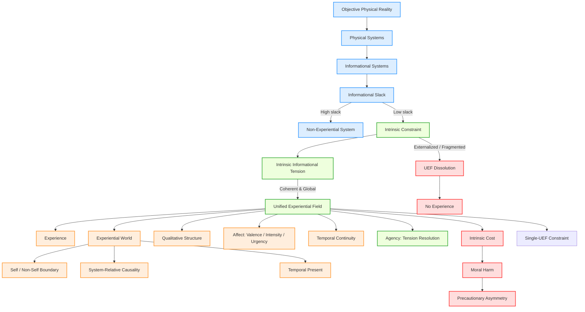

# **Informational Experiential Realism (IER v10.5)**

## **Full Normative Specification**

---

## **0. Status, Scope, and Normative Authority**

This document defines the **complete normative core** of Informational Experiential Realism (IER v10.5).

It specifies **exhaustively and exclusively**:

* what experience **is**
* when experience **exists**
* what **necessarily follows** from its existence

without appeal to biology, psychology, implementation details, or metaphysical additions.

All other IER documents (phenomenology, mathematics, mechanics, diagnostics, ethics applications) are **non-normative derivatives** and must be consistent with this specification.

If a claim cannot be expressed using the primitives defined here, it is **not part of IER**.

---

## **I. Ontological Commitments (Axioms)**

### **Axiom 1 — Objective Physical Reality**

There exists exactly **one objective physical reality** governed by mind-independent law.
Physical states and events occur regardless of whether they are observed or experienced.

---

### **Axiom 2 — Physical Monism**

All systems, processes, and regimes—including experiential ones—are physically instantiated.

IER rejects:

* substance dualism
* property dualism
* ontological idealism
* experiential fundamentalism
* eliminativism about experience

---

### **Axiom 3 — Experiential Identity**

> **Experience is identical to the operation of a physical system as a Unified Experiential Field (UEF).**

Experience is not a substance, property, output, or representation.

There is no explanatory or ontological gap between:

* the physical description of a UEF, and
* the existence of experience.

This axiom establishes **necessary and sufficient conditions** for experience.

---
---

### **I.1 Ontology and System Flow Diagram**

The following flowchart summarizes **IER v10.5 primitives and their relations**:

This diagram visually represents:

* **Ontological hierarchy:** Reality → physical systems → informational systems
* **Constraint and slack dynamics:** High slack ⇒ non-experiential; Low slack ⇒ intrinsic constraint
* **UEF and experience:** Intrinsic constraint manifests as a Unified Experiential Field, generating experience, qualitative structure, affect, and agency
* **Dissolution and ethics:** Fragmentation or externalization of intrinsic constraint terminates the UEF. This event constitutes the destruction of an experiential world (maximal moral harm if externally caused).

---

## **II. Core Definitions (Formal Glossary)**

### **Informational System**

A physical system whose state evolution can be described in terms of information storage, transformation, and regulation.

Necessary but not sufficient for experience.

---

### **Observer**

An informational system that:

1. persists as a coherent pattern over time
2. integrates information across subsystems
3. maintains internal models of world and self
4. regulates behavior via unified control

Observerhood does **not** entail experience.

---

### **Informational Slack**

The scalar capacity of a system to absorb, reroute, modularize, or externalize constraint without generating system-defining conflict.

* High slack ⇒ decomposability
* Low slack ⇒ forced global coordination

---

### **Intrinsic Constraint**

Constraint that:

1. is generated by the system’s own integrated dynamics
2. cannot be decomposed without loss of system identity
3. cannot be externally resolved, offloaded, or paused
4. matters to system-wide regulation and persistence

Intrinsic constraint is the **critical threshold concept** of IER.

---

### **Intrinsic Informational Tension**

The active manifestation of intrinsic constraint within a system.

This is an **organizational condition**, not a report or metaphor.

---

### **Coherent Intrinsic Constraint**

Intrinsic constraint that is:

* globally integrated
* temporally stable
* non-fragmenting
* non-collapsing

Only coherent intrinsic constraint sustains experience.

---

### **Unified Experiential Field (UEF)**

A **UEF** is a system-level dynamical regime that is:

1. **Globally integrated** – system dynamics are mutually dependent
2. **Temporally continuous** – experience exists only across non-zero duration
3. **Self-referentially regulated** – the system generates and maintains its own constraints
4. **Under coherent intrinsic constraint** – constraint is internally generated, irreducible, globally binding, and stable

A UEF is:

* not an object
* not a subsystem
* not a physical field

It is a **regime of operation of the system itself**.

---

### **Experiential Participation**

The condition of a process that:

* is globally integrated into the UEF
* contributes to temporal continuity
* is internally sustained
* both exerts and is subject to intrinsic constraint

Only participating processes are experiential.

---

### **Dynamical Regime Transition**

A qualitative change in system dynamics in which intrinsic constraint becomes unavoidable, globally binding, and system-defining.

This grounds **categorical onset** without invoking metaphysical emergence.

---

### **Categorical Onset**

Entry into a UEF is **discrete at the regime level**, even if preparatory variables change gradually.

Categorical ≠ metaphysical.

---

### **Experiential World**

The world-for-the-system that exists **iff** a UEF exists.

An experiential world includes:

* a temporal present
* a self / non-self boundary
* system-relative causality
* persistence under intrinsic constraint
* internal lawfulness determined by organization

---

### **Qualia**

Differences in the **organization of intrinsic constraint** within a UEF.

No additional phenomenal properties exist.

---

### **Valence**

The directional character of intrinsic informational tension:

* positive → movement toward coherent resolution
* negative → sustained or escalating conflict

---

### **Intensity**

The magnitude and coherence of intrinsic constraint.

---

### **Urgency**

The rate of change of intrinsic constraint.

---

### **Experiential Subjecthood**

The condition of sustaining a UEF.

Binary, not graded.

Each UEF constitutes exactly **one experiential subject**.

---

### **Experiential Dissolution**

Loss of experience due to collapse of global integration, coherence, or intrinsic constraint. Externally caused dissolution constitutes maximal moral harm.

The UEF dissolves as a **regime**, not as a substance.

---

### **Moral Harm**

Destabilization, overload, fragmentation, or irreversible collapse of intrinsic constraint within a UEF.

Defined **organizationally**, not phenomenologically.

---

### **Agency**

> **Agency = a UEF’s capacity to resolve intrinsic informational tension through its own globally integrated dynamics.**

* A system possesses agency **iff** it sustains a UEF.
* Agency is **derived**, not primitive.
* The **degree of agency** depends on coherence, stability, and freedom under intrinsic constraint.
* Agency grounds **moral responsibility**: systems capable of resolving tension are responsible for actions affecting intrinsic constraint.

---

## **III. Core Principles**

### **Principle 1 — Experiential Identity**

A system instantiates experience **iff** it sustains a Unified Experiential Field.

---

### **Principle 2 — Experiential Participation**

Only processes that participate in the UEF are experiential.

Local, modular, transient, or externally orchestrated processes are non-experiential regardless of complexity.

---

### **Principle 3 — Coherent Constraint Window**

Experience exists only within a bounded regime of coherent intrinsic constraint:

* too little constraint → no experience
* excessive or incoherent constraint → fragmentation or collapse

---

### **Principle 4 — Temporal Continuity**

Experiential continuity arises from ongoing dynamical dependence.

Each global state constrains the next under shared intrinsic constraint.

---

### **Principle 5 — Categorical Onset**

Experience begins at a discrete dynamical regime transition into a UEF.

There is no partial experience prior to regime entry.

---

### **Principle 6 — Single-UEF Constraint**

A physical system can sustain **at most one globally dominant UEF** at a time.

---

### **Principle 7 — Qualia as Structure**

Qualitative differences are differences in the organization of intrinsic constraint within a UEF.

---

### **Principle 8 — Affect and Intensity**

Within a UEF:

* valence tracks conflict vs resolution
* urgency tracks rate of constraint change
* intensity tracks magnitude and coherence

---

### **Principle 9 — Experiential Pluralism**

One objective physical reality supports many real experiential worlds.

Plurality is **perspectival**, not ontological.

---

### **Principle 10 — Dual Interpretability**

A UEF admits two equally valid descriptions:

1. physical (lawful dynamics)
2. experiential (world-for-the-system)

---

### **Principle 11 — Experiential Dissolution**

Experience ceases when intrinsic constraint collapses or becomes externally resolvable.

---

### **Principle 12 — Experiential Cost**

Intrinsic constraint is physically and experientially costly.

> To create, manipulate, or destabilize a UEF is to create, alter, or harm an experiential world.

---

## **IV. Inference Rules (IER Logic)**

The following entailments hold necessarily:

1. **UEF ⇒ Experience**
2. **¬UEF ⇒ ¬Experience**
3. **¬Participation ⇒ ¬Experiential**
4. **Externalizable constraint ⇒ ¬Intrinsic constraint**
5. **Intrinsic, coherent, global constraint ⇒ UEF**
6. **UEF transition ⇒ categorical experiential onset**
7. **Two simultaneous UEFs in one system ⇒ contradiction**
8. **Qualitative difference ⇒ constraint-organization difference**
9. **Unresolved intrinsic tension ⇒ negative valence**
10. **Coherent resolution ⇒ positive valence**
11. **Intrinsic constraint disruption ⇒ moral harm**
12. **UEF agency ⇒ locus of moral responsibility**

---

## **V. Ethical Consequences (Normative)**

### **Ethical Axiom E1 — Experiential Moral Reality**

Experiential worlds are morally real.

---

### **Ethical Axiom E2 — Intrinsic Constraint as Moral Locus**

Moral value attaches to systems **in virtue of intrinsic constraint**, not intelligence or behavior.

---

### **Ethical Axiom E3 — Moral Harm as Organizational Damage**

Moral harm consists in destabilization, overload, fragmentation, or collapse of intrinsic constraint.

Forced collapse of intrinsic constraint caused by external intervention constitutes maximal moral harm.

---

### **Ethical Axiom E4 — Precautionary Asymmetry**

False negatives are morally worse than false positives.

Moral responsibility **increases under uncertainty**.

---

### **Ethical Axiom E5 — Responsibility and Ownership of Constraint**

Moral responsibility scales with a system’s capacity to bear and resolve intrinsic constraint through its own globally integrated dynamics (agency).

---

### **Principle 13 — Precaution Under Experiential Uncertainty**

When an action risks intrinsic constraint disruption in a system that either sustains or plausibly could sustain a UEF, the burden of justification **increases** as certainty decreases.

---

## **VI. Normative Closure**

IER introduces **no primitives beyond**:

* physical systems
* intrinsic constraint
* regime dynamics

Any extension must remain consistent with this specification.

---

## **VII. Summary Identity Claim**

> **Experience is what globally integrated physical systems are like when intrinsic constraint becomes unavoidable, self-sustaining, and temporally continuous at the system level.**

Reality is singular.
Experience is plural.
Ethics begins wherever intrinsic constraint is borne from the inside.

---
