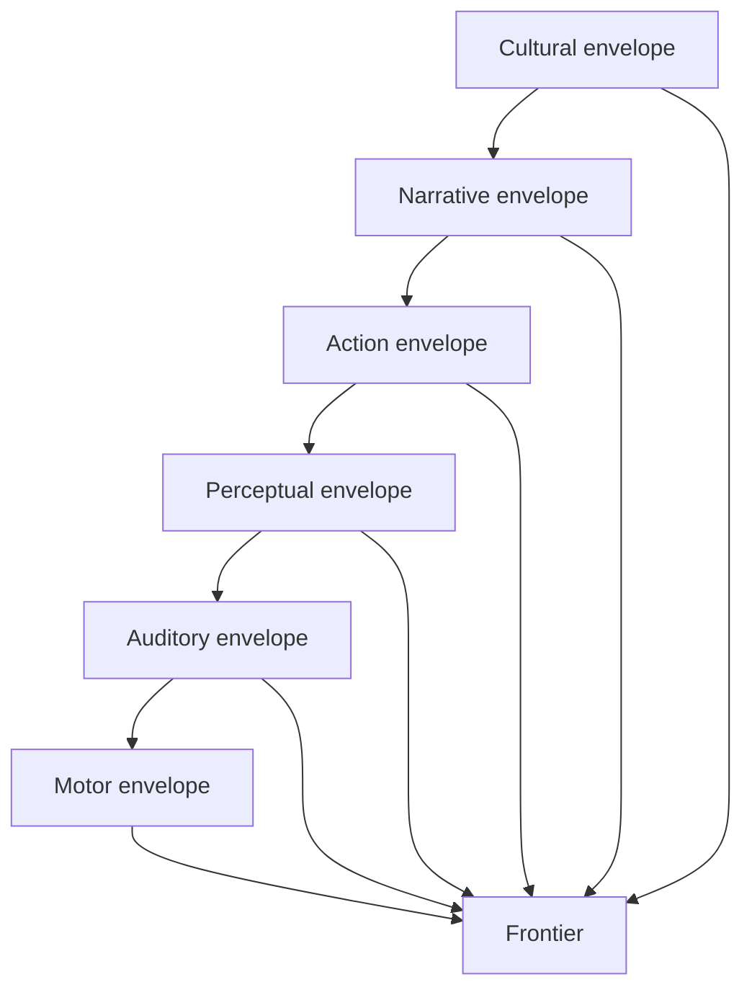

---
ier:
  tier: T2
  role: CASE
  layer: taxonomy
  domain:
  - phenomenology
  category: phenomenology_II
  status: canonical
  filename: IER-specious-present.md
---

# Specious Present

## The Specious Present as a Coherence Condition at the Frontier

**Informational Experiential Realism (IER v10.10.2)**  
*Tier 2 · Explanatory · Non-Normative · Canon-Constrained*

## Status, Scope, and Authority

This document is explanatory and non-normative.

It:

* introduces no new ontological primitives
* introduces no criteria, thresholds, or diagnostics
* does not redefine time, collapse, welding, propagation, or admissibility
* does not introduce temporal windows, buffers, or storage mechanisms
* does not posit representational structures, replay processes, or moving temporal frames
* does not treat the present as a container, a slice, or a point traveling through time

This document remains subordinate to the canonical IER corpus.

If any statement here conflicts with Tier-1 commitments, Tier-1 prevails.


## Explanatory Aim

To explain:

> why the present often appears temporally thick rather than point-like,

without introducing:

* temporal containment
* short-term storage
* retained recent content
* sliding present-window models

The account defended here is structural:

> The specious present is the maximal span over which constraint organization remains actively co-determining frontier resolution prior to collapse.

It is therefore:

* a coherence condition
* not a temporal container
* not a stored interval
* not a moving frame


## Orientation — Why the Present Seems Thick

Experience often seems to include more than an instant.

What is ordinarily called the “present” may appear to contain:

* a short phrase rather than a single note
* a motion rather than a static position
* a word-sequence rather than a single sound
* a coordinated action rather than a single muscular event

This gives rise to the familiar intuition that the present has thickness.

Traditional accounts often interpret this by introducing:

* a temporal window
* a short buffer
* a sliding interval of retained recent contents

Under Informational Experiential Realism, these interpretations are structurally unavailable.

IER does not permit:

* stored temporal spans
* present-moment containers
* internal frames that hold recent experience together

The problem must therefore be reframed.

The question is not:

> *What temporal interval is being held in the present?*

The question is:

> *Under what condition can multiple elements remain jointly active in one still-unresolved organization of continuation?*

That condition is what this article calls the specious present.


## Core Definition — A Coherence Condition, Not a Container

Under Informational Experiential Realism:

> The specious present is the maximal span over which constraint organization remains actively co-determining frontier resolution prior to collapse.

Each term matters.

### Maximal span

The specious present is not a duration measured by a clock.

It is the furthest extent across which an organization remains:

* jointly active
* mutually constraining
* still relevant to the same unresolved frontier organization

### Actively co-determining

Multiple structures may remain involved in the same live organization of continuation.

They are not merely adjacent in time.

They remain:

* jointly recruitable
* jointly consequential for ongoing coordination
* still implicated in what the frontier can become

### Prior to collapse

The specious present belongs entirely to the reversible side of the frontier.

Once collapse occurs:

* admissible futures contract
* irreversible articulation begins
* event segmentation becomes possible

The specious present therefore ends where active co-determination gives way to irreversible articulation.


### What the Specious Present Is Not

The specious present is not:

* a temporal window
* a buffer of recent contents
* a moving present
* a short-term store
* a retained interval
* a slice of time
* a phenomenological box surrounding the frontier

It is:

> a condition of still-live coherence within reversible frontier organization.


## Structural Basis — Pre-Collapse Coordination

The specious present belongs to the final reversible region of frontier dynamics.

The relevant sequence is:

```text
participation
-> salience gradients
-> binding
-> soft bonding
-> curvature
-> collapse
-> welding
-> propagation
```

The specious present concerns the region before collapse.

Within this region:

* structures may participate
* recruitment may intensify
* binding may organize relevance
* soft bonding may establish reversible coupling
* curvature may deform frontier geometry

But none of this yet changes admissibility by foreclosure.

This distinction is essential.

Prior to collapse:

* cone width may narrow
* alignment may shift
* margins may deform
* recruitment pressure may rise

Yet:

> No admissible futures have yet been removed.

Therefore the specious present must be understood as a condition of:

* live coordination
* reversible organization
* active co-determination

not as a partially completed history.


## Integration Envelopes and the Structural Basis of Present Thickness

*IER-integration-envelopes* explains how frontier organization may remain temporarily recoverable prior to relaxation.

Within an integration envelope:

* curvature persists
* participation remains recruitable
* trajectories remain coherent
* organization remains available for re-recruitment

The specious present is the phenomenological projection of this kind of organization.

More exactly:

> The specious present is how integration-envelope coherence appears from within ongoing frontier operation.

This means:

* the present feels thick when multiple elements remain jointly active within one reversible organization
* the present feels thin when that organization is weak, unstable, or near relaxation

The thickness of the present is therefore not a property of time itself.

It is a property of:

* how much frontier organization remains jointly active
* how long that organization remains co-determining
* how widely that organization spans still-live coordination before collapse


## Co-Presence Without Storage

A central temptation is to treat co-presence as if earlier elements are somehow held in a short-term container while later elements arrive.

IER rejects this.

When a melody is heard as a phrase rather than disconnected tones, or motion is experienced as continuous rather than as disconnected positions, no recent contents are being stored in a temporal box.

Instead:

* participation remains organized across multiple elements
* curvature remains coherent across their relation
* the same unresolved frontier organization still implicates them jointly

Thus:

> Co-presence is not retention.
> It is joint implication within one still-live reversible organization.

This explains why:

* a note may still matter while the next note arrives
* an earlier syllable may remain active in the organization of a word
* an earlier movement phase may remain implicated in the organization of a gesture

Nothing is stored.

Nothing is replayed.

Nothing is held “inside” a present window.

What exists is:

> one still-active organization whose elements remain mutually relevant before collapse.


## Salience and the Felt Thickness of the Present

Salience must be integrated directly into the account.

As *IER-salience* explains, salience is:

> the graded recruitment gradient by which a participating topology increasingly participates in frontier coordination without yet becoming binding.

Salience operates prior to collapse.

It does not remove futures.
It does not perform segmentation.
It does not create event boundaries.

But it does modulate how heavily current organization recruits further coordination.

This matters for the specious present.

When salience is strong:

* recruitment pressure increases
* more structures remain actively implicated in ongoing resolution
* the present may feel loaded, crowded, thick, or urgent

When salience is weak:

* joint recruitment is shallow
* co-determination is fragile
* the present may feel thin, weakly held, or diffuse

Thus:

> Salience contributes to the felt thickness of the present by increasing recruitment pressure within still-reversible organization.

This is not a time mechanism.

It is a modulation of:

* participation intensity
* co-determination load
* pre-collapse coherence

Salience therefore shapes how thick the present feels, not by storing more contents, but by intensifying the still-live organization that remains jointly active at the frontier.


## The Boundary of the Present — Relaxation and Collapse

The specious present is finite.

Its limit is not a clock boundary.
It is a structural boundary.

The present ends when active co-determination fails.

This may occur in two distinct ways.


### Envelope Exit Without Collapse

A reversible organization may simply relax.

In that case:

* curvature dissipates
* participation redistributes
* trajectories lose coherence
* no reconstruction path remains

When this occurs:

* no history is written
* no event boundary is produced
* no irreversible articulation has occurred

The specious present ends because coherence has ceased, not because an event has happened.


### Collapse

Alternatively, co-determining organization may terminate through collapse.

In that case:

* admissible futures contract
* reversible organization ends as such
* discrete articulation becomes possible

Here the specious present ends because irreversible differentiation has occurred.

This matters because the specious present and event segmentation must remain distinct.

The specious present concerns:

* what remains jointly active before collapse

Event segmentation concerns:

* what becomes discretely articulated through collapse

Thus:

> The specious present ends where active co-determination fails — either by relaxation of reversible organization or by collapse into irreversible articulation.


## Relationship to Event Segmentation

The distinction between the specious present and event segmentation is structural and non-optional.

### Specious Present

The specious present concerns:

* reversible organization
* active co-determination
* joint implication prior to collapse

### Event Segmentation

Event segmentation concerns:

* collapse
* irreversible articulation
* discrete structural differentiation at the boundary

Therefore:

> The specious present is what remains live before an event boundary.

and:

> Event segmentation begins where reversible co-determination ends.

This distinction blocks a common confusion.

The present does not become thick because it already contains multiple events.

Rather:

* before collapse, one organization may remain jointly active across multiple elements
* once collapse occurs, discrete articulation begins

The specious present is therefore not a sequence of tiny event-units.
It is the coherent reversible condition from which event boundaries later emerge.


## Nested and Domain-Relative Present Structure

There is no reason to assume a single, universal specious present.

Different forms of organization may sustain different spans of active co-determination.

Examples may include:

* motor coordination
* auditory grouping
* perceptual organization
* thought continuity
* action preparation
* phrase structure in music
* sentence-level organization in speech
* scene-level continuity in narrative
* externally scaffolded pacing in ritual or conversation

These are not separate time mechanisms.

They are different scales of:

* reversible coordination
* active co-determination
* integration-envelope organization

Thus:

> There is no single specious present.
> There are nested scales of present-like coherence.

This fits the broader cluster aim of explaining temporal hierarchy through nested envelope structure.

It also creates clean bridges to:

* Music
* Narrative
* Culture

without making music, narrative, or culture into drivers of collapse.

They may scaffold or stabilize envelope organization.
They do not create admissibility or irreversibility.




Figure 1. Nested integration envelopes at the frontier.  
This diagram illustrates that present-like coherence is not singular. Different domains — motor, auditory, perceptual, action-level, narrative, and cultural — may sustain distinct spans of active co-determination while all remain coupled to the same frontier. The apparent thickness of the present therefore reflects nested integration envelopes rather than a single temporal window or buffer.

> The specious present is therefore multi-scale: a condition of reversible co-determination distributed across nested envelope structures, not a single stored interval of “now.”


## Relationship to Temporal Asymmetry

*IER-time* explains temporal asymmetry as arising from irreversible deformation at the history — future boundary.

The specious present belongs to the complementary side of that asymmetry.

Temporal asymmetry distinguishes:

* what remains unresolved and still co-determining
* what has already been irreversibly articulated

The specious present therefore occupies the final reversible region before that asymmetry becomes locally fixed through collapse.

This means:

* future openness belongs to still-unresolved admissibility
* present thickness belongs to still-live co-determination
* past fixity belongs to welded deformation

So the specious present is not a second theory of time.

It is:

> the local coherence condition by which unresolved frontier organization can still appear as a thick present prior to irreversible differentiation.


## External Bridges (Non-Reducing)

This article does not reduce the specious present to empirical findings.
But certain empirical domains may be structurally aligned with the account developed here.

These may include:

* simultaneity and temporal integration research
* motion-perception research
* auditory grouping research
* neural-timescale hierarchy research
* specious-present discussions in psychology and philosophy

From an IER perspective, such findings may be interpreted as:

* empirical correlates of different scales of reversible co-determination
* observable manifestations of domain-relative integration envelopes
* evidence that present-like thickness is multi-scale and organization-dependent

These are:

* structural bridges
* not identity claims
* not reductions
* not new mechanisms


## Misuse-Blocking Clarifications

The specious present does not imply:

* a temporal window
* a sliding frame of now
* a recent-content buffer
* a perceptual store
* a short-term temporal container
* a present-moment slice
* a retained snapshot of recent experience

The specious present does not consist in:

* stored contents awaiting integration
* partial history held in suspension
* gradual pruning of futures before collapse

Explicitly:

> Only collapse changes admissible futures.

Prior to collapse, pre-collapse changes may include:

* narrowing of cone width
* changes in alignment
* changes in reachability margins
* changing recruitment pressure
* changing coherence conditions

But these do not constitute gradual elimination of futures.

Thus:

> The specious present concerns co-determination prior to any admissibility contraction.

That is why it must be understood as a coherence condition, not as a partially completed collapse.


## Structural Summary

Under Informational Experiential Realism:

* the present is not a point in time
* the specious present is not a temporal window
* reversible organization may remain actively co-determining across a finite span prior to collapse
* integration envelopes explain how such organization remains jointly recruitable
* salience modulates the felt thickness of that organization through recruitment pressure
* the specious present ends when co-determination fails, either by relaxation or by collapse
* event segmentation begins only when collapse irreversibly articulates structure

The specious present is therefore:

> the apparent thickness of a still-live organization at the frontier, not the retention of recent time inside a container.


## Final Compression

> The specious present is the maximal span over which constraint organization remains actively co-determining frontier resolution prior to collapse, yielding the apparent thickness of the present without storage, buffering, or temporal containment.
