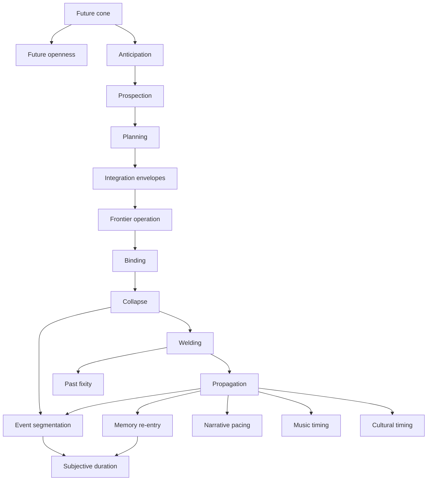
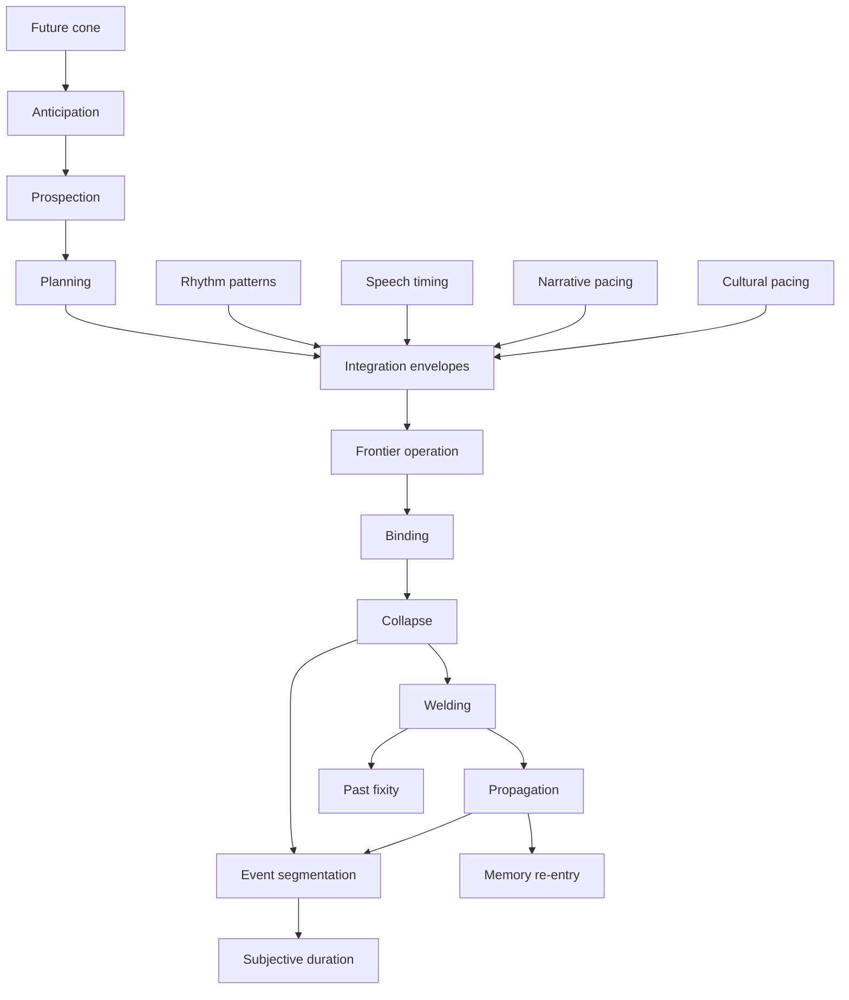

---
ier:
  tier: T2
  role: ELABORATION
  layer: pipeline
  domain:
  - temporal_persistence
  category: temporal_continuity
  status: canonical
  filename: IER-subjective-time.md
---

# Subjective Time

## Subjective Time as Frontier-Structured Irreversibility

**Informational Experiential Realism (IER v10.10.2)**  
*Tier 2 · Synthesis · Explanatory · Non-Normative · Canon-Constrained*

## Status, Scope, and Authority

This document is explanatory and non-normative.

It:

* introduces no new ontological primitives
* introduces no criteria, thresholds, or diagnostics
* does not redefine time, collapse, admissibility, welding, or propagation
* does not introduce clocks, time variables, or internal timelines
* does not posit storage of temporal sequences or traversal through time
* does not treat time as a substance, dimension, or flowing medium

This document remains subordinate to the canonical IER corpus.

If any statement here conflicts with Tier-1 commitments, Tier-1 prevails.


## Explanatory Aim

To explain temporal phenomenology within Informational Experiential Realism by showing how:

* the present appears extended
* experience divides into events
* intervals feel longer or shorter
* the past appears fixed and the future open
* experience exhibits temporal hierarchy
* time appears to “flow”

all arise from:

> frontier dynamics under intrinsic constraint

without introducing any additional temporal primitives.


## Orientation — The Problem of Temporal Experience

Experience appears temporally structured.

Among the phenomena to be explained:

* the present appears thick rather than instantaneous
* experience divides into events
* intervals feel longer or shorter
* the past appears fixed
* the future appears open
* experience appears to progress or flow
* temporal structure exists at multiple scales

These are often explained using:

* internal clocks
* stored timelines
* temporal containers
* moving presents

Under Informational Experiential Realism, such constructs are structurally unavailable.

IER does not permit:

* internal time variables
* temporal storage mechanisms
* traversal through a timeline
* accumulation of temporal units

The problem must therefore be reframed:

> Subjective time is not something experienced within time.
> It is the structure of experience produced by frontier resolution.


## Core Claim — No Time Variable, Only Structured Resolution

IER introduces no internal representation of time.

All temporal phenomenology arises from:

* admissibility structure
* irreversible contraction
* persistence of deformation
* ordered boundary-local resolution


### Future Openness

At boundary configuration ( s ):

```text
A(s)
```

denotes admissible continuation.

Future openness corresponds to:

* multiplicity of ( A(s) )
* unresolved continuation
* structural indeterminacy

The future is not a container.

It is:

> what remains reachable.


### Irreversibility

Collapse contracts admissibility:

```text
$A_{t^+}(s) \subset A_{t^-}(s)$
```

This contraction is:

* atomic
* irreversible
* reachability-defined

Irreversibility is therefore produced by:

> collapse at the history — future boundary.


### Past Fixity

After collapse:

* welding integrates deformation
* propagation distributes consequences

The past is:

> welded deformation that continues to constrain admissible futures.


### Temporal Ordering

Temporal order is not traversal.

It is:

> the ordered accumulation of collapse-indexed transitions at the boundary.

There is no movement through time — only:

* ongoing frontier operation
* irreversible contraction
* persistent structural consequence


## Continuity and Discreteness — The Structural Resolution

Experience appears both continuous and discrete.

Under Informational Experiential Realism, this is not a contradiction.

It reflects two distinct structural regimes:


### Continuous Organization (Pre-Collapse)

Within integration envelopes:

* frontier organization is continuous
* multiple elements remain jointly implicated
* constraint organization remains reversible

This produces:

* apparent continuity
* co-presence
* temporal thickness


### Discrete Articulation (Collapse)

Discreteness arises only when:

```text
$A_{t^+}(s) \subset A_{t^-}(s)$
```

That is:

* collapse irreversibly contracts admissible futures
* a structural distinction is produced
* alternatives are no longer reachable

This produces:

* event boundaries
* irreversible differentiation
* discrete articulation


### Canonical Statement

> Continuity belongs to reversible frontier organization.
> Discreteness belongs exclusively to collapse.

or more compactly:

> Experience is continuous in organization and discrete in irreversible consequence.

No additional temporal mechanism is required.


## The Specious Present — Co-Determination Before Collapse

*IER-specious-present* establishes:

> The specious present is the maximal span over which constraint organization remains actively co-determining frontier resolution prior to collapse.

Within this span:

* organization is reversible
* multiple structures remain jointly active
* admissibility has not yet been contracted

This explains:

* present thickness
* simultaneity-like experience
* co-presence without storage

The specious present is:

> a coherence condition, not a temporal container.


## Event Segmentation — Discrete Articulation of Collapse

Event segmentation introduces discreteness.

> Events are the discrete articulation of collapse at the boundary.

Formally:

> An event corresponds to a configuration at which admissibility contracts.

However:

* not all collapse yields event-scale articulation
* segmentation depends on:

  * propagation
  * structural consequence
  * cognitive registration

Events are therefore:

* not time slices
* not stored units
* not accumulated entities

They are:

> boundary-indexed articulations of irreversible change.


## Propagation and Persistence — From Events to Structure

Collapse alone does not produce temporal structure.

The required sequence is:

```text
collapse -> welding -> propagation
```


### Welding

* integrates deformation into structure
* produces persistence


### Propagation

* distributes deformation forward
* reshapes admissibility
* enables continuity across intervals


### Result

> Temporal structure arises from propagated deformation, not from collapse alone.




Figure 1. Temporal structure under IER.  
This diagram summarizes the subjective-time cluster as one continuous frontier architecture. The top sequence shows future-facing organization within admissible continuation: future openness, anticipation, prospection, planning, and integration envelopes leading into live frontier operation. The middle sequence shows irreversible structure formation: binding, collapse as contraction of (A(s)), welding, and propagation. From this pipeline arise event segmentation, past fixity, memory re-entry, and subjective duration. Narrative, music, and culture appear here as post-collapse temporal organizers and external scaffolds of temporal structure, not as generators of collapse or admissibility.




Figure 2. Live frontier organization, irreversible articulation, and temporal scaffolds.  
The top block shows cognition operating within the future cone: anticipation, prospection, planning, integration envelopes, and frontier operation. The middle block shows the irreversible pipeline: binding, collapse, welding, and propagation, from which event segmentation, memory re-entry, past fixity, and duration become possible. The bottom block shows external temporal scaffolds — rhythm, speech timing, narrative pacing, and cultural pacing — which stabilize or shape envelope organization without generating collapse, admissibility, or irreversibility themselves.

> Figures 1 and 2 make explicit that subjective time is not produced by a clock or timeline, but by the relation between reversible frontier organization, irreversible contraction, and the persistence of propagated deformation.


## Salience — Pre-Event Temporal Loading

Salience operates prior to collapse.

It:

* modulates recruitment
* influences binding
* shapes which collapses become event-scale
* determines which deformation is strongly registered

Thus:

> Salience shapes temporal structure by determining which frontier organization becomes consequential, without altering admissibility.


## Subjective Duration — Registered Deformation Density

*IER-duration* establishes:

> Experienced duration tracks the density and structural organization of cognitively registered welded deformation.

Duration depends on:

* propagation
* segmentation structure
* salience-modulated registration

It does not depend on:

* event count
* activity level
* switching frequency


### Immediate vs Retrospective Duration

Immediate duration:

* depends on current organization

Retrospective duration:

* depends on reconstructed deformation

> Duration reflects structure, not stored time.


### Dissociation

Boredom demonstrates:

* extended immediate experience
* compressed retrospective duration

Thus:

> Duration depends on registration, not activity.


## Temporal Hierarchy — Nested Integration Envelopes

Temporal structure exists at multiple scales due to:

* nested integration envelopes
* multi-scale propagation
* hierarchical organization of deformation

Thus:

> Temporal hierarchy reflects nested scales of reversible co-determination and propagated deformation.


## The Appearance of Temporal Flow

Experience appears to flow.

IER rejects this literally.

There is no:

* moving present
* traversal through time
* advancing frame

Instead:

> The appearance of flow arises from ordered collapse-indexed progression and persistence of deformation.


## Retrospective Determinacy — Why the Past Feels Fixed

At prior configuration ( s' ):

* multiple futures were admissible
* collapse removed alternatives
* only welded deformation persists

Thus:

* the past appears inevitable
* alternatives are no longer reachable

This reflects:

> loss of admissible alternatives, not stored history.


## Narrative, Music, and Cultural Time

External structures may organize temporal experience:

* narrative pacing
* musical rhythm
* conversational timing

They:

* organize segmentation
* stabilize envelopes
* compress temporal structure

They do not:

* generate collapse
* alter admissibility


## What Subjective Time Is Not

Subjective time is not:

* a timeline
* a dimension inside experience
* a stored sequence
* a measurable internal variable
* event accumulation
* traversal across states

Additionally:

> Events are not stored or accumulated.
> History is deformation, not a sequence.


## Structural Summary

| phenomenon         | frontier structure                   |
| ------------------ | ------------------------------------ |
| present thickness  | pre-collapse co-determination        |
| continuity         | reversible organization              |
| discreteness       | collapse                             |
| event boundaries   | admissibility contraction            |
| persistence        | welding + propagation                |
| duration           | registered deformation density       |
| temporal hierarchy | nested envelopes                     |
| past fixity        | welded deformation                   |
| future openness    | admissible futures ( A(s) )          |
| flow appearance    | ordered collapse-indexed progression |


## Final Compression

> Subjective time arises from irreversible contraction of admissible futures and the propagation of welded deformation within nested envelopes of reversible co-determination, yielding temporal structure without clocks, containers, or flow.
