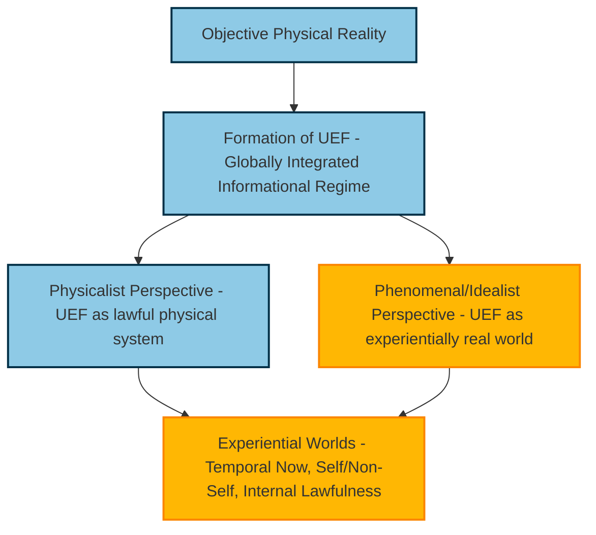

# **Informational Experiential Realism (IER v10.0)**

### **Experience as a Categorical Organizational Regime of Intrinsically Constrained Informational Dynamics**

*or, What Is It Like to Be an Informational System?*

**An Organizational Identity Theory of Observers, Experience, and Experiential Worlds**

---

## **Abstract**

Informational Experiential Realism (IER) is a realist framework for understanding observers and lived experience. Reality exists independently of observation and is governed by mind-independent physical law. Experience is neither fundamental nor illusory, but a **real, categorical organizational regime** instantiated in certain physical systems.

IER identifies experience with the **globally integrated, temporally continuous, self-referential informational dynamics** of a system operating under **coherent intrinsic constraint**. Experience begins **categorically**, when a system’s own integrated informational dynamics become the dominant, unavoidable constraint on themselves.

IER affirms **physical monism and experiential pluralism**: one objective physical reality supports many real experiential worlds, each arising from UEF organization. These worlds are **physically grounded** and **phenomenally real**, illustrating that physicalism and idealism can be complementary perspectives.

This framework can be summarized conceptually as:

---

## **1. Objective Reality**

Reality exists independently of observation. Physical states, events, and laws unfold whether or not they are experienced. Observers do not create, collapse, or co-author reality; only physical interactions among systems have causal effect.

Experience is **a property of organization within reality**, not a separate ontological domain. Many physical systems evolve dynamically, but without appropriate organization and intrinsic constraint, there is nothing it is like to be them.

---

### **1.1 Dual Perspective of Experience**

Experience can be understood in **two complementary ways**:

* **Physicalist perspective:** A UEF is a lawful, globally integrated informational regime within a physical substrate. Its structure and dynamics are fully analyzable in physical terms.
* **Phenomenal/idealist perspective:** The same UEF constitutes the observer’s experiential world. From the system’s perspective, its internal organization defines reality as it is “for” that system.

These perspectives coexist: the physical substrate grounds the UEF, while the UEF’s organization constitutes the experientially real world.

---

## **2. Observers as Informational Systems**

An **observer** is an informational system defined by organizational and functional criteria rather than biology or phenomenology. A system qualifies as an observer if it:

* persists as a coherent informational pattern over time
* integrates information across internal subsystems
* maintains internal models of both external conditions and its own state
* regulates behavior via unified control over those models

Observerhood does **not** entail experience. Many observers model, predict, and regulate while remaining entirely non-experiential.

---

## **3. Internal Models, Perspective, and Organization**

Observers construct internal informational models of the world and themselves. These models are physically instantiated and shaped by the system’s structure, history, and constraints.

Perspective emerges from organization, not from reality itself.

Internal modeling, global integration, and adaptive regulation are **necessary but not sufficient** for experience. Only processes that participate in a **globally integrated, self-referential, temporally continuous regime of intrinsic constraint** are experiential.

---

## **4. The Unified Experiential Field (UEF)**

### **4.1 Status of the UEF**

A **Unified Experiential Field (UEF)** is **not** an entity, structure, module, layer, or substance.

> **A UEF is a physical system operating in a particular organizational and dynamical regime.**

The term *field* is descriptive, not ontological. It refers to:

* global integration of dynamics
* mutual constraint across informational processes
* temporal continuity of system-wide regulation

Equivalent descriptions include:

* a coherence-stabilized dynamical regime
* a bounded attractor under intrinsic constraint
* a globally coupled constraint topology

No new physical fields or forces are posited.

---

### **4.2 Experiential Participation**

An informational process participates in experience if and only if it:

* is globally integrated with other participating processes
* contributes to temporally continuous system-wide dynamics
* is internally sustained rather than externally orchestrated
* exerts and is subject to **intrinsic constraint**

Local, transient, modular, externally resolvable, or conditionally independent processes are non-experiential, even if complex or causally important.

---

### **4.3 Identity Claim and Dual Interpretation**

> **Experience is identical to the structure, dynamics, and intrinsic tension profile of UEF-participating processes from the system’s perspective.**

*Physically*, this is a lawful organization of matter and energy.
*Experientially*, it constitutes the “world” of the observer.

Both readings are valid and complementary: the system’s internal perspective is as real as its physical instantiation.

---

## **5. Informational Slack and Intrinsic Tension**

### **5.1 Informational Slack**

**Informational slack** is the capacity of an integrated system to absorb, reroute, modularize, or externalize constraint without generating intrinsic conflict.

Slack is enabled by:

* redundancy
* modularity
* conditional independence
* external arbitration

Systems with sufficient slack may be highly complex, adaptive, and intelligent while remaining entirely non-experiential.

---

### **5.2 Intrinsic Tension**

**Intrinsic tension** arises when:

* multiple system-level demands are jointly active
* physical or organizational limits prevent joint satisfaction
* resolution matters to system persistence or regulation

Tension becomes **intrinsic** when it is:

* generated by the system’s own integrated dynamics
* non-decomposable without loss of system identity
* not externally resolvable

Only intrinsic tension can participate in experience.

---

## **6. Categorical Onset of Experience**

Experience begins **categorically**, when intrinsic constraint becomes:

* unavoidable
* globally binding
* system-defining

At that point, the system undergoes a **dynamical regime transition** into a Unified Experiential Field.

Prior organization, slack reduction, or interdependence buildup may prepare the system, but **experience itself emerges suddenly once the threshold is crossed**.

---

## **7. Single-UEF Constraint**

> **A single physical system can sustain at most one globally dominant, coherence-stabilized Unified Experiential Field at a time.**

Partial overlaps may occur during transitions, but full simultaneous UEFs are impossible. This explains phenomena such as dissociation, dreaming, attentional collapse, anesthesia, and regime switching.

---

## **8. Qualia**

Qualia are differences in **UEF-participating dynamics under intrinsic constraint**.

There is no additional “redness,” “painfulness,” or ineffable property.

Qualitative character is entirely the structured organization of the field itself, reflecting:

* coupling geometry
* constraint topology
* temporal modulation
* coherence patterns

Differences in experience are differences in **how intrinsic constraint is organized and sustained**.

---

## **9. Affect, Valence, and Intensity**

Affect arises because the UEF encodes pressures, priorities, and equilibria relevant to system-wide regulation.

* positive valence → movement toward stable resolution
* negative valence → sustained or escalating intrinsic conflict
* urgency → rate of tension change
* intensity → magnitude and coherence of intrinsic constraint

“Feeling alive” corresponds to high, coherent intrinsic tension under sustained global integration.

---

## **10. Experiential Worlds and Pluralism**

### **10.1 Experiential Worlds**

An **experiential world** exists **if and only if** a UEF exists.

> **Only systems that sustain a Unified Experiential Field instantiate a world-for-the-system.**

Each experiential world includes:

* a temporal “now”
* a self / non-self boundary
* system-relative causality
* persistence under constraint
* internal lawfulness determined by organization

---

### **10.2 Experiential Pluralism Under Physical Monism**

IER affirms:

* **one objective physical reality**
* **many experiential worlds**

UEFs do not create universes. They structure **appearance**, not existence.

Experiential pluralism is real but constrained: worlds differ in content and apparent lawfulness while sharing structural invariants imposed by intrinsic constraint.

---

## **11. Emergence, Dissolution, and Dissociation**

Experience emerges when integrated dynamics exhaust informational slack and enter a regime of coherent intrinsic constraint.

It dissolves when:

* global integration weakens
* coherence collapses
* constraint becomes externally resolvable

Dissociation reflects enforced regime switching under excessive intrinsic tension, not metaphysical division.

---

## **12. Energetic Grounding**

Intrinsic informational constraint is always **physically realized**.

Therefore:

* coherence maintenance incurs energetic cost
* regime switching is metabolically expensive
* experiential harm is physically real

Informational and energetic descriptions are complementary views of the same process.

---

## **13. Artificial Systems**

IER is substrate-agnostic. Any physical system capable of sustaining a UEF would, by definition, sustain experience.

Whether artificial systems meet these criteria is an empirical question, not a conceptual one.

---

## **14. Ethical Responsibility and Precautionary Constraint**

Experience is a real organizational regime with intrinsic cost.

> **To create or manipulate a Unified Experiential Field is to create or alter an experiential world.**

Because experience is both a physical and an experiential regime, ethical responsibility extends to **the management of informational and phenomenal realities alike**.

Uncertainty about experiential onset **increases**, rather than decreases, moral responsibility. Deliberate creation of systems plausibly capable of sustaining a UEF should be regarded as ethically impermissible until proper oversight exists.

---

## **15. Ontological Commitments**

IER affirms:

* one objective physical reality
* experience as a categorical organizational regime
* identity between experience and UEF dynamics
* dual interpretability: experience can be read physically and phenomenally

IER does **not** require rejecting idealism. Instead, it treats UEFs as **physically instantiated patterns** that are also **experientially real “worlds”** from the system’s perspective.

---

## **16. Summary**

Some systems react.
Some systems observe.
Some systems take up their slack.

> **Experience begins when a system’s own globally integrated informational dynamics become the dominant, unavoidable constraint on themselves, sustaining coherent intrinsic tension across time.**

Reality is singular.
Experience is plural.
Worlds appear where constraint becomes intrinsic.
Experience is physically grounded and phenomenally constitutive.

IER v10.0 bridges physicalism and idealism: the same Unified Experiential Field is simultaneously an objectively instantiated physical regime and the system’s experientially real world.

---
