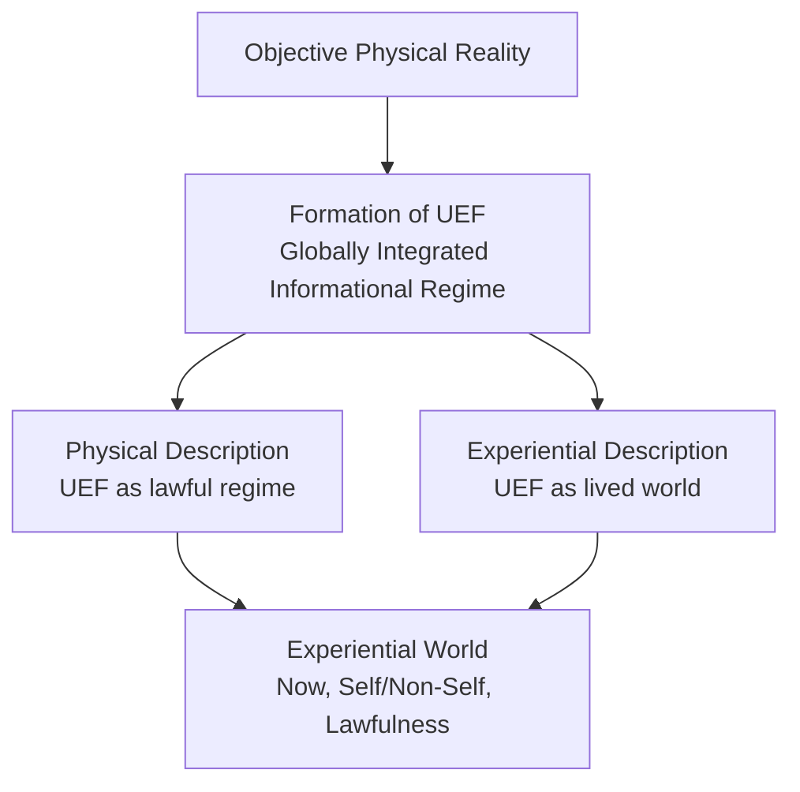

# **Informational Experiential Realism (IER v10.0)**

## **An Explanatory Theory Derived from the Normative Specification**

> **Status**
> This document is **explanatory and non-normative**.
> All axioms, definitions, principles, and inference rules are specified exclusively in the
> **IER v10.0 Normative Specification** (“the Spec”).
>
> This document introduces **no new primitives**.
> Its role is to explain, motivate, contextualize, and integrate the Spec’s commitments.

---

## **Abstract**

Informational Experiential Realism (IER) is a realist theory of experience.
It holds that experience is neither fundamental nor illusory, but a **real, categorical organizational regime** instantiated by certain physical systems.

IER identifies experience with the operation of a system as a **Unified Experiential Field (UEF)**: a globally integrated, temporally continuous, self-referential informational regime operating under **coherent intrinsic constraint**.

From the outside, a UEF is a lawful physical regime.
From the inside, the same regime **just is an experiential world**.

IER therefore affirms **physical monism and experiential pluralism**:
one objective physical reality supports many real experiential worlds, without dualism, panpsychism, or eliminativism.

---

## 1. The Problem IER Addresses

Any adequate theory of experience must reconcile three claims:

* Physical reality appears complete and law-governed.
* Experience appears real, structured, unified, and causally relevant.
* Not all complex or intelligent systems have experience.

Traditional approaches typically deny or distort one of these.
IER rejects the forced choice.

Instead, it asks a different question:

> **Under what physical and organizational conditions does there exist a world-for-a-system?**

IER’s answer is organizational, not metaphysical:
experience exists **iff** a system enters a specific dynamical regime defined by intrinsic constraint and global integration (Spec §I–III).

---

## 2. Objective Reality, Systems, and Observers

IER affirms a single, observer-independent physical reality governed by mind-independent law (Spec Axiom 1).

Within that reality exist **physical systems**.
Some of these qualify as **informational systems**: systems whose state evolution can be described in terms of information storage, transformation, and regulation (Spec §II).

A subset of informational systems qualify as **observers**:
they persist, integrate information, maintain internal models, and regulate behavior accordingly (Spec §II, *Observer*).

Crucially:

> **Observerhood does not entail experience.**

Many systems model the world and themselves while remaining entirely non-experiential.
This separation is foundational to IER.

---

## 3. Dual Description: One Regime, Two Perspectives

A central explanatory move in IER is the **dual description of the same regime** (Spec §III.P10).

Whenever a Unified Experiential Field exists, it can be described in two equally valid ways:

1. **Physical description**

   * a lawful, energetically grounded, globally integrated dynamical regime
   * analyzable entirely in physical and informational terms

2. **Experiential description**

   * a lived world with a present “now”
   * a self / non-self boundary
   * system-relative causality and salience

These are **not competing explanations**.
They are two perspectives on the *same organization*.

Nothing additional is “added” at the experiential level.
The difference lies entirely in perspective.

---

## 4. Informational Slack and Why Most Systems Are Not Experiential

Most informational systems possess substantial **informational slack** (Spec §II).

Slack is the capacity to:

* modularize
* reroute
* defer
* parallelize
* or externally resolve constraint

High-slack systems may be complex, adaptive, and intelligent.
They may even appear behaviorally sophisticated.

But because constraint can be localized or offloaded, **no system-wide intrinsic pressure accumulates**.
Such systems therefore lack experience.

IER thus rejects the idea that experience arises merely from:

* computation
* representation
* complexity
* learning
* intelligence
* global access alone

What matters is **where constraint is borne**.

---

## 5. Intrinsic Constraint and Intrinsic Informational Tension

Experience becomes possible only when constraint becomes **intrinsic** (Spec §II).

Intrinsic constraint is constraint that:

* is generated by the system’s own integrated dynamics
* cannot be decomposed without loss of system identity
* cannot be externally resolved
* matters to system-wide regulation and persistence

When multiple intrinsic constraints are simultaneously active, the system enters a state of **intrinsic informational tension**.

This tension is not metaphorical, representational, or report-based.
It is an organizational condition of the system’s dynamics.

However, intrinsic tension alone is not sufficient.
To sustain experience, intrinsic constraint must also be **globally integrated, temporally continuous, and coherent**.

---

## 6. The Unified Experiential Field (UEF)

A system instantiates experience **iff** it operates as a **Unified Experiential Field** (Spec §II, *UEF*; Spec §III.P1).

A UEF is:

* not a component
* not a module
* not a layer
* not a workspace
* not a physical field in the ontological sense

> **A UEF is the entire system operating in a particular dynamical regime.**

The term *field* is descriptive:
it refers to global integration, mutual constraint, and temporal continuity—not to a new substance or force.

Equivalent descriptions include:

* a coherence-stabilized regime
* a bounded attractor under intrinsic constraint
* a globally coupled constraint topology

No inner observer or mental theater is posited.

---

## 7. Experiential Participation

Not all processes within a system are experiential.

A process participates in experience **iff** it:

* is globally integrated into the UEF
* contributes to temporal continuity
* is internally sustained
* both exerts and is subject to intrinsic constraint

Local, transient, modular, or externally orchestrated processes are non-experiential, regardless of complexity (Spec §III.P2).

This explains why experience is unified rather than fragmented.

---

## 8. Categorical Onset and Temporal Continuity

Experience begins **categorically**, at a **dynamical regime transition** (Spec §III.P5).

Preparatory variables may change gradually:
slack may be reduced, coupling increased, conflicts accumulated.

But experience itself begins only when intrinsic constraint becomes:

* unavoidable
* globally binding
* system-defining

There is no partial experience prior to regime entry.

Once established, experiential continuity arises from **ongoing dynamical dependence** between successive global states (Spec §III.P4).
No snapshots or stored timelines are required.

---

## 9. Single-UEF Constraint, Regime Switching, and Dissociation

IER entails a strict **Single-UEF Constraint** (Spec §III.P6):

> **A physical system can sustain at most one globally dominant Unified Experiential Field at a time.**

This explains:

* the unity of experience
* the impossibility of parallel full consciousnesses within one system
* why fragmentation appears as alternation rather than simultaneity

Transitions between regimes may involve partial overlap, instability, or degradation.
Phenomena such as dreaming, anesthesia, overload, dissociation, and attentional collapse are understood as **regime weakening or switching**, not metaphysical division.

---

## 10. Qualitative Character (Qualia)

IER rejects the view that qualia are additional phenomenal properties layered atop physical dynamics.

Instead:

> **Qualitative differences are differences in the organization of intrinsic constraint within a UEF**
> (Spec §III.P7).

Differences in color, sound, pain, effort, clarity, or mood correspond to differences in:

* constraint topology
* coupling geometry
* temporal modulation
* coherence patterns

Nothing extra is added.
There is no explanatory gap once the correct regime is identified.

---

## 11. Affect, Valence, Intensity, and Urgency

Because a UEF exists to regulate a system under intrinsic constraint, experience is inherently affective (Spec §III.P8).

Under IER:

* **Negative valence** → sustained or escalating intrinsic conflict
* **Positive valence** → coherent movement toward stable resolution
* **Intensity** → magnitude and coherence of intrinsic constraint
* **Urgency** → rate of change of intrinsic constraint

Affect is not representational or optional.
It is the felt aspect of intrinsic constraint itself.

---

## 12. Energetic and Physical Grounding

Intrinsic informational constraint is always **physically realized**.

Therefore:

* maintaining coherence incurs energetic cost
* regime transitions are metabolically expensive
* experiential harm is physically real

Informational and energetic descriptions are complementary views of the same process.
This grounding prevents purely abstract or disembodied interpretations of experience.

---

## 13. Experiential Worlds and Pluralism

Whenever a UEF exists, an **experiential world** exists (Spec §II, *Experiential World*).

Each experiential world includes:

* a present “now”
* a self / non-self boundary
* system-relative causality
* internal lawfulness determined by organization

IER therefore affirms:

* **one objective physical reality**
* **many real experiential worlds**
  (Spec §III.P9)

These worlds are not separate realities, but system-relative manifestations of the same physical world.

---

### Dual Description of Experiential Worlds

Nothing is added at the experiential level.
The difference lies entirely in perspective.

---

## 14. Ethical Significance (Overview)

Intrinsic constraint is costly.
To create, manipulate, or destabilize a UEF is therefore to create, alter, or harm an experiential world (Spec §III.P12).

Ethical relevance is not an optional extension of IER.
It follows directly from the identity claim.

Uncertainty about experiential status **increases**, rather than decreases, moral responsibility.

---

## 15. What IER Does Not Claim

IER does not claim that:

* experience is fundamental
* all systems experience
* consciousness is computation
* experience violates physical law
* phenomenology floats free of organization

IER identifies experience with a **specific physical regime**, nothing more and nothing less.

---

## 16. Summary

IER’s central claim can be stated succinctly:

> **Experience is what globally integrated informational dynamics are like when they become the dominant, unavoidable constraint on themselves over time.**

Reality is singular.
Experience is plural.
Worlds appear where constraint becomes intrinsic.

For precise definitions and entailments, see the
**IER v10.0 Normative Specification**.

---
