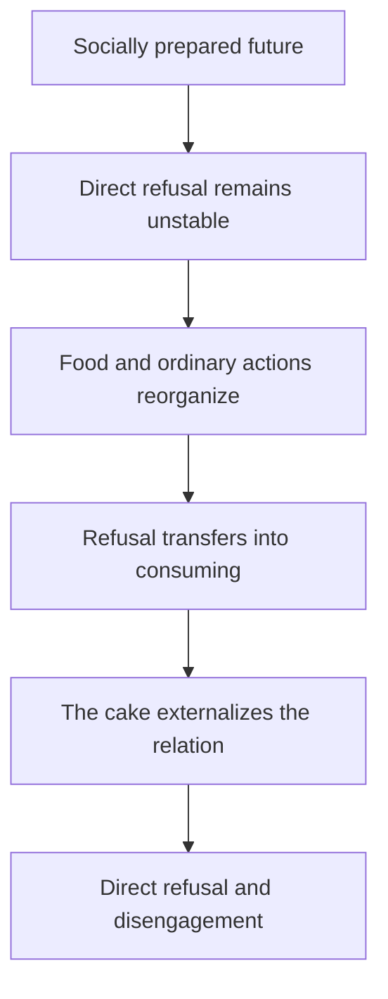

---
ier:
  tier: T4
  role: READER_GUIDE
  layer: application
  domain:
    - literature
    - psychology
    - orientation
  category: companion_reader
  status: draft
  canonical: false
  canonical_authority: none
  filename: IER-edible-woman-reader.md
  version: 10.11.3
  provides:
    - non-specialist introduction to the IER reading of The Edible Woman
    - translation of IER concepts into literary and psychological language
    - comparison with adjacent interpretive frameworks
    - evaluation guide for the behavioural-substitution hypothesis
  requires:
    - IER-edible-woman.md
    - IER-precis.md
  tags:
    - edible-woman
    - margaret-atwood
    - reader-guide
    - literary-analysis
    - psychology
    - behavioural-substitution
---

# How to Read “Becoming Inedible”

## A Reader’s Guide to the IER Analysis of *The Edible Woman*

**Informational Experiential Realism (IER v10.11.3)**

*Tier 4 · Companion Reader · Draft · Non-Normative · Non-Canonical*

## Purpose and Scope

This guide is for readers who know Margaret Atwood, literary criticism, psychology, or the human sciences but do not know Informational Experiential Realism. It explains the argument of `IER-edible-woman.md`, translates its technical vocabulary, and identifies where the article is making a textual observation, a literary inference, or a specifically IER explanation.

The guide does not ask the reader to accept IER before considering the interpretation. The literary proposal can be assessed at several levels. A reader may find the description of Marian’s trajectory illuminating while remaining undecided about IER’s ontology of experience. Conversely, a psychologist may recognize similarities to displacement, somatic expression, appraisal, or affordance change while disputing IER’s way of redescribing those phenomena.

Neither the article nor this guide diagnoses Marian. She is a fictional character, and the novel is not a clinical record. The analysis does not identify an eating disorder, dissociative disorder, conversion disorder, or other condition. It also does not claim that actual food refusal ordinarily has the structure proposed here.

## The Short Version

The companion article argues that Marian resists a socially prepared future before she can directly refuse it. Her engagement to Peter is not merely a private choice between two isolated individuals. Marriage, work, family expectation, consumer culture, clothing, grooming, and photography together make one continuation increasingly easy to enter and increasingly difficult to leave: Marian as a socially recognizable future wife.

Her inability to eat develops within that trajectory. IER does **not** explain this by saying that Marian’s body secretly knows the truth and sends her conscious mind a coded message. It says that one embodied subject can reorganize before that subject has an explicit explanation for what is happening. As meat becomes slaughtered flesh, an egg becomes possible life, a carrot becomes uprooted life, and processed food acquires the appearance of organisms or organs, eating ceases to be an available ordinary action. Food still exists physically, but it no longer affords eating for Marian.

The article’s distinctive hypothesis is that refusal has moved into the wrong behavioural domain. Marian cannot yet stably refuse being made consumable within marriage, so she becomes unable to occupy the position of consumer. The consumer/consumed relation persists, but her position within it reverses:

> Refusal of being consumed remains unstable; refusal to consume becomes behaviourally available.

The woman-shaped cake brings the relation back into the domain where Marian can act on it. She constructs an edible representation, calls it a substitute, offers it to Peter, and directly accuses him of trying to destroy or assimilate her. The cake is therefore more than a symbol for the reader. It is a material model used by Marian to change the situation. After Peter leaves, the engagement no longer governs what must happen next. Marian eats, cleans, speaks in the first person again, and reorganizes her immediate future.

The ending is not a return to innocence. Marian again consumes food, including steak, and Duncan calls her a consumer. The change is narrower: she remains implicated in consumption, but she is no longer accepting her assigned position as the object to be consumed by a future she did not adequately author.

This diagram states the article’s proposed interpretive arc. It is not presented as a demonstrated clinical mechanism.

# 1. Three Levels of Claim

The easiest way to misread the article is to collapse three different kinds of statement.

| Level | Example | What kind of support it requires |
| --- | --- | --- |
| Textual description | Marian’s food aversion expands; Part Two uses third person; she offers Peter a woman-shaped cake as a substitute. | Direct support from the novel. |
| Literary inference | The food sequence is related to Marian’s fear of being consumed or assimilated by the marriage trajectory. | Fit with imagery, form, chronology, dialogue, and the ending. |
| IER redescription | A governing relation transfers across behavioural domains because direct disengagement remains unstable. | Coherence with IER concepts plus explanatory usefulness for the literary pattern. |

The novel explicitly supports the first level. It strongly invites, but does not dictate, much of the second. The third is the companion article’s theoretical contribution.

For example, the novel depicts Marian’s body or stomach as if it has taken an “ethical stand.” A literary critic may reasonably describe the body as protesting what Marian cannot consciously say. IER redescribes this without introducing a second inner person: bodily regulation, attention, interpretation, action readiness, and explicit thought are differently organized aspects of one subject. Behaviour may change before an articulate explanation becomes available.

Likewise, Marian explicitly calls the cake a substitute. That textual fact supports an analysis of substitution. It does not by itself prove the article’s broader hypothesis that her inability to consume substitutes for an inability to refuse being consumed. That remains a proposed explanation of the pattern.

# 2. The Minimum IER Needed for This Article

## 2.1 IER is a proposed physical identity theory of experience

IER begins with a philosophical claim about what experience is. It proposes that experience is identical with the operation of a physical system under a particular kind of globally integrated, internally borne constraint. It calls such an organization a **Unified Experiential Field**, or **UEF**.

“Field” does not mean a mysterious energy field or a container in the brain. It names the unified operation of the subject. On IER’s account, the physical process does not first occur and then produce an additional mental product. When the relevant physical organization exists, its operation **is** the experience.

This base ontology is not established by *The Edible Woman*. The novel is used as a fictional structure to which IER’s behavioural vocabulary can be applied. A reader can therefore distinguish two questions:

1. Does the proposed reading illuminate Marian’s trajectory?
2. Is IER’s underlying identity theory of experience correct?

An answer to the first does not settle the second.

## 2.2 “Constraint” does not mean repression or external pressure alone

In ordinary literary and psychological language, constraint often means prohibition, oppression, inhibition, or social limitation. IER uses the term more broadly and more physically. A constraint is a restriction on how a system can continue from its present organization.

Some constraints in the novel are plainly social: expectations surrounding marriage, gender, work, appearance, and family approval. Others are bodily: nausea, inability to swallow, hunger, fatigue, and the practical requirements of remaining alive. Others are interpretive or historical: once steak has become connected to cow, blood, and butchery, that history changes what Marian can do with it.

IER’s point is not that all these constraints are the same. It is that their effects meet in one continuing subject and jointly shape what remains practically available.

## 2.3 There is no inner executive standing outside experience

IER does not picture the person as a conscious executive receiving messages from separate modules and deciding what the body will do. Nor does it replace the conscious executive with an unconscious one.

The framework treats deliberation, perception, affect, autonomic regulation, self-description, memory, and action as forms of participation within one organized subject. They can conflict, differ in salience, and constrain one another. Marian can know that toast is edible and still be unable to eat it. That conflict does not require two Marians.

For this reason, the article avoids the attractive but overly literal statement that “her body knows before she does.” Its safer claim is:

> Marian’s embodied behaviour reorganizes before her explicit interpretation stabilizes.

## 2.4 Experience is organized toward possible continuation

IER describes a subject at the boundary between a sedimented history and a range of physically admissible continuations. “Future” here does not mean a list of consciously imagined options. It means what the current organization can still become or do.

This lets the article ask questions that are slightly different from “What does Marian believe?” or “What does the carrot symbolize?” It asks:

- What actions remain available to Marian in this situation?
- Which continuations have become easier, harder, or impossible?
- What keeps recruiting her attention and participation?
- Which earlier organization continues across changes of place, object, or activity?
- When does the engagement cease to govern what happens next?

This emphasis on continuation is the bridge between IER’s ontology and its literary application.

# 3. Translating the Article’s Vocabulary

The terms below are best read as precise questions about organization, not as names for hidden faculties.

| IER term | Plain-language translation in this article | Application to Marian |
| --- | --- | --- |
| **Environment** | Everything outside the proposed subject boundary that can constrain or support continuation. | Peter, the office, family responses, food, the salon, the apartment, and cultural practices all participate differently in Marian’s environment. |
| **Culture / social stack** | Material, linguistic, institutional, and relational supports that make some lives easier to reproduce than others. | The “future wife” role arrives with expectations, language, appearance, approval, and practical momentum already attached. |
| **Situation** | The presently integrated organization of what matters, what is happening, and what can be done. | The same steak is dinner for Peter but a scene of slaughter for Marian because they inhabit different actionable situations. |
| **Participation** | Which processes, histories, perceptions, bodily demands, and models are actively contributing to what happens next. | Cow, blood, butcher, disgust, Peter, hunger, and social politeness do not contribute equally at every meal. |
| **Salience** | What becomes comparatively difficult to ignore because it matters to continuation. | The animal history of meat becomes more salient than taste or nourishment. |
| **Interpretation** | A stabilizing organization of what is happening under incomplete knowledge. It can guide action without being true. | Marian’s “ethical stand” makes her changing food response intelligible and then helps recruit further foods as cases. |
| **Affordance** | An action that is locally available to this subject in this situation. | Food can cease to afford eating while affording disgust, concealment, ethical concern, or refusal. |
| **Narrowing** | Progressive loss of practical flexibility before an irreversible outcome. | Marian’s menu and her means of responding to the engagement both become increasingly restricted. |
| **Autonomia** | Bodily and regulatory participation becoming strongly foregrounded without becoming a separate agent. | Nausea, throat closure, appetite loss, and hunger constrain action while Marian remains one acting subject. |
| **Situation dominance** | A changed context reorganizes what is happening on new terms. | The cake introduces a new local situation in which accusation and direct refusal become possible. |
| **Experience dominance** | An already active organization recruits a changed context as another place for itself to continue. | Restaurant, breakfast, office party, grocery store, apartment, and engagement party all become sites of consumption, vulnerability, or capture. |
| **Trajectory authorship** | Authorship distributed across sustained action and consequence over time, not located in one magical decision. | Marian’s authorship is visible across running, hiding, consenting, concealing, baking, confronting, eating, and leaving—not only in the cake scene. |
| **Disengagement** | A prior organization ceases to govern what must happen next. Stopping an activity is not enough. | Marian repeatedly escapes particular scenes, but the engagement continues to organize her future until the confrontation. |
| **Rebinding / reorganizability** | Another organization becomes capable of governing continuation; the system regains room to reorganize. | After Peter leaves, appetite, cleaning, narration, and immediate planning can organize around a future that no longer has to preserve the marriage. |
| **Self-model / narrative self** | A practical organization of identity, history, role, and anticipated continuation—not the subject itself. | The shift from “I” to “she” stages altered self-coordination; it does not mean that Marian literally loses or regains subjecthood. |
| **Model** | An organization used to preserve selected relations and explore or enact consequences. | The cake preserves “woman made attractive, offered, and consumed” in a manipulable external form. |
| **Empathy** | Local reproduction of another’s apparent situation or vulnerability, without access to that being’s actual experience. | Marian can organize around the imagined vulnerability of cow, chick, carrot, or mold without learning what any of them experiences. |
| **Ethical constraint** | Moral relevance that shapes action without necessarily supplying a complete decision rule. | Marian recognizes implication in destruction, but “never consume anything living” becomes incompatible with her own continuation. |
| **Behavioural transfer** | An active organization continues through a different object, activity, or setting. | The consumption relation persists across food, cleaning, clothing, photography, and the cake. |
| **Behavioural substitution** | This article’s provisional hypothesis: an unavailable refusal appears in a different domain while preserving and reversing the relation. | Marian cannot stably refuse being consumed, so consuming becomes unavailable. |

The final term is not established IER canon. It is a concept proposed by the literary bridge article for later evaluation.

# 4. Reading the Novel’s Trajectory Through IER

## 4.1 The engagement is a prepared future, not a single isolated choice

The article does not say that Marian has no agency or that Peter unilaterally determines her life. Marian assents, resists, delegates, improvises, conceals, and eventually refuses. The relevant issue is how much of the continuation has already been organized by her environment.

Marriage is culturally legible. It comes with a role, timing, public presentation, family response, and assumptions about work and femininity. Peter does not need to invent all of this, and Marian does not need to consciously endorse every component for it to shape what is easier to do next.

For literary critics, this is close to saying that ideology is materialized in institutions, habits, expectations, and forms of appearance. IER’s added emphasis is on local action geometry: how those structures become part of Marian’s immediate field of viable continuation rather than remaining abstract “social forces.”

## 4.2 The third-person narration stages altered self-coordination

Part Two’s shift from “I” to “she” follows the engagement and precedes the categorical steak refusal. The article therefore does not make the narration a direct report of the food symptom or a literal measure of consciousness.

IER distinguishes the experiential subject from the self-model. Marian remains the subject of experience throughout the novel. What changes is the form through which her history, role, and future are organized. Third person makes her available as someone described within a ready-made social account: employee, fiancée, future wife, dressed and photographed woman.

The return to first person supports a reorganization reading because it accompanies a changed trajectory. It does not prove the restoration of a metaphysical “true self,” nor does it guarantee complete psychological recovery.

## 4.3 The food sequence is a change in action, not just a change in opinion

Marian does not merely decide that meat is morally objectionable and adopt a stable vegetarian practice. Food becomes unavailable in an uneven sequence. Fish and shrimp remain possible after some meats do not. Artificial foods temporarily seem safe. The pattern later expands to vegetables and processed foods imagined as organic.

IER describes this as affordance reorganization. The conventional identity of the object no longer stabilizes the action. Steak does not simply mean “food plus an upsetting thought”; it now recruits cow, flesh, blood, butcher, and violence strongly enough that eating fails as a continuation.

This is why the article takes Marian’s bodily response seriously without treating it as infallible. The response is real as an organization of action. Its ethical and causal interpretation may still be incomplete or wrong.

## 4.4 Marian’s ethical explanation both clarifies and broadens the pattern

Marian retrospectively interprets her body as refusing what once was or might still be living. That explanation gives the existing changes a common structure. Once stabilized, it can make later encounters easier to recruit into the same organization.

The sequence can therefore be read as feedback:

1. some foods become unavailable before a general rule is formed;
2. Marian interprets the pattern as an ethical stand;
3. the interpretation changes what becomes salient in later situations;
4. later refusals appear to confirm and expand the interpretation.

IER calls an interpretation action-organizing without granting it privileged access to truth. The feeling that the carrot is screaming may be compelling enough to stop Marian’s action. It does not establish that the carrot screams, suffers as imagined, or constitutes an experiential subject.

## 4.5 Mold extends the problem from diet to destruction

Mold is not another item in Marian’s menu. The kitchen scene matters because the same organization now reaches cleaning. Washing dishes would preserve Marian’s household by destroying or removing another living organization.

This exposes the practical limit of her rule. Organisms continue through transformation of their environments. Eating, cleaning, healing, sheltering, and ordinary maintenance preserve some organizations at costs to others. The novel does not thereby show that ethical concern is foolish. It shows that the demand for complete innocence cannot guide a finite embodied life.

IER separates biological life, possible experience, moral standing, harm, and absolute preservation. Marian’s concern may be ethically serious even when her classification is unreliable and her rule is unlivable.

## 4.6 The consumer/consumed relation persists across domains

The article treats consumption as a governing relation, not merely a repeated word or symbol. At work, people are classified for consumer research. In marriage, Marian fears assimilation. At meals, living beings appear as available matter. At the salon and party, Marian is made displayable. With the camera, a socially manufactured Marian threatens to become fixed as an image.

These scenes are materially different. IER does not claim they are literally identical. It asks whether they preserve enough organization—availability, transformation, capture, destruction, assimilation—to recruit one another across Marian’s trajectory.

This is experience dominance: new objects and settings become new surfaces for an already active relation. It is also behavioural transfer: the governing organization continues even when the visible behaviour changes.

## 4.7 The cake is an action, not merely a decoded symbol

Traditional literary interpretation can ask what the cake represents. IER asks an additional question: what does constructing and presenting the cake make possible?

The cake preserves selected features of the party woman while omitting Marian’s subjecthood. It is feminine, decorated, offered, edible, and destructible. Marian can point to it, accuse Peter, and offer it as a substitute. Relations previously distributed across food, dress, camera, engagement, and fear become manipulable in one shared situation.

The model changes its situation. Before the cake, Marian can run from scenes, hide food, avoid photographs, or seek Duncan. These actions resist without ending the governing continuation. With the cake on the table, direct accusation and refusal become available.

Calling the cake a model does not deny that it is a symbol, image, joke, grotesque object, or parody of domestic labour. “Model” identifies its practical role in the scene: it preserves enough organization to support projection and action.

## 4.8 The ending is reorganization, not cure or purity

After Peter leaves, Marian becomes hungry and eats part of the cake. The next day first-person narration returns. She cleans the apartment, reports eating steak, and gives the remaining cake to Duncan.

The article interprets this cluster as disengagement: the engagement no longer has to be preserved by what happens next. That is more specific than saying Marian is cured, liberated, integrated, or restored to a true self.

Residue and ambiguity remain. Marian still lives within consumer society, embodiment, gender, material dependency, and inherited language. Duncan’s final description of her as a consumer prevents an innocent ending. IER’s term **reorganizability** is deliberately modest: Marian has regained enough practical flexibility for another continuation to become possible.

# 5. The Behavioural-Substitution Hypothesis

This is the most original and most contestable part of the article.

## 5.1 What it proposes

The hypothesis claims that Marian’s eating problem preserves the structure of her primary conflict while changing domain and reversing her position within it.

| Primary relation | Substituted relation |
| --- | --- |
| Marian is becoming available for assimilation into an externally organized future. | Other living or apparently living things are available for assimilation by Marian. |
| Marian is positioned as what can be consumed. | Marian is positioned as the consumer. |
| Direct refusal of the engagement remains unstable. | Refusal becomes possible as inability to eat. |

The behaviour is meaningful without being a deliberately encoded communication. Marian need not secretly decide, “Because Peter is consuming me, I will stop consuming animals.” The relation can persist through changes in attention, bodily response, interpretation, and available action without being represented as a sentence or selected by a hidden agent.

## 5.2 What it does not propose

The hypothesis does not claim that:

- every symptom is symbolic;
- every eating disorder expresses fear of being consumed;
- the body possesses superior moral or psychological knowledge;
- Marian has no conscious awareness of her ambivalence;
- Peter is the sole cause of the crisis;
- one event mechanically produces every later refusal;
- fictional organization demonstrates a real clinical mechanism.

## 5.3 How to evaluate it

A reader should ask:

1. **Coverage:** Does the hypothesis explain more than the food scenes? Does it illuminate the rabbit, work, marriage, makeover, camera, cake, and ending?
2. **Chronology:** Does it respect the actual sequence rather than rearranging scenes to fit the theory?
3. **Specificity:** Does positional reversal explain why refusal appears in consuming rather than in some unrelated behaviour?
4. **Economy:** Does it unify the novel without erasing differences among animals, plants, mold, photography, and marriage?
5. **Alternatives:** Could objectification, anxiety, disgust generalization, depressive appetite loss, feminist satire, or narrative symbolism explain the same pattern more simply?
6. **Turning point:** Does the cake’s practical reorganization explain why direct refusal and appetite become available together better than a purely symbolic reading does?

The hypothesis earns its place only if it improves the reading under those tests. Its label alone explains nothing.

# 6. Comparison with Familiar Literary Approaches

IER is best treated as a complementary lens rather than a replacement for established criticism.

| Approach | Likely point of emphasis | IER’s overlap | IER’s difference |
| --- | --- | --- | --- |
| **Feminist criticism** | Marriage, gender roles, objectification, domesticity, consumer femininity, and Marian’s threatened autonomy. | The article treats social roles and material practices as distributed constraints on Marian’s future. | It asks how those constraints reorganize immediate action and affordances without reducing Marian either to free chooser or passive product of ideology. |
| **Marxist or materialist criticism** | Consumer capitalism, market research, commodification, labour, and exchange. | Seymour Surveys and the consumer/consumed relation are part of the social infrastructure of the reading. | IER follows how large-scale structures become locally actionable within one subject rather than treating “capitalism” as a complete causal agent. |
| **Psychoanalytic criticism** | Symptom, displacement, repression, oral incorporation, unconscious conflict, and symbolic substitution. | Behavioural substitution resembles displacement: a conflict appears in another domain. | IER does not posit a hidden interpreter that selects a symptom or assume that symbolic content is the causal code of the behaviour. |
| **Narratology** | The first-person/third-person/first-person structure, focalization, irony, and formal control. | The narrative shift is central evidence of altered self-coordination. | IER distinguishes narrative organization from experiential subjecthood and relates the formal change to action across a trajectory. |
| **Phenomenological criticism** | Lived embodiment, estrangement, intentionality, appetite, disgust, and the body’s disclosure of a world. | IER takes changes in Marian’s lived action field as primary rather than reducing them to propositions. | It attempts a physicalist structural redescription and withholds epistemic authority from how the experience presents itself. |
| **Ecocriticism / animal studies** | Consumption, animal vulnerability, vegetal life, interdependence, and the moral visibility of food. | The article preserves the ethical force of Marian’s recognition of implication. | It separates life, experience, standing, and preservation, and rejects empathy as proof of another being’s experience. |
| **Reader-response criticism** | How imagery recruits the reader’s disgust, identification, and judgment. | The article recognizes that represented vulnerability can reorganize a local situation. | Its primary object is Marian’s organization within the fiction, not a general claim about actual readers. |

IER’s most useful contribution to literary criticism may be its insistence that symbols can be actions. The cake means, but it also changes the scene. The camera represents, but it also creates a practical threat of fixing and circulating a version of Marian. Literary objects participate in the trajectory rather than merely awaiting interpretation from outside it.

# 7. Comparison with Familiar Psychological Explanations

IER is not a clinical psychology and does not provide diagnostic criteria. Still, its explanation can be compared with several psychological families of thought.

## 7.1 Displacement and somatic expression

A psychodynamic account might say that a conflict that cannot be consciously acknowledged is displaced into a symptom. A psychosomatic account might emphasize the genuine bodily expression of stress or conflict.

IER agrees that behaviour can reorganize outside articulate deliberation and that a conflict can appear in another domain. Its caution concerns agency and coding. It does not assume that an unconscious executive chose food as a symbol or that nausea is a message sent from body to mind. The same embodied organization can alter salience, autonomic participation, interpretation, and action before it can formulate a report about itself.

## 7.2 Appraisal, attention, and disgust generalization

A cognitive account might describe changes in appraisal: meat is appraised as flesh, risk, or harm; attention becomes biased toward signs of life; disgust generalizes across categories; avoidance reinforces the pattern.

IER can accept much of this descriptive sequence. Its own vocabulary emphasizes that appraisal is not merely an internal label applied to an otherwise unchanged action. Once interpretation and salience reorganize the situation, the available continuation changes. Avoidance also has a trajectory cost: each local refusal resolves immediate conflict while making the broader field of eating narrower.

## 7.3 Ecological and embodied approaches

Ecological psychology and embodied cognition emphasize organism–environment relations and action possibilities rather than a detached internal spectator. IER has a strong family resemblance here. Its concept of affordance is relational: what can be done depends on the organization of subject and environment together.

IER adds its own ontology of intrinsic constraint and insists that affordances are locally admissible continuations within one experiential subject. Whether that added metaphysical structure is useful or warranted is an independent question.

## 7.4 Predictive or model-based accounts

A model-based psychology might say that Marian’s expectations and generative models increasingly interpret ambiguous food features as signs of life, harm, or anatomy. The cake might be treated as an externalized model that enables reappraisal.

IER also uses the word **model**, but it does not make prediction or inner representation the basis of experience. A model is an organization used to preserve selected structure and project bounded consequences. The cake can function as a model precisely because models need not be hidden in the head.

## 7.5 Agency and recovery

Many psychological readings would describe the cake scene as recovery of agency, integration, insight, or assertiveness. IER narrows the claim. Marian has acted throughout the novel, including when her agency is conflicted or constrained. What changes is trajectory authorship and disengagement: the future no longer has to reproduce the engagement.

This avoids two extremes. Marian was not previously an inert victim, and the cake does not make her an unconstrained sovereign. Agency is graded and distributed across time; authorship concerns whether she bears and reorganizes the constraints shaping her continuation.

# 8. What IER Adds to the Analysis

The article offers six main additions.

## 8.1 One account across bodily, social, narrative, and material domains

The reading does not require separate explanations for society acting on Marian, a body rebelling against a mind, a narrator changing grammatical person, and a symbol resolving a theme. It treats these as differently describable organizations within one trajectory while preserving their differences.

## 8.2 Behaviour before explicit explanation

IER makes room for meaningful reorganization that is neither consciously planned nor authored by a second unconscious person. Marian’s later ethical theory can shape the continuation without being the original cause or final truth of the pattern.

## 8.3 Action possibilities rather than beliefs alone

The language of affordances explains why “Marian knows the food is edible” is not a sufficient objection. Knowledge and action availability can diverge. The central fact is not merely what proposition she endorses but what continuation her present organization permits.

## 8.4 Authorship across time

The article does not search for the one authentic decision that reveals Marian’s real will. It examines how authorship is lost, mixed, exercised, and recovered across a sequence of consent, resistance, concealment, construction, confrontation, and consequence.

## 8.5 The cake as an intervention

Treating the cake as a material model explains how representation can reorganize action. Marian does not only understand the consumption metaphor; she builds an object that makes a different response possible in a shared situation.

## 8.6 Ethics without purity

The analysis preserves the moral importance of vulnerability and harm while rejecting the idea that ethical seriousness must produce a universal rule of non-consumption. Marian’s own continuation has standing too. Ethical conflict can be real even when no innocent option exists.

# 9. What the Article Does Not Establish

For a critical reader, these limits are as important as the interpretation.

- The novel does not prove that IER’s ontology of experience is true.
- The reading does not establish a general causal theory of food refusal.
- Marian’s bodily response is not treated as ethically or epistemically infallible.
- The third-person narration does not show loss of consciousness, identity, or subjecthood.
- Social constraint does not eliminate Marian’s agency.
- Peter is not the complete mechanism of the crisis, and his internal reason for leaving is unknown.
- The cake is not said to cure Marian or restore an untouched authentic self.
- Biological life is not equated with experience or categorical moral standing.
- “Behavioural substitution” is a provisional bridge concept, not a settled IER mechanism.
- Similarity to an established psychological concept does not amount to empirical validation.

The companion article is strongest when read as a disciplined redescription of narrative organization. It is weakest if its technical vocabulary is treated as proof simply because it is technical.

# 10. A Scene-by-Scene Quick Reference

| Novel element | Familiar reading | IER question |
| --- | --- | --- |
| Rabbit story and Marian’s flight | Identification with prey; early resistance to Peter. | What relation becomes active before the proposal, and how does it shape later continuation? |
| Engagement and delegated “big decisions” | Ambivalence; patriarchal role formation. | Who or what supplies the trajectory’s organization, and how integrated is Marian’s assent? |
| Shift to third person | Alienation, dissociation, or objectification. | How has self-coordination changed while the experiential subject remains continuous? |
| Steak, egg, carrot, processed foods | Expanding disgust, ethical identification, or somatic protest. | When and why does food cease to afford eating? |
| Marian’s ethical rule | Moral awakening or rationalization. | How does a retrospective interpretation organize later salience without becoming infallible? |
| Mold-covered dishes | Rejection of domesticity; identification with life. | How does the pattern move from eating into cleaning and destruction? |
| Party makeover and camera | Manufactured femininity; objectification; hunter imagery. | Whose representation is being stabilized, and what action would the image support? |
| Woman-shaped cake | Symbolic substitute, parody, confrontation. | How does a material model make direct accusation and refusal available? |
| Peter’s departure | Failed engagement; rejection of the cake. | Has the previously governing future ceased to organize what happens next? |
| Eating, cleaning, and return of “I” | Recovery, reintegration, or qualified liberation. | What has rebound, what residue remains, and how much reorganizability has returned? |
| Duncan’s “consumer” remark | Irony; complication of emancipation. | Can Marian regain authorship without escaping implication in consumption? |

# 11. Questions for a Seminar or Comparative Discussion

## For literary scholars

1. Does the concept of a material model add anything to a symbolic reading of the cake?
2. Does trajectory authorship illuminate Marian’s mixed agency better than the opposition between autonomy and oppression?
3. Is the consumer/consumed relation genuinely preserved across work, marriage, food, photography, and the cake, or does the framework over-unify distinct motifs?
4. What formal work does the narration shift perform that cannot be captured by psychological vocabulary?
5. Does the qualified ending support disengagement, or does Duncan’s final remark reinstate the original structure?

## For psychologists and philosophers of mind

1. Can behaviour reorganize before explicit explanation without positing a separate unconscious agent?
2. What explanatory work is done by “affordance reorganization” beyond appraisal, avoidance, and disgust generalization?
3. Is behavioural substitution distinguishable from displacement in a way that could matter outside literary analysis?
4. Does treating the cake as an external model improve an account of reappraisal and action?
5. What evidence would be required before any part of this fictional redescription could become a psychological hypothesis?

## For ethicists

1. Which parts of Marian’s expanding concern track plausible harm, and which depend on resemblance or imagined livingness?
2. How should concern respond to uncertainty about experience without collapsing into universal preservation?
3. Does the ending reject Marian’s ethics, reject only her purity rule, or leave the question unresolved?
4. How should Marian’s own viability constrain her duty not to consume or destroy?

# 12. Final Orientation

The IER article can be understood without mastering the entire theory. Its central contribution is a way of describing how one governing relation can organize social expectation, bodily response, perception, narration, ethical interpretation, and action across time.

In ordinary language, the reading says:

> Marian is being prepared for a future in which she experiences herself as available for assimilation. She resists before she can directly end that future. Because the conflict is organized around consumption, her resistance appears in consuming: food becomes increasingly impossible. The cake gives the conflict an external, self-authored form, allowing her to direct refusal toward the engagement rather than toward nourishment. What returns is not innocence or an untouched true self, but enough authorship and flexibility to continue differently.

In IER language, the same claim is:

> Distributed environmental scaffolding contributes to a partially non-integrated trajectory. An experience-dominant consumer/consumed organization transfers across situations, reorganizing salience, interpretation, autonomic participation, and affordances. The proposed positional reversal is behavioural substitution. Marian’s material model changes the local action field, supports direct refusal, and permits disengagement and rebinding. Reorganizability increases without erasing history, implication, or constraint.

Those paragraphs should be treated as translations of one reading, not as two separate explanations. The value of IER here depends on whether its more exact vocabulary helps the reader see the novel’s organization more clearly—and whether the framework preserves ambiguity where the novel does.

## Source Relationship

This guide is a companion to `IER-edible-woman.md`, whose chapter-based textual claims and drafting boundaries are controlled by `edible-woman-claims-ledger.md`. Direct quotations and edition-specific page citations should be verified against the edition selected for publication.
