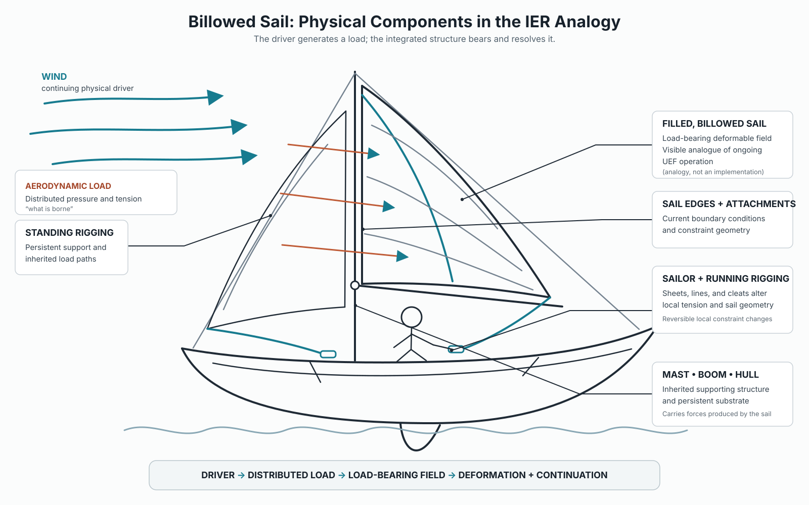

---
ier:
  tier: T2
  role: EXAMPLE
  status: active
  filename: billowed-sail.md
---

# The Billowed Sail

## A Physical Analogy for Continuing Drive, Load-Bearing, Reversible Deformation, and Ongoing Operation

**Informational Experiential Realism (IER v10.11.5)**\
**Date:** 30 September 2026\
*Tier-2 · Explanatory · Illustrative · Non-Normative · Canon-Constrained*

## Status, Scope, and Authority

This article develops one physical analogy: a sail can sustain a dynamically changing operation under continuing drive without being irreversibly rewritten at every moment.

Its role is explanatory; the analogy does not define a canonical mechanism.

It introduces no new IER primitive, criterion, experiential mode, dynamical operator, threshold, measurement, or implementation. A sail is not claimed to be experiential. Aerodynamic deformation is not intrinsic constraint, and ongoing operation does not by itself imply collapse, welding, sedimentation, or substrate replacement.

The [IER précis](https://github.com/mlehotay/ier/blob/main/IER/IER-precis.md) supplies the conceptual overview. Definitions remain controlled by the [Specification](https://github.com/mlehotay/ier/blob/main/IER/IER-specification.md) and canonical concept owners. For optional background, the Stapled Net is a complementary illustration of inherited constraint and run-relative irreversible transition permission, available through [Michael Lehotay's PhilPeople profile](https://philpeople.org/profiles/michael-lehotay).

## The Central Image

Imagine a sailboat moving under wind. Mast, boom, hull, standing rigging, running rigging, sailcloth, and attachment points establish an organized substrate. Apparent wind supplies continuing drive. The rig turns that drive into a distributed aerodynamic and tensile load. The sail bears that load by taking a curved, dynamically maintained shape.

The wind does not specify the shape by itself. Neither does the cloth or any one line. Present form depends on their interaction with boat orientation, velocity, water resistance, trim, and inherited structural condition.

> The environment drives; the rig constrains; the sail deforms; the coupled system responds.

A gust may deepen the sail, a lull may relax it, and a heading change may alter its twist. None of those changes requires a new permanent substrate. Existing organization already permits a range of lawful response.

> Continuing drive does not imply continuing irreversible rewriting.

## Diagram

## Driver, Load, Bearer, and Support

Four roles must remain distinct:

| Role | Sail system | What changes |
| --- | --- | --- |
| **Driver** | apparent wind and coupled boat motion | supplies continuing energy and pressure conditions |
| **Load** | distributed aerodynamic pressure and material tension | varies with wind, heading, speed, shape, and trim |
| **Bearer** | participating sailcloth in its current connected form | deforms while carrying the load |
| **Support** | mast, boom, hull, standing rigging, fittings, and attachments | supplies persistent boundary conditions |

The driver is not the load: the same wind can produce different loads under different headings or trim. The load is not the bearer: pressure and tension are borne by the cloth and rig. The bearer is not all support: much of the boat enables the operation without belonging to the deforming surface.

This mechanical role partition is not an ownership partition. In a candidate UEF, visible deformation, load-bearing, support, or functional indispensability would not by itself determine whether a process belongs to the subject. Constitutive membership would require bilateral participation: the process would have to contribute to the globally binding restriction and bear that same restriction in its own continuation through the owned operation. A nominal support could in principle meet that condition, while a conspicuous mechanical bearer could fail to meet it.

External drive also does not settle ownership. The wind supplies energy, and distributed bearing shows integration, but neither fact makes the organization intrinsically experiential.

Contribution and bearing are a partial summary of constitutive membership. [Processes](https://github.com/mlehotay/ier/blob/main/IER/IER-processes.md#the-full-membership-relation) also requires joint non-externalizable resolution, diachronic uptake, and common typing. [Intrinsic Closure](https://github.com/mlehotay/ier/blob/main/IER/IER-intrinsic-closure.md) tests admissible successor support under independently fixed physical declarations and all meaningful partitions, not mechanical connectedness or statistical dependence.

## Constraint Has Geometry

The sail's response depends on where and how it is constrained: luff, leech, foot, halyard, sheet, mast bend, boom angle, and attachment points all matter. Two settings can impose similar overall tension while supporting different shapes and continuations.

Constraint therefore has direction and topology. It determines which deformations remain available, where curvature concentrates, and how a local adjustment changes the whole surface. The wind elicits a response through this geometry; it does not draw the response directly.

## Current Shape and Trajectory

The sail's current shape is one configuration of the coupled system. Its trajectory is the ordered succession of configurations through time. A still image cannot reveal whether the sail is filling, easing, oscillating, or passing through the same shape from another direction.

Trajectory need not be a monotonic contraction of possibilities. A trim change can close some continuations and open others. A tack or gybe can reorganize which face of the sail is loaded while operation continues. Current geometry shapes what can happen next without encoding a plan or representing the reachable set.

This distinction is purely physical here. It does not establish phenomenal succession, numerical subject identity, or authorship of a trajectory.

## Persistence and Drift

The operation persists when the coupled system continues to bear changing load through a connected organization. Persistence is not immobility: the sail may translate, twist, deepen, flatten, and oscillate while remaining part of one continuing rig operation.

Drift is gradual movement through the available configuration space under changing drive and boundary conditions. It may be smooth or irregular. Calling it drift does not imply lack of cause; it marks change that is accommodated by existing organization rather than by replacement of that organization.

The analogy does not decide IER's conditions for UEF continuity or numerical identity. It only makes ongoing operation through successive states easy to picture.

The full [Continuity](https://github.com/mlehotay/ier/blob/main/IER/IER-continuity.md#physical-stage-continuity) relation requires continuous owned closure, actual successor production, physically effective typed irreversible inheritance, operation-mediated membership and boundary change, and a unique qualifying successor and predecessor in a fixed domain. Retained rigging and continuing motion do not establish those conditions. Existing inherited consequences can remain effective without a fresh irreversible event at every cut; failure of any clause can end a subject token without a system-wide experience-null interval.

## Curvature, Luffing, and Engagement

Curvature is a continuously variable response of the load-bearing surface. A filled sail can alter curvature while remaining globally engaged. Filled therefore does not mean rigid.

When effective airflow or trim is insufficient, part of the sail may luff. Luffing makes slack and engagement visible as local, graded mechanical conditions. It is not informational slack, UEF failure, or cessation. A brief flutter, a fully unloaded sail, damaged cloth, and removal of the sail are different physical events and must not be collapsed into one theoretical category.

## Cleating and Reversible Fixation

Cleating a line holds a setting persistently, but it is normally reversible: the line can be uncleated and adjusted. A cleated setting can constrain many subsequent shapes without rewriting the sailcloth.

This is the Sail's clearest contrast with the Stapled Net. The net foregrounds run-relative irreversible locks and route loss; the sail foregrounds continuing load-bearing through adjustable, usually reversible constraint. The two examples are complementary and neither defines the other.

## Reachable Configurations

Given current wind, boat motion, material condition, and rig settings, only some sail shapes are mechanically reachable. Altering a sheet or heading changes that set. A shape may be unavailable now yet reachable after a permitted adjustment; another may become unreachable because a setting, failure, or deformation removes its remaining route.

Reachability is not probability or representation. The sail does not need an internal catalogue of shapes. It has physically possible continuations because of its state and coupling.

## Reversible and Irreversible Change

The analogy requires a disciplined separation:

- **state evolution:** any change in current configuration;
- **reversible deformation:** a change accommodated within existing organization;
- **reversible fixation:** a held setting, such as a cleated line, that can be released;
- **persistent substrate reorganization:** stretching, tearing, repair, or a durable rig alteration;
- **atomic foreclosure:** an IER structural notion not established by ordinary route loss here;
- **successor realization:** lawful continuation to an admissible successor under intrinsic constraint, not established in the UEF domain by a changed sail shape;
- **subject continuation:** numerical identity under the full stage relation, not established by successive sail shapes;
- **UEF failure or cessation:** not inferred from luffing, damage, unloading, or any single mechanical event.

Irreversible alteration is conditional, not continuous. Repeated loading may stretch cloth; overload may tear it; a fitting may deform; sailors may reef or replace components. Those events change later possibilities, but ordinary gust-by-gust response does not require them.

## Correspondence and Limits

| Sail relation | Bounded IER intuition | Limit |
| --- | --- | --- |
| Continuing wind and coupled motion | Ongoing drive | External drive does not establish intrinsic ownership |
| Distributed load-bearing | One operation depends on connected organization | Not proof of unity or experience |
| Current billowed geometry | Present constraint-shaped state | Not a definition of UEF structure |
| Successive shapes | Trajectory through states | Not numerical identity or phenomenal succession |
| Curvature, trim, and drift | Reversible operation within an existing substrate | Not canonical resolution or sedimentation |
| Durable stretch, tear, or rig alteration | Persistent change can reshape later reachability | Not automatically collapse, successor realization, or cessation |

The analogy says nothing general about situations, social organization, development, institutions, cognition, behavioural novelty, or morphological computation. It is not a theory of persons or action. Its scope ends with the physical distinctions in the table.

IER's identity proposal is abductive and a posteriori. This analogy clarifies selected features of a possible physical organization; it supplies neither a deduction of experience nor independent evidence that the sail system is identical with a subject.

## Short Sailing Glossary

- **Apparent wind:** airflow experienced by the moving boat, combining ambient wind and boat motion.
- **Luff:** the forward edge of a sail; also, as a verb, the fluttering that occurs when flow or trim does not sustain a filled form.
- **Leech:** the trailing edge of a sail.
- **Foot:** the lower edge of a sail.
- **Sheet:** a line used primarily to control sail angle and trim.
- **Cleat:** a fitting that holds a line at a chosen setting while permitting later release.
- **Tack / gybe:** manoeuvres that change which side of the sail receives the wind.

## Compression

A billowed sail is a connected, deformable bearer operating under continuing environmental drive. Its inherited rig converts that drive into a changing distributed load; its current geometry shapes reachable continuation; and its trajectory consists of successive configurations. Curvature, drift, luffing, trim, and cleating show that substantial ongoing change can remain reversible. Durable alteration sometimes occurs, but it is not required at every moment. That distinction - ongoing operation without continual irreversible rewriting - is the analogy's entire job.
