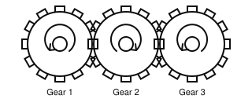

# Interlocking Gears

## Mediated Dependence Does Not Settle Intrinsic Unity

## Status, Scope, and Authority

This is a non-canonical analogy. It illustrates why the route by which a
dependence is mediated does not decide IER's relation stack. It does not
establish a Unified Experiential Field, and it supplies no empirical test for
synchronic closure, ownership, constitutive membership, or diachronic
continuity.

Three ideal gears are arranged in a line:



```text
Gear 1  ↔  Gear 2  ↔  Gear 3
```

Gear 1 meshes with Gear 2. Gear 2 meshes with Gear 3. Gear 1 and Gear 3 never touch.

For equal gears, their angular velocities satisfy:

$$ \omega_1=-\omega_2=\omega_3. $$

Once the train is engaged, specifying the motion of one gear fixes the compatible motion of the others. Gear 3 therefore cannot vary its rotation independently of Gear 1 even though no direct Gear 1-to-Gear 3 interaction exists.

> No direct contact does not imply independent continuation.

The dependence is mediated through Gear 2.

This makes the gear train a particularly clean illustration of constraint propagation. Unlike a logjam, nothing needs to be irregular, unstable, or approximate. In the idealization, three distinguishable bodies can have only one independent kinematic degree of freedom.

That sounds very close to unity, but it is not enough to settle the IER
question.

The complete constraint can still be represented through the two local mesh relations:

$$ C_{12}(\theta_1,\theta_2)=0 $$

and

$$ C_{23}(\theta_2,\theta_3)=0. $$

The relation between Gear 1 and Gear 3 follows from composition of those local
constraints. No additional primitive three-gear law is required. That fact,
however, does not show that the global outgoing successor support factorizes.
Local equations can jointly exclude combinations of projected subsystem
successors that each projection permits on its own.

The correct test begins with a candidate, grain, frontier, intervention family,
and exhaustive physically meaningful partition family fixed independently of
the result. For each partition, it compares the actual global successor fibre
with the product of projections derived from that same fibre. Under a stated
idealized gear model, the train may pass that support-level test. Under another
candidate boundary or physical intervention family, it may not. The local
form of the equations does not decide the result.

The system therefore demonstrates a severe limit on what coordination, or its
local description, can establish.

```text
exact dependence
    is not
the full IER relation stack

one free coordinate
    is not
ownership, membership, persistence, or experience
```

Even perfect system-wide correlation can arise from a chain of locally describable relations.

This complements the logjam. A logjam shows that long chains of mutually
dependent continuation do not by themselves establish the full qualifying
organization. The gears remove the messiness and make the same point under
ideal conditions. The dependence can be exact, reciprocal, persistent, and
system-wide without establishing ownership, bilateral constitutive membership,
`Adj_dia`, or experience.

The lesson is therefore not that gears approximate a Unified Experiential Field.

It is the opposite:

> Gear 1 never touches Gear 3, yet Gear 3 cannot continue independently of
> Gear 1. That establishes mediated dependence. Whether the fixed candidate
> also has synchronic closure must be tested at the global successor support,
> and closure alone would still not establish the rest of the relation stack.

Whatever qualifying organization IER requires must therefore be assessed
relation by relation rather than inferred from either perfect coordination or
the availability of a local-equation description.
